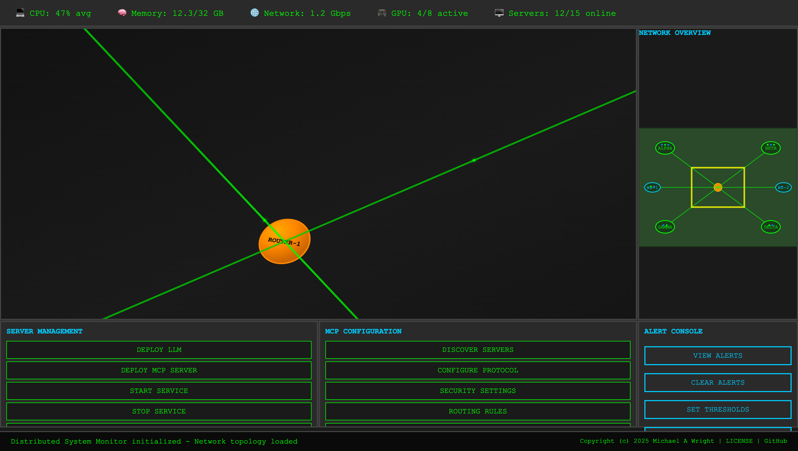

# RTS Monitor - Distributed System Monitor

A web-based Distributed System Monitor built with Rust and WebAssembly. This project provides a visual interface for managing distributed LLMs and Model Context Protocol (MCP) servers across a network, with interactive monitoring and management capabilities.



## Features

### Monitor Interface
- **Resource Panel**: Displays system-wide metrics (CPU, Memory, Network, GPU usage)
- **Main Map**: Interactive SVG network topology with server islands and connections
- **Minimap**: Overview of entire network with viewport indicator
- **Server Management Menu**: Deploy, stop, and restart distributed processes
- **MCP Configuration Menu**: Server discovery and protocol settings
- **Alert Console**: System notifications and warnings

### Visual Design
- Retro terminal aesthetic with green-on-black color scheme
- SVG-based graphics for scalable map elements
- Responsive grid layout optimizing screen real estate
- Hover effects and visual feedback for all interactive elements
- Footer with copyright notice and links to LICENSE and GitHub repository

### Technical Stack
- **Rust**: Core logic and WASM bindings using `wasm-bindgen`
- **WebAssembly**: High-performance web execution
- **HTML5**: Semantic structure with inline CSS3
- **SVG**: Vector graphics for map and minimap
- **Minimal JavaScript**: Only for WASM initialization and event bridging

## Getting Started

### Prerequisites
- [Rust](https://rustup.rs/) (latest stable)
- [wasm-pack](https://rustwasm.github.io/wasm-pack/installer/)

### Building

1. **Clone the repository**
   ```bash
   git clone <repository-url>
   cd rts_monitor
   ```

2. **Build the WASM package**
   ```bash
   ./scripts/build.sh
   ```

3. **Run the application**
   ```bash
   ./scripts/run.sh
   ```
   This will:
   - Start a web server on port 4000
   - Automatically open your browser to http://localhost:4000/
   - Press Ctrl+C to stop the server

   Note: If you don't have `basic-http-server` installed, install it with:
   ```bash
   cargo install basic-http-server
   ```

## Usage

Click on any UI element to see status messages appear at the bottom of the screen:

- **Map/Minimap**: Click on servers or network connections
- **Resource Panel**: View detailed system metrics
- **Server Management**: Deploy or manage LLM/MCP processes
- **MCP Configuration**: Configure Model Context Protocol settings
- **Alert Console**: View and manage system alerts

All interactions are logged to both the browser console and the on-screen status display.

## Project Structure

```
rts_monitor/
+-- src/
|   +-- lib.rs          # Main WASM module with interaction handlers
+-- scripts/
|   +-- build.sh        # Build automation script
|   +-- run.sh          # Development server script
+-- docs/
|   +-- images/
|   |   +-- screenshot.png
|   +-- overview.md     # Project overview for management
+-- pkg/                # Generated WASM output (after build)
+-- index.html          # Main web interface
+-- Cargo.toml          # Rust project configuration
+-- CLAUDE.md           # Project guidance for Claude Code
+-- LICENSE             # MIT License
+-- README.md           # This file
```

## Development

### Code Quality
```bash
# Run clippy for linting
cargo clippy

# Format code
cargo fmt

# Run tests
cargo test
```

### Architecture

The application uses a clean separation between Rust (logic) and JavaScript (DOM interaction):

- **Rust (`src/lib.rs`)**: Handles all interaction logic and status message generation
- **HTML/CSS**: Defines the complete UI layout and styling
- **JavaScript**: Minimal glue code for WASM initialization and event forwarding

## License

Copyright (c) 2025 Michael A Wright

This project is released under the MIT License. See LICENSE file for details.

## Contributing

Contributions are welcome! Please feel free to:

- Report bugs or issues
- Suggest monitoring features
- Add new system metrics
- Improve the network visualization

---

*Built with Rust and WebAssembly*
