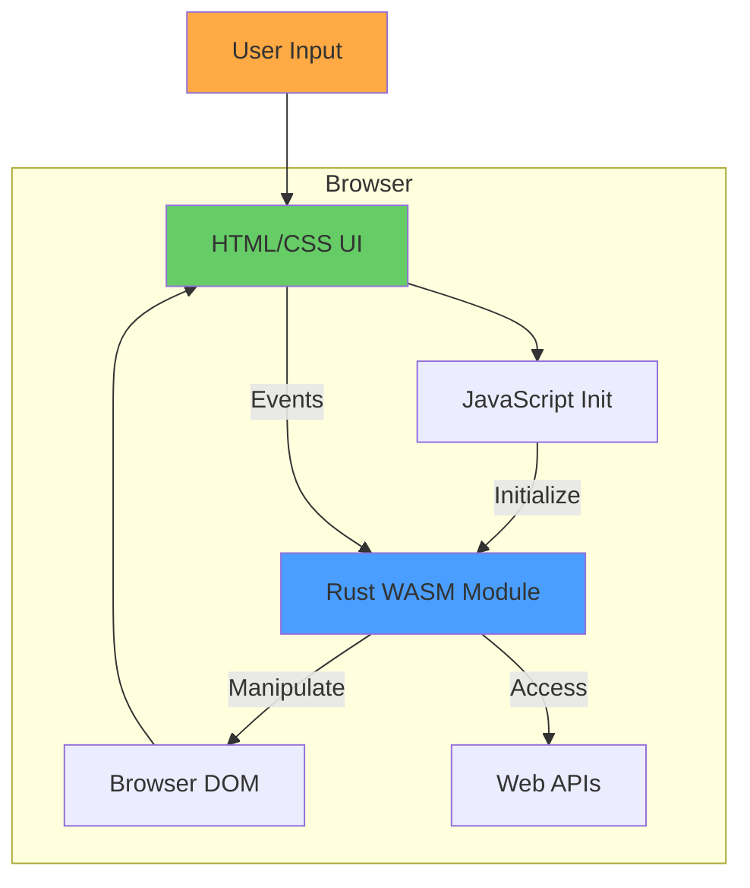
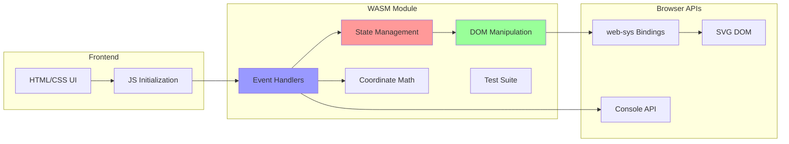
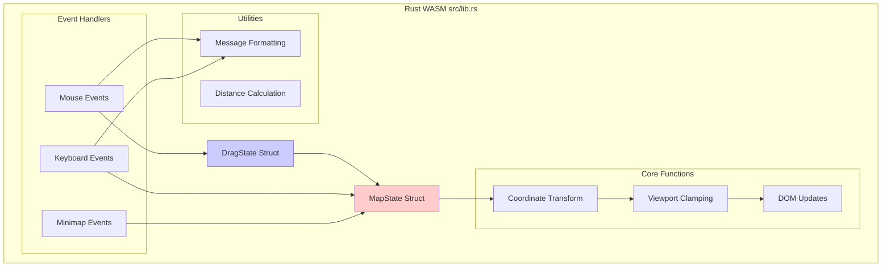
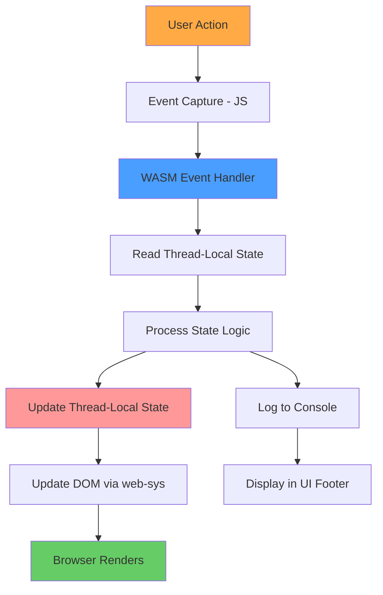
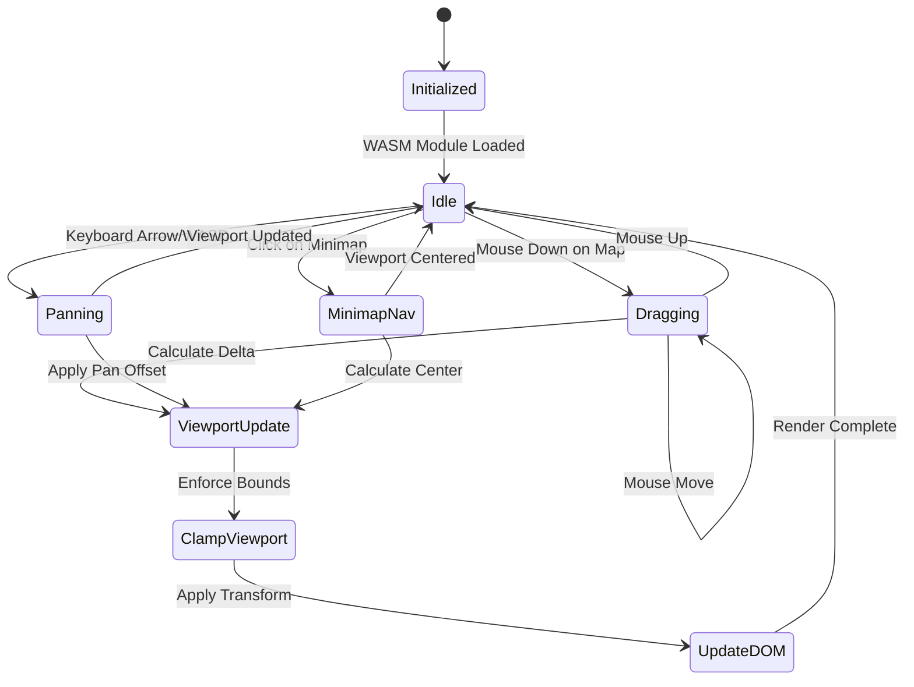
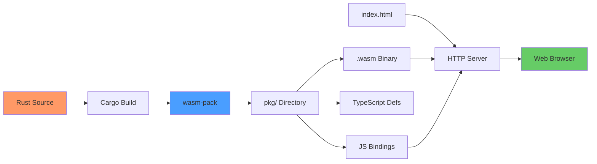

# Architecture Overview

This page provides a comprehensive overview of the RTS Monitor architecture, including high-level design, component relationships, and data flow.

## High-Level Architecture

The RTS Monitor follows a **Rust-First Architecture** where all application logic resides in Rust (compiled to WebAssembly), with minimal JavaScript for initialization and event binding.



### Design Principles

1. **Rust-First**: All application logic in Rust, compiled to WASM
2. **Minimal JavaScript**: Only ~50 lines for WASM init and event binding
3. **Inline Styling**: All CSS in `index.html` for self-contained UI
4. **SVG Graphics**: Scalable vector graphics for map and minimap
5. **Thread-Local State**: Global state management via Rust thread-locals

## System Architecture



## Component Architecture



## Layer Architecture

The system is organized into three primary layers:

### 1. Presentation Layer (HTML/CSS)

**File**: `index.html` (complete UI definition)

**Components**:
- Resource Panel (system metrics)
- Main Map (SVG topology view)
- Minimap (overview + viewport indicator)
- Server Management Menu
- MCP Configuration Menu
- Alert Console

**Responsibilities**:
- Visual layout and styling
- SVG element definitions
- UI component structure

### 2. Application Layer (Rust/WASM)

**File**: `src/lib.rs` (543 lines of Rust)

**Components**:
- State management (MapState, DragState)
- Event handling (mouse, keyboard, minimap)
- Business logic (coordinate transforms, viewport control)
- DOM manipulation (via web-sys)

**Responsibilities**:
- All application logic
- State transitions
- User interaction processing
- DOM updates

### 3. Browser API Layer (web-sys)

**Bindings**: Rust → Browser APIs

**Components**:
- DOM manipulation
- Console logging
- Event system
- SVG rendering

**Responsibilities**:
- Browser API access from Rust
- Type-safe JavaScript interop
- Platform integration

## Data Flow



### User Interaction Flow

1. **User Action**: Mouse click, drag, keyboard press
2. **Event Capture**: JavaScript event listener triggers
3. **WASM Handler**: Rust function called via wasm-bindgen
4. **State Processing**: Thread-local state read and modified
5. **DOM Update**: web-sys updates SVG transforms and attributes
6. **Render**: Browser re-renders updated elements
7. **Feedback**: Console messages displayed in UI footer

## State Management Architecture



### State Storage

**Thread-Local Variables** (Rust):
```rust
thread_local! {
    static MAP_STATE: RefCell<Option<MapState>> = RefCell::new(None);
    static DRAG_STATE: RefCell<Option<DragState>> = RefCell::new(None);
}
```

**MapState Fields**:
- `offset_x`, `offset_y`: Current viewport position
- `viewport_width`, `viewport_height`: Visible area dimensions
- `world_width`, `world_height`: Total world dimensions

**DragState Fields**:
- `start_x`, `start_y`: Initial mouse position
- `initial_offset_x`, `initial_offset_y`: Viewport position at drag start

## Build and Deployment Architecture



### Build Process

1. **Source**: Rust code in `src/lib.rs`
2. **Compilation**: `wasm-pack build --target web`
3. **Output**: WASM binary + JS bindings in `pkg/`
4. **Serving**: `basic-http-server` serves static files
5. **Loading**: Browser loads HTML, JS initializes WASM

## Technology Stack Details

For detailed information about the technology stack, see [[Technology Stack]].

## Component Details

For detailed information about specific components:

- [[UI Components]] - Presentation layer details
- [[State Management]] - State management patterns
- [[Event Handling]] - Event processing architecture
- [[Component Details]] - Component implementation details

## Related Pages

- [[Interaction Flows]] - Sequence diagrams for user interactions
- [[Build and Deploy]] - Detailed build and deployment process
- [[Development Guide]] - Development workflow and best practices

---

*Last Updated: 2025-11-18*
