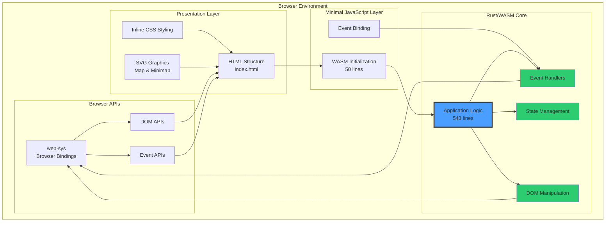
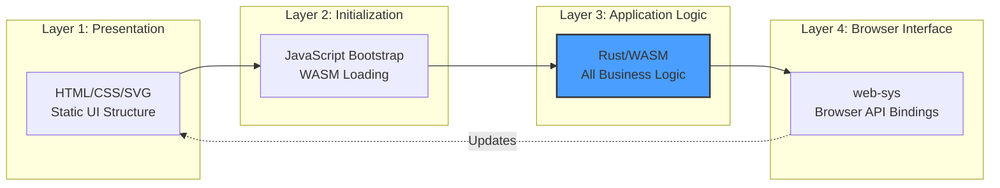
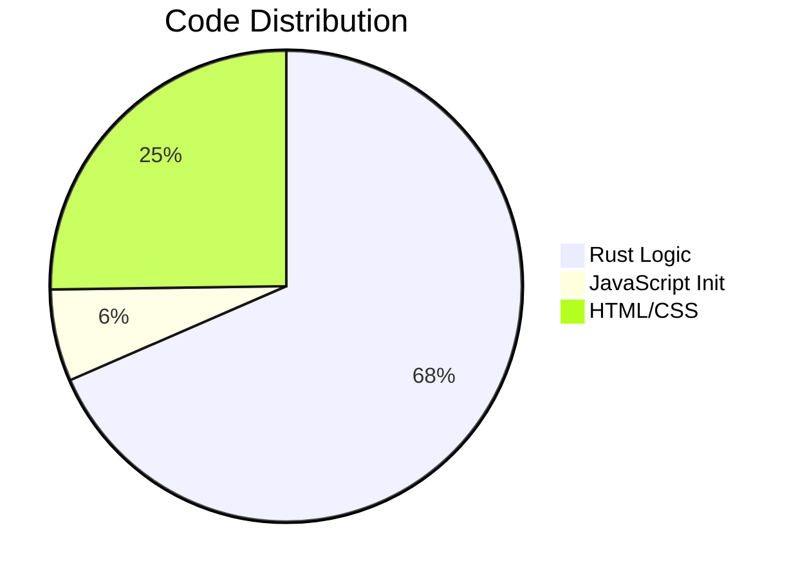
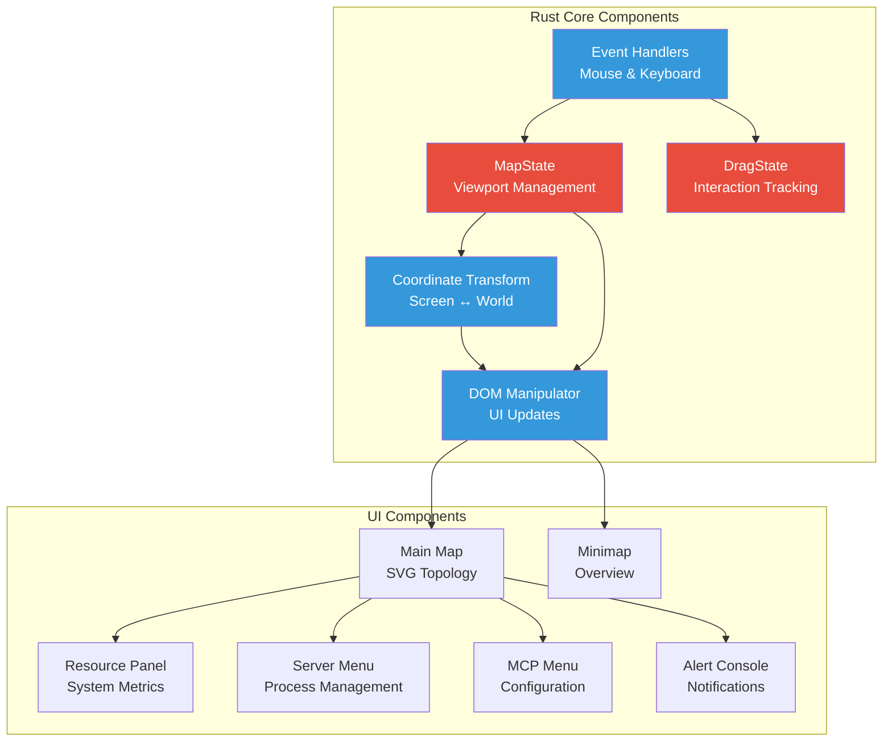
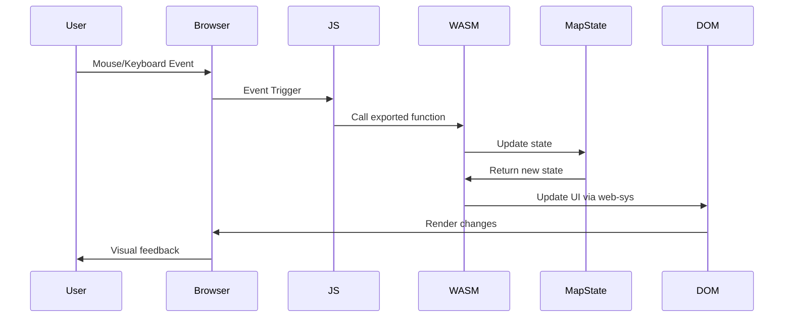
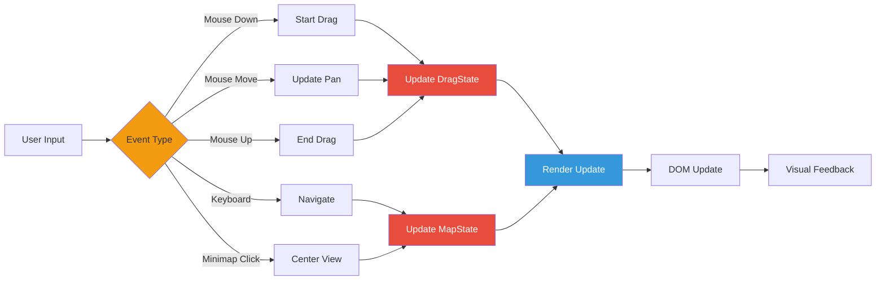
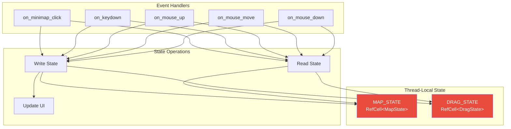
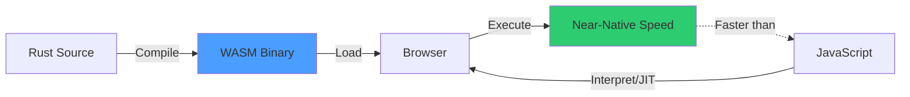

# Architecture Overview

This page provides a comprehensive overview of the RTS Monitor architecture, including system design, component interactions, and key architectural decisions.

## Table of Contents

- [System Architecture](#system-architecture)
- [Architectural Principles](#architectural-principles)
- [Component Architecture](#component-architecture)
- [Data Flow](#data-flow)
- [State Management](#state-management)
- [File Structure](#file-structure)

## System Architecture

RTS Monitor follows a **Rust-first WebAssembly architecture**, where all application logic resides in Rust and compiles to WebAssembly for browser execution.

### High-Level Architecture



### System Layers



## Architectural Principles

### 1. Rust-First Philosophy

**80% reduction in JavaScript** - All application logic implemented in Rust.



**Benefits:**
- Type safety and memory safety
- High performance through WASM
- Better testing and maintainability
- Compile-time error checking

### 2. Single Source of Truth

All state managed in Rust via thread-local storage:
- `MAP_STATE`: Viewport position and dimensions
- `DRAG_STATE`: Mouse drag tracking

### 3. Minimal JavaScript Surface

JavaScript responsibilities limited to:
- WASM module loading and initialization
- Event listener binding to exported Rust functions
- No business logic

### 4. Direct Browser API Access

Using `web-sys` for:
- DOM manipulation
- Event handling
- SVG updates
- Console logging

## Component Architecture

### Core Components



### MapState Structure

```rust
struct MapState {
    x: f64,        // Current viewport X position
    y: f64,        // Current viewport Y position
    width: f64,    // Viewport width
    height: f64,   // Viewport height
}
```

**Responsibilities:**
- Track current viewport position
- Manage viewport dimensions
- Provide bounds for pan limits
- Calculate visible area

### DragState Structure

```rust
struct DragState {
    is_dragging: bool,     // Mouse drag active
    start_x: f64,          // Drag start X
    start_y: f64,          // Drag start Y
    map_start_x: f64,      // Map position at drag start
    map_start_y: f64,      // Map position at drag start
}
```

**Responsibilities:**
- Track mouse drag operations
- Store drag start coordinates
- Enable smooth pan calculations

## Data Flow

### Event Flow Architecture



### State Update Flow



## State Management

### Thread-Local Storage Pattern



**Advantages:**
- Simple, predictable state access
- No complex state management library needed
- Fast access via RefCell borrowing
- Thread-safe for single-threaded WASM

## File Structure

### Project Layout

```
rts_monitor/
├── src/
│   └── lib.rs              # Main Rust/WASM module (543 lines)
│                           # - MapState & DragState structures
│                           # - All event handlers
│                           # - Coordinate transformations
│                           # - DOM manipulation
│                           # - Exported WASM functions
│
├── index.html              # Complete UI structure
│                           # - Inline CSS styling
│                           # - SVG map and minimap
│                           # - UI component layout
│                           # - JavaScript WASM initialization
│
├── pkg/                    # Generated by wasm-pack (auto-generated)
│   ├── rts_monitor.js      # JavaScript bindings
│   ├── rts_monitor_bg.wasm # Compiled WebAssembly
│   └── ...                 # Supporting files
│
├── scripts/
│   ├── build.sh            # Build automation
│   └── run.sh              # Development server
│
├── Cargo.toml              # Rust dependencies
└── CLAUDE.md               # Development guidance
```

### Component Responsibility Matrix

| Component | File | Responsibility | Lines |
|-----------|------|----------------|-------|
| Application Logic | `src/lib.rs` | All business logic, state, events | 543 |
| UI Structure | `index.html` | HTML layout, CSS styling | ~200 |
| WASM Init | `index.html` (script) | Load and initialize WASM | 50 |
| Build Artifacts | `pkg/*` | Compiled WASM + JS bindings | Auto-gen |

## Design Patterns

### 1. **WASM Bindgen Pattern**

Exported functions use `#[wasm_bindgen]` attribute:

```rust
#[wasm_bindgen]
pub fn on_mouse_down(event: web_sys::MouseEvent) {
    // Event handling logic
}
```

### 2. **Interior Mutability Pattern**

Thread-local state with RefCell for safe mutation:

```rust
thread_local! {
    static MAP_STATE: RefCell<MapState> = RefCell::new(MapState::new());
}
```

### 3. **Direct DOM Manipulation**

Using web-sys for browser API access:

```rust
let document = window().unwrap().document().unwrap();
let element = document.get_element_by_id("map").unwrap();
element.set_attribute("transform", &format!(...));
```

## Performance Considerations

### WebAssembly Benefits



**Performance Advantages:**
- Compiled code vs. interpreted JavaScript
- Small binary size (~100KB)
- Fast startup time
- Efficient memory usage
- Predictable performance

### Optimization Strategies

1. **Minimal DOM Updates**: Only update changed elements
2. **Event Debouncing**: Efficient mouse move handling
3. **Thread-Local State**: Fast state access without overhead
4. **SVG Transformations**: Hardware-accelerated graphics
5. **WASM Linear Memory**: Efficient memory management

## Related Pages

- [Technology Stack](Technology-Stack.md) - Detailed technology information
- [UI Components](UI-Components.md) - UI component details
- [Interaction Model](Interaction-Model.md) - Event handling and user interactions
- [Development Guide](Development-Guide.md) - Build and development workflow
