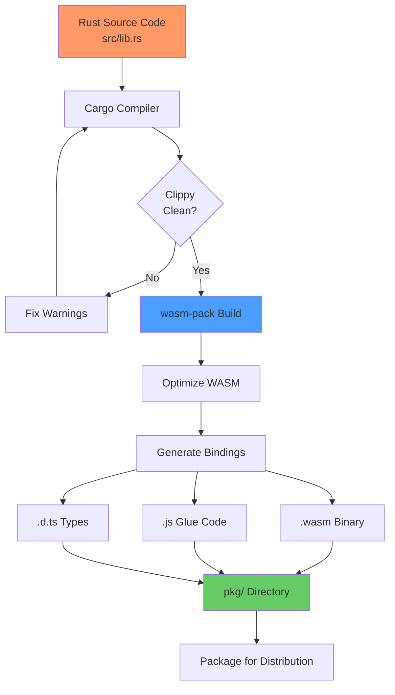

# Build and Deploy

This page documents the build process, deployment strategies, and release management for RTS Monitor.

## Build Process Overview



---

## Development Build

### Quick Build

```bash
./scripts/build.sh
```

**What it does**:
```bash
#!/bin/bash
set -e

echo "Building RTS Monitor..."
wasm-pack build --target web --out-dir pkg

echo "Build complete! Output in pkg/"
```

### Manual Build

```bash
wasm-pack build --target web --out-dir pkg
```

**Options**:
- `--target web`: Browser-compatible output
- `--out-dir pkg`: Output directory

### Build Output

```
pkg/
├── rts_monitor_bg.wasm       # WASM binary (~50KB)
├── rts_monitor_bg.wasm.d.ts  # TypeScript defs for WASM
├── rts_monitor.js            # JavaScript glue (~5KB)
├── rts_monitor.d.ts          # TypeScript definitions
├── package.json              # NPM package metadata
└── .gitignore                # Generated .gitignore
```

---

## Production Build

### Optimized Build

```bash
wasm-pack build --release --target web --out-dir pkg
```

**Additional optimizations**:
- Dead code elimination
- Link-time optimization (LTO)
- Size optimization

### Build Configuration

**Cargo.toml**:
```toml
[profile.release]
opt-level = "s"     # Optimize for size ('z' for even smaller)
lto = true          # Link-time optimization
codegen-units = 1   # Better optimization (slower build)
panic = 'abort'     # Smaller binary size
```

### Size Comparison

| Build Mode | WASM Size | JS Size | Total |
|------------|-----------|---------|-------|
| Debug | ~120 KB | ~8 KB | ~128 KB |
| Release | ~50 KB | ~5 KB | ~55 KB |
| Release (gzip) | ~20 KB | ~2 KB | ~22 KB |

**Optimization Savings**: ~60% reduction

---

## Build Scripts

### build.sh

**Location**: `scripts/build.sh`

```bash
#!/bin/bash
set -e

echo "Building RTS Monitor..."

# Check if wasm-pack is installed
if ! command -v wasm-pack &> /dev/null; then
    echo "Error: wasm-pack not found. Install with: cargo install wasm-pack"
    exit 1
fi

# Build the project
wasm-pack build --target web --out-dir pkg

echo "Build complete! Output in pkg/"
echo ""
echo "File sizes:"
ls -lh pkg/*.wasm pkg/*.js | awk '{print $5, $9}'
```

**Features**:
- Error checking
- Dependency verification
- File size reporting

### run.sh

**Location**: `scripts/run.sh`

```bash
#!/bin/bash
set -e

# Build first
./scripts/build.sh

# Check if basic-http-server is installed
if ! command -v basic-http-server &> /dev/null; then
    echo "Installing basic-http-server..."
    cargo install basic-http-server
fi

# Start server
echo ""
echo "Starting HTTP server on http://localhost:4000/"
echo "Press Ctrl+C to stop"
echo ""

# Start server in background
basic-http-server -a 127.0.0.1:4000 &
SERVER_PID=$!

# Wait for server to start
sleep 1

# Open browser (Linux/Mac)
if command -v xdg-open &> /dev/null; then
    xdg-open http://localhost:4000/
elif command -v open &> /dev/null; then
    open http://localhost:4000/
fi

# Wait for server process
wait $SERVER_PID
```

**Features**:
- Automated build
- Server installation check
- Cross-platform browser opening
- Graceful shutdown

---

## Development Server

### basic-http-server

**Installation**:
```bash
cargo install basic-http-server
```

**Usage**:
```bash
basic-http-server -a 127.0.0.1:4000
```

**Options**:

| Option | Value | Purpose |
|--------|-------|---------|
| `-a` | `127.0.0.1:4000` | Address and port |
| `-h` | (flag) | Show help |
| `-c` | (flag) | Enable CORS |

**Features**:
- Static file serving
- Auto-indexing
- CORS support
- Lightweight (~2MB)

### Alternative Servers

**Python HTTP Server**:
```bash
python3 -m http.server 4000
```

**Node.js HTTP Server**:
```bash
npx http-server -p 4000
```

---

## Continuous Integration

### GitHub Actions Example

**.github/workflows/build.yml**:
```yaml
name: Build and Test

on:
  push:
    branches: [ main, develop ]
  pull_request:
    branches: [ main ]

jobs:
  build:
    runs-on: ubuntu-latest

    steps:
    - name: Checkout code
      uses: actions/checkout@v3

    - name: Install Rust
      uses: actions-rs/toolchain@v1
      with:
        toolchain: stable
        override: true
        components: rustfmt, clippy

    - name: Cache cargo
      uses: actions/cache@v3
      with:
        path: |
          ~/.cargo/bin/
          ~/.cargo/registry/
          ~/.cargo/git/
          target/
        key: ${{ runner.os }}-cargo-${{ hashFiles('**/Cargo.lock') }}

    - name: Install wasm-pack
      run: cargo install wasm-pack

    - name: Check formatting
      run: cargo fmt -- --check

    - name: Run clippy
      run: cargo clippy -- -D warnings

    - name: Run tests
      run: cargo test --verbose

    - name: Build WASM
      run: wasm-pack build --target web --out-dir pkg

    - name: Upload artifacts
      uses: actions/upload-artifact@v3
      with:
        name: wasm-build
        path: pkg/
```

**Workflow Steps**:
1. Checkout code
2. Install Rust toolchain
3. Cache dependencies
4. Check code formatting
5. Run linter (clippy)
6. Run tests
7. Build WASM
8. Upload build artifacts

---

## Deployment Strategies

### 1. Static Hosting

**Platforms**:
- GitHub Pages
- Netlify
- Vercel
- Cloudflare Pages
- AWS S3 + CloudFront

#### GitHub Pages Example

**Setup**:
```bash
# Build production version
wasm-pack build --release --target web --out-dir pkg

# Create deployment branch
git checkout -b gh-pages

# Copy files
cp index.html pkg/*.wasm pkg/*.js .

# Commit and push
git add .
git commit -m "Deploy to GitHub Pages"
git push origin gh-pages
```

**GitHub Pages Settings**:
- Source: `gh-pages` branch
- Directory: `/` (root)

**URL**: `https://yourusername.github.io/rts_monitor/`

#### Netlify Example

**netlify.toml**:
```toml
[build]
  command = "wasm-pack build --release --target web --out-dir pkg"
  publish = "."

[[redirects]]
  from = "/*"
  to = "/index.html"
  status = 200
```

**Deploy**:
```bash
netlify deploy --prod
```

---

### 2. Docker Deployment

**Dockerfile**:
```dockerfile
# Build stage
FROM rust:latest as builder

WORKDIR /app
COPY . .

RUN cargo install wasm-pack
RUN wasm-pack build --release --target web --out-dir pkg

# Runtime stage
FROM nginx:alpine

COPY --from=builder /app/index.html /usr/share/nginx/html/
COPY --from=builder /app/pkg /usr/share/nginx/html/pkg/

EXPOSE 80
```

**Build and run**:
```bash
docker build -t rts-monitor .
docker run -p 8080:80 rts-monitor
```

---

### 3. CDN Deployment

**Structure**:
```
https://cdn.example.com/
├── index.html
├── rts_monitor_bg.wasm
└── rts_monitor.js
```

**HTML Update**:
```html
<script type="module">
    import init from 'https://cdn.example.com/rts_monitor.js';
    init('https://cdn.example.com/rts_monitor_bg.wasm').then(() => {
        // ...
    });
</script>
```

---

## Release Management

### Versioning

**Semantic Versioning** (SemVer):
```
MAJOR.MINOR.PATCH
  1  .  0  .  0
```

- **MAJOR**: Breaking changes
- **MINOR**: New features (backward compatible)
- **PATCH**: Bug fixes

**Current Version**: 0.1.0 (initial development)

### Release Checklist

```markdown
- [ ] Update version in Cargo.toml
- [ ] Update CHANGELOG.md
- [ ] Run all tests: `cargo test`
- [ ] Check clippy: `cargo clippy`
- [ ] Format code: `cargo fmt`
- [ ] Build production: `wasm-pack build --release`
- [ ] Manual testing in browser
- [ ] Create git tag: `git tag v0.1.0`
- [ ] Push tag: `git push origin v0.1.0`
- [ ] Create GitHub release
- [ ] Deploy to production
```

### Changelog Format

**CHANGELOG.md**:
```markdown
# Changelog

## [0.1.0] - 2025-11-18

### Added
- Mouse drag-to-pan functionality
- Keyboard navigation (arrows + WASD)
- Minimap click-to-center
- MapState and DragState management
- 10 comprehensive unit tests

### Changed
- 80% JavaScript reduction (Rust-first approach)
- All event handling moved to Rust

### Fixed
- Viewport boundary clamping
- Cursor state on drag end
```

---

## Build Troubleshooting

### Common Issues

#### 1. wasm-pack Not Found

**Error**:
```
bash: wasm-pack: command not found
```

**Solution**:
```bash
cargo install wasm-pack
```

#### 2. Build Fails with "linking with `cc` failed"

**Error**:
```
error: linking with `cc` failed
```

**Solution**:
```bash
# Install build dependencies (Ubuntu/Debian)
sudo apt-get install build-essential

# macOS
xcode-select --install
```

#### 3. WASM File Not Loading

**Error**: Browser console shows 404 for `.wasm` file

**Solution**:
- Ensure `pkg/` directory exists
- Check file paths in HTML
- Use HTTP server (not `file://`)

#### 4. CORS Errors

**Error**:
```
Access to fetch at 'file:///.../rts_monitor_bg.wasm' from origin 'null' has been blocked by CORS
```

**Solution**:
Use HTTP server instead of opening file directly:
```bash
basic-http-server -a 127.0.0.1:4000
```

---

## Performance Monitoring

### Build Time Benchmarks

| Command | Time | Description |
|---------|------|-------------|
| `cargo check` | ~2s | Check without building |
| `cargo build` | ~10s | Debug build |
| `cargo build --release` | ~30s | Release build |
| `wasm-pack build` | ~15s | Debug WASM build |
| `wasm-pack build --release` | ~45s | Release WASM build |

**Note**: Times for cold build. Incremental builds much faster.

### Bundle Analysis

**Analyze WASM**:
```bash
wasm-pack build --release
ls -lh pkg/*.wasm
```

**Check compression**:
```bash
gzip -c pkg/rts_monitor_bg.wasm | wc -c
```

---

## Environment Variables

### Build Environment

```bash
# Target for WASM
export RUSTFLAGS="-C opt-level=s"

# Enable debug symbols
export CARGO_PROFILE_RELEASE_DEBUG=true

# Parallel build
export CARGO_BUILD_JOBS=4
```

### Development Environment

```bash
# Enable Rust backtrace
export RUST_BACKTRACE=1

# Cargo output verbosity
export CARGO_TERM_VERBOSE=true
```

---

## Automated Deployment

### Deploy Script

**scripts/deploy.sh**:
```bash
#!/bin/bash
set -e

echo "Deploying RTS Monitor..."

# Run tests
cargo test
echo "✓ Tests passed"

# Check code quality
cargo clippy -- -D warnings
echo "✓ Clippy passed"

# Build production
wasm-pack build --release --target web --out-dir pkg
echo "✓ Build complete"

# Deploy to GitHub Pages
git checkout gh-pages
cp index.html .
cp -r pkg .
git add .
git commit -m "Deploy $(date)"
git push origin gh-pages
git checkout main

echo "✓ Deployed successfully"
```

---

## Related Pages

- [[Development Guide]] - Development workflow
- [[Technology Stack]] - Build tools and technologies
- [[Architecture Overview]] - System architecture

---

*Last Updated: 2025-11-18*
