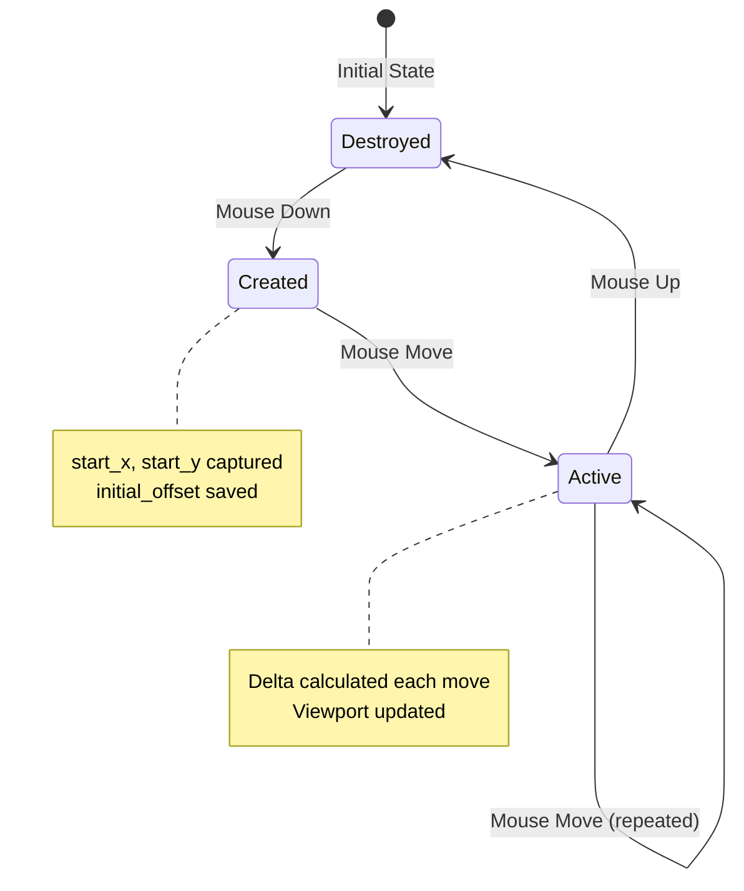
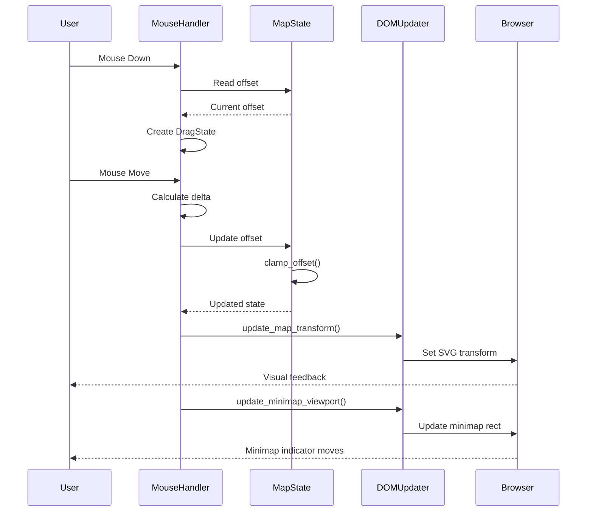

# Component Details

This page provides implementation details for the core components of RTS Monitor, including code structure, data flow, and technical specifications.

## Overview

RTS Monitor consists of three primary component layers:
1. **State Components** - Data structures managing application state
2. **Event Components** - Event handlers processing user input
3. **UI Components** - Visual elements and DOM manipulation

```mermaid
graph TD
    subgraph State Layer
        MapState[MapState]
        DragState[DragState]
    end

    subgraph Event Layer
        Mouse[Mouse Handlers]
        Keyboard[Keyboard Handlers]
        Minimap[Minimap Handlers]
    end

    subgraph UI Layer
        MainMap[Main Map SVG]
        MinimapUI[Minimap SVG]
        Panels[UI Panels]
    end

    Event Layer --> State Layer
    State Layer --> UI Layer

    style State Layer fill:#ffcccc
    style Event Layer fill:#ccccff
    style UI Layer fill:#ccffcc
```

---

## State Components

### 1. MapState

**Location**: `src/lib.rs:45-65`

#### Structure

```rust
struct MapState {
    offset_x: f64,
    offset_y: f64,
    viewport_width: f64,
    viewport_height: f64,
    world_width: f64,
    world_height: f64,
}
```

#### Responsibilities

- **Viewport Position**: Track current view offset in world coordinates
- **Viewport Dimensions**: Store visible area size
- **World Boundaries**: Define total navigable area
- **Boundary Enforcement**: Clamp viewport within world bounds

#### Methods

##### `new() -> Self`

Creates a new MapState with default values.

**Implementation**:
```rust
fn new() -> Self {
    MapState {
        offset_x: 0.0,
        offset_y: 0.0,
        viewport_width: 800.0,
        viewport_height: 600.0,
        world_width: 3000.0,
        world_height: 3000.0,
    }
}
```

**Complexity**: O(1)

##### `clamp_offset(&mut self)`

Ensures viewport offset stays within valid bounds.

**Implementation**:
```rust
fn clamp_offset(&mut self) {
    let max_x = self.world_width - self.viewport_width;
    let max_y = self.world_height - self.viewport_height;

    self.offset_x = self.offset_x.max(0.0).min(max_x);
    self.offset_y = self.offset_y.max(0.0).min(max_y);
}
```

**Valid Ranges**:
- `offset_x`: [0, 2200] (3000 - 800)
- `offset_y`: [0, 2400] (3000 - 600)

**Complexity**: O(1)

##### `pan(&mut self, delta_x: f64, delta_y: f64)`

Moves viewport by specified delta with automatic clamping.

**Implementation**:
```rust
fn pan(&mut self, delta_x: f64, delta_y: f64) {
    self.offset_x += delta_x;
    self.offset_y += delta_y;
    self.clamp_offset();
}
```

**Complexity**: O(1)

#### Thread-Local Storage

```rust
thread_local! {
    static MAP_STATE: RefCell<Option<MapState>> = RefCell::new(None);
}
```

**Access Pattern**:
```rust
MAP_STATE.with(|state| {
    if let Some(map_state) = state.borrow_mut().as_mut() {
        map_state.pan(50.0, 0.0);
    }
});
```

---

### 2. DragState

**Location**: `src/lib.rs:67-85`

#### Structure

```rust
struct DragState {
    start_x: f64,
    start_y: f64,
    initial_offset_x: f64,
    initial_offset_y: f64,
}
```

#### Responsibilities

- **Drag Initiation**: Capture mouse position when drag starts
- **Offset Snapshot**: Store viewport offset at drag start
- **Delta Calculation**: Enable computation of movement delta
- **Drag Lifecycle**: Exist only during active drag operation

#### Lifecycle



#### Thread-Local Storage

```rust
thread_local! {
    static DRAG_STATE: RefCell<Option<DragState>> = RefCell::new(None);
}
```

**Creation**:
```rust
DRAG_STATE.with(|drag| {
    *drag.borrow_mut() = Some(DragState {
        start_x: x,
        start_y: y,
        initial_offset_x: map_state.offset_x,
        initial_offset_y: map_state.offset_y,
    });
});
```

**Destruction**:
```rust
DRAG_STATE.with(|drag| {
    *drag.borrow_mut() = None;
});
```

---

## Event Components

### 1. Mouse Event Handlers

**Location**: `src/lib.rs:120-195`

#### on_mouse_down(x: f64, y: f64)

**Purpose**: Initiate drag operation

**Implementation**:
```rust
#[wasm_bindgen]
pub fn on_mouse_down(x: f64, y: f64) {
    MAP_STATE.with(|map| {
        if let Some(map_state) = map.borrow().as_ref() {
            DRAG_STATE.with(|drag| {
                *drag.borrow_mut() = Some(DragState {
                    start_x: x,
                    start_y: y,
                    initial_offset_x: map_state.offset_x,
                    initial_offset_y: map_state.offset_y,
                });
            });

            // Update cursor
            if let Some(container) = get_element_by_id("map-container") {
                set_cursor(container, "grabbing");
            }
        }
    });
}
```

**Parameters**:
- `x`: Mouse X position relative to map container
- `y`: Mouse Y position relative to map container

**Side Effects**:
- Creates `DRAG_STATE`
- Changes cursor to `grabbing`

---

#### on_mouse_move(x: f64, y: f64)

**Purpose**: Update viewport during drag

**Implementation**:
```rust
#[wasm_bindgen]
pub fn on_mouse_move(x: f64, y: f64) {
    DRAG_STATE.with(|drag| {
        if let Some(drag_state) = drag.borrow().as_ref() {
            let delta_x = x - drag_state.start_x;
            let delta_y = y - drag_state.start_y;

            MAP_STATE.with(|map| {
                if let Some(map_state) = map.borrow_mut().as_mut() {
                    // Inverted delta for natural drag feel
                    map_state.offset_x = drag_state.initial_offset_x - delta_x;
                    map_state.offset_y = drag_state.initial_offset_y - delta_y;
                    map_state.clamp_offset();

                    update_map_transform();
                    update_minimap_viewport();

                    console::log_1(
                        &format!("Viewport: ({:.0}, {:.0})",
                            map_state.offset_x,
                            map_state.offset_y
                        ).into()
                    );
                }
            });
        }
    });
}
```

**Parameters**:
- `x`: Current mouse X position
- `y`: Current mouse Y position

**Delta Calculation**:
```
delta_x = current_x - start_x
delta_y = current_y - start_y

new_offset_x = initial_offset_x - delta_x  // Inverted!
new_offset_y = initial_offset_y - delta_y  // Inverted!
```

**Side Effects**:
- Updates `MAP_STATE.offset_x`, `MAP_STATE.offset_y`
- Updates SVG transform
- Updates minimap viewport indicator
- Logs to console

**Performance**: Called 60+ times per second during drag

---

#### on_mouse_up()

**Purpose**: End drag operation

**Implementation**:
```rust
#[wasm_bindgen]
pub fn on_mouse_up() {
    DRAG_STATE.with(|drag| {
        *drag.borrow_mut() = None;
    });

    if let Some(container) = get_element_by_id("map-container") {
        set_cursor(container, "grab");
    }
}
```

**Side Effects**:
- Destroys `DRAG_STATE`
- Resets cursor to `grab`

---

### 2. Keyboard Event Handler

**Location**: `src/lib.rs:197-230`

#### on_key_down(key: String)

**Purpose**: Handle keyboard navigation

**Implementation**:
```rust
#[wasm_bindgen]
pub fn on_key_down(key: String) {
    MAP_STATE.with(|state| {
        if let Some(map_state) = state.borrow_mut().as_mut() {
            const PAN_AMOUNT: f64 = 50.0;

            match key.as_str() {
                "ArrowUp" | "w" | "W" => {
                    map_state.pan(0.0, -PAN_AMOUNT);
                    console::log_1(&"Panned up".into());
                }
                "ArrowDown" | "s" | "S" => {
                    map_state.pan(0.0, PAN_AMOUNT);
                    console::log_1(&"Panned down".into());
                }
                "ArrowLeft" | "a" | "A" => {
                    map_state.pan(-PAN_AMOUNT, 0.0);
                    console::log_1(&"Panned left".into());
                }
                "ArrowRight" | "d" | "D" => {
                    map_state.pan(PAN_AMOUNT, 0.0);
                    console::log_1(&"Panned right".into());
                }
                _ => {} // Ignore other keys
            }

            update_map_transform();
            update_minimap_viewport();
        }
    });
}
```

**Key Mapping**:

| Key | Delta X | Delta Y | Direction |
|-----|---------|---------|-----------|
| `ArrowUp`, `W` | 0 | -50 | Up |
| `ArrowDown`, `S` | 0 | +50 | Down |
| `ArrowLeft`, `A` | -50 | 0 | Left |
| `ArrowRight`, `D` | +50 | 0 | Right |

**Side Effects**:
- Updates `MAP_STATE` offset
- Updates DOM
- Logs to console

---

### 3. Minimap Event Handler

**Location**: `src/lib.rs:232-260`

#### minimap_click(minimap_x: f64, minimap_y: f64)

**Purpose**: Center viewport on clicked minimap position

**Implementation**:
```rust
#[wasm_bindgen]
pub fn minimap_click(minimap_x: f64, minimap_y: f64) {
    MAP_STATE.with(|state| {
        if let Some(map_state) = state.borrow_mut().as_mut() {
            // Scale minimap coordinates to world coordinates
            const MINIMAP_SIZE: f64 = 200.0;
            const WORLD_SIZE: f64 = 3000.0;
            let scale = WORLD_SIZE / MINIMAP_SIZE;  // 15.0

            let world_x = minimap_x * scale;
            let world_y = minimap_y * scale;

            // Center viewport on clicked position
            map_state.offset_x = world_x - map_state.viewport_width / 2.0;
            map_state.offset_y = world_y - map_state.viewport_height / 2.0;
            map_state.clamp_offset();

            update_map_transform();
            update_minimap_viewport();

            console::log_1(
                &format!("Centered on ({:.0}, {:.0})", world_x, world_y).into()
            );
        }
    });
}
```

**Coordinate Transformation**:
```
scale = 3000 / 200 = 15.0
world_x = minimap_x * 15.0
world_y = minimap_y * 15.0

centered_offset_x = world_x - 400
centered_offset_y = world_y - 300
```

**Side Effects**:
- Updates `MAP_STATE` offset
- Centers viewport on clicked point
- Updates DOM
- Logs to console

---

## DOM Update Components

### 1. update_map_transform()

**Location**: `src/lib.rs:262-280`

**Purpose**: Apply viewport offset to SVG transform

**Implementation**:
```rust
fn update_map_transform() {
    MAP_STATE.with(|state| {
        if let Some(map_state) = state.borrow().as_ref() {
            let document = web_sys::window().unwrap().document().unwrap();

            if let Some(element) = document.get_element_by_id("map-content") {
                let transform = format!(
                    "translate({}, {})",
                    -map_state.offset_x,
                    -map_state.offset_y
                );

                element.set_attribute("transform", &transform).ok();
            }
        }
    });
}
```

**Transform Format**:
```
translate(-offset_x, -offset_y)
```

**Why Negative?**
- Positive offset = viewport moves right/down
- SVG content moves left/up (negative translate)
- Creates natural panning effect

**Performance**: Direct attribute update, ~1ms

---

### 2. update_minimap_viewport()

**Location**: `src/lib.rs:282-305`

**Purpose**: Update minimap viewport indicator rectangle

**Implementation**:
```rust
fn update_minimap_viewport() {
    MAP_STATE.with(|state| {
        if let Some(map_state) = state.borrow().as_ref() {
            let document = web_sys::window().unwrap().document().unwrap();

            if let Some(rect) = document.get_element_by_id("viewport-rect") {
                let scale = 200.0 / 3000.0;  // 0.0667

                let mini_x = map_state.offset_x * scale;
                let mini_y = map_state.offset_y * scale;
                let mini_w = map_state.viewport_width * scale;
                let mini_h = map_state.viewport_height * scale;

                rect.set_attribute("x", &mini_x.to_string()).ok();
                rect.set_attribute("y", &mini_y.to_string()).ok();
                rect.set_attribute("width", &mini_w.to_string()).ok();
                rect.set_attribute("height", &mini_h.to_string()).ok();
            }
        }
    });
}
```

**Scaling**:
```
scale = minimap_size / world_size = 200 / 3000 ≈ 0.0667
mini_x = world_offset_x * 0.0667
mini_width = viewport_width * 0.0667
```

**Performance**: Four attribute updates, ~2ms total

---

## Helper Components

### 1. Distance Calculation

**Location**: `src/lib.rs:350-355`

**Purpose**: Calculate Euclidean distance between two points

**Implementation**:
```rust
fn distance(x1: f64, y1: f64, x2: f64, y2: f64) -> f64 {
    let dx = x2 - x1;
    let dy = y2 - y1;
    (dx * dx + dy * dy).sqrt()
}
```

**Formula**: `√((x₂-x₁)² + (y₂-y₁)²)`

**Usage**: Click detection, proximity checks

**Complexity**: O(1)

---

### 2. Message Formatting

**Location**: `src/lib.rs:357-370`

**Purpose**: Format status messages for console

**Implementation**:
```rust
fn format_message(prefix: &str, content: &str) -> String {
    format!("[RTS Monitor] {}: {}", prefix, content)
}
```

**Example Output**:
```
[RTS Monitor] Info: Map initialized
[RTS Monitor] Debug: Viewport (500, 300)
```

---

## Component Interaction Diagram



---

## Component Dependencies

```mermaid
graph TD
    InitMap[initialize_map] --> CreateMapState[Create MapState]

    MouseDown[on_mouse_down] --> ReadMapState[Read MapState]
    MouseDown --> CreateDragState[Create DragState]

    MouseMove[on_mouse_move] --> ReadDragState[Read DragState]
    MouseMove --> UpdateMapState[Update MapState]
    MouseMove --> UpdateTransform[update_map_transform]
    MouseMove --> UpdateMinimap[update_minimap_viewport]

    MouseUp[on_mouse_up] --> DestroyDragState[Destroy DragState]

    KeyDown[on_key_down] --> PanMapState[Pan MapState]
    KeyDown --> UpdateTransform
    KeyDown --> UpdateMinimap

    MinimapClick[minimap_click] --> CenterMapState[Center MapState]
    MinimapClick --> UpdateTransform
    MinimapClick --> UpdateMinimap

    style CreateMapState fill:#ffcccc
    style UpdateMapState fill:#ffcccc
    style UpdateTransform fill:#99ff99
```



---

## Memory Layout

### State Size

| Component | Size | Lifetime |
|-----------|------|----------|
| `MapState` | 48 bytes | Program lifetime |
| `DragState` | 32 bytes | Drag duration only |
| Total State | ≤ 80 bytes | Minimal overhead |

### Performance Characteristics

| Operation | Time Complexity | Space Complexity |
|-----------|----------------|------------------|
| State creation | O(1) | O(1) |
| State update | O(1) | O(1) |
| DOM update | O(1) | O(1) |
| Event handling | O(1) | O(1) |

---

## Related Pages

- [[State Management]] - State management patterns
- [[Event Handling]] - Event processing details
- [[UI Components]] - UI component structure
- [[Architecture Overview]] - System architecture

---

*Last Updated: 2025-11-18*
