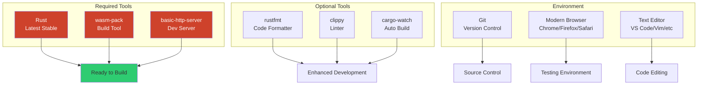
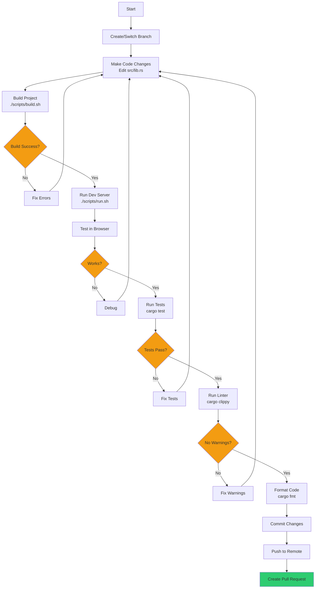
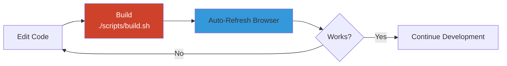
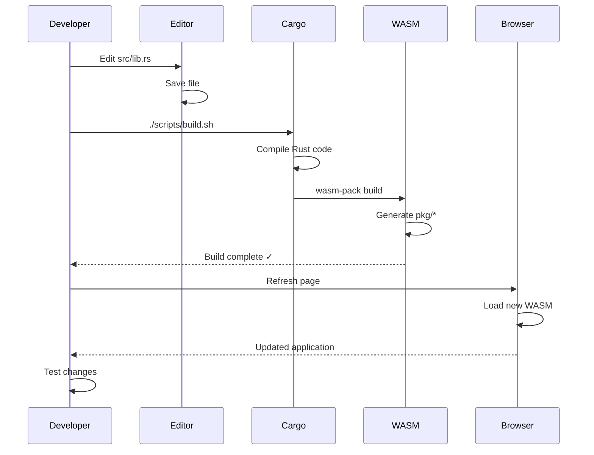
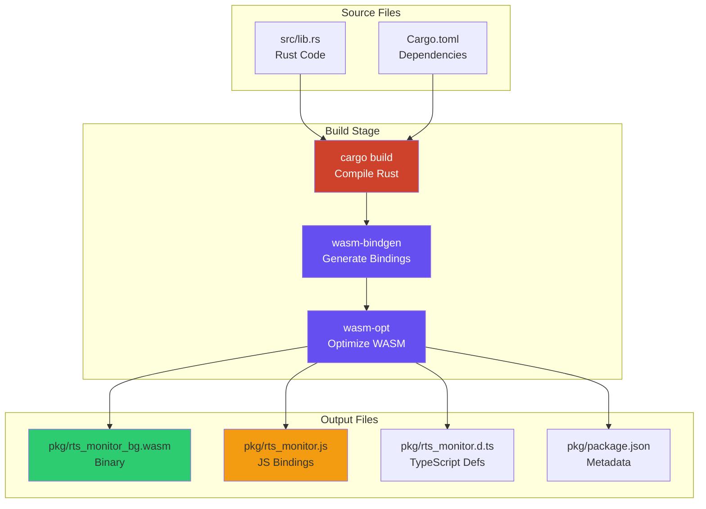
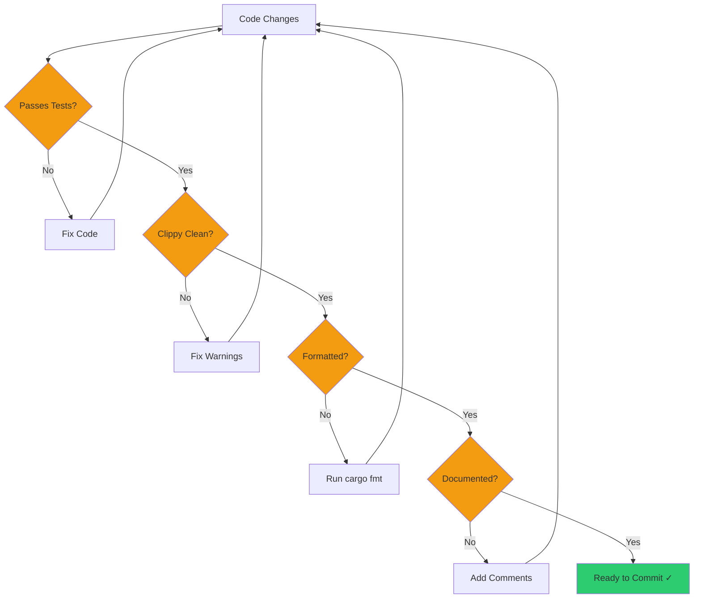
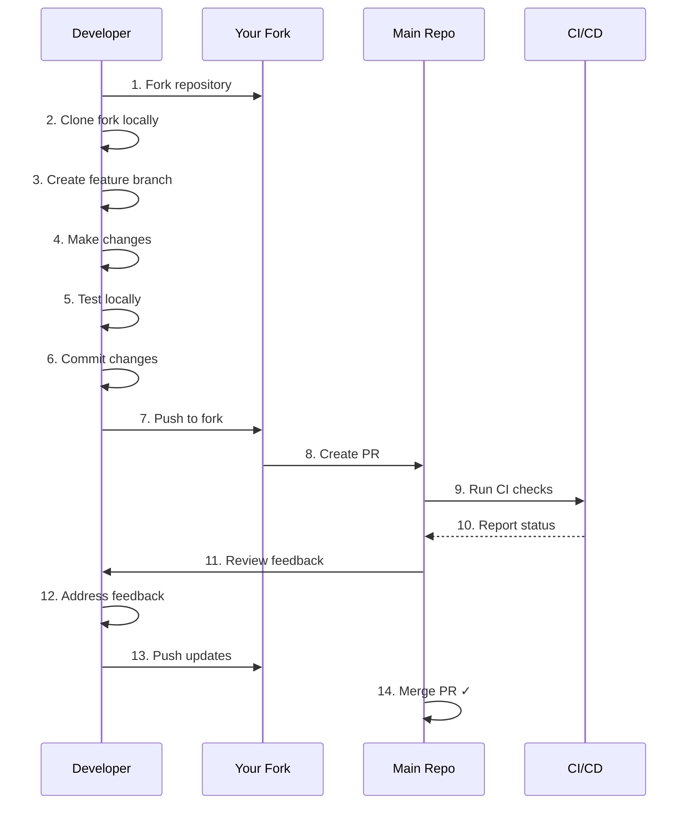
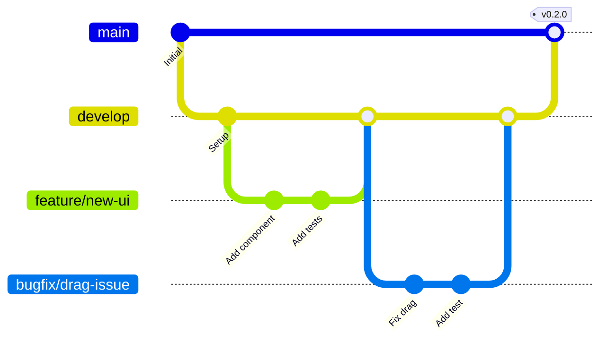
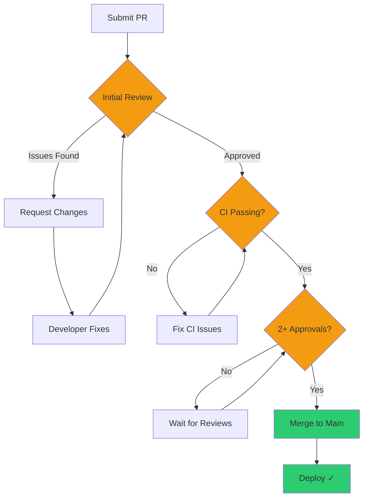

# Development Guide

This guide provides comprehensive information for developers working on RTS Monitor, including setup, workflow, testing, and contribution guidelines.

## Table of Contents

- [Getting Started](#getting-started)
- [Development Workflow](#development-workflow)
- [Build Process](#build-process)
- [Testing Strategy](#testing-strategy)
- [Code Quality](#code-quality)
- [Contributing Guidelines](#contributing-guidelines)
- [Troubleshooting](#troubleshooting)

## Getting Started

### Prerequisites



### Installation Steps

#### 1. Install Rust

```bash
# Install Rust via rustup
curl --proto '=https' --tlsv1.2 -sSf https://sh.rustup.rs | sh

# Update to latest stable
rustup update stable

# Verify installation
rustc --version
cargo --version
```

#### 2. Install wasm-pack

```bash
# Install wasm-pack
cargo install wasm-pack

# Verify installation
wasm-pack --version
```

#### 3. Install basic-http-server

```bash
# Install development server
cargo install basic-http-server

# Verify installation
basic-http-server --version
```

#### 4. Install Optional Tools

```bash
# Code formatter
rustup component add rustfmt

# Linter
rustup component add clippy

# Auto-build on file changes (optional)
cargo install cargo-watch
```

### Clone and Setup

```bash
# Clone the repository
git clone https://github.com/yourusername/rts_monitor.git
cd rts_monitor

# Build the project
./scripts/build.sh

# Run the development server
./scripts/run.sh
```

## Development Workflow

### Standard Development Cycle



### Quick Iteration Loop

For rapid development, use this shortened cycle:



**Fast Iteration Commands:**

```bash
# Terminal 1: Auto-build on changes
cargo watch -s './scripts/build.sh'

# Terminal 2: Development server (once)
./scripts/run.sh

# Edit code -> Auto-build -> Refresh browser -> Test
```

### File Change Workflow



## Build Process

### Build Pipeline



### Build Commands

#### Standard Build

```bash
# Full build
./scripts/build.sh

# Equivalent to:
wasm-pack build --target web --out-dir pkg
```

#### Manual Build Steps

```bash
# 1. Build Rust to WASM
cargo build --target wasm32-unknown-unknown --release

# 2. Generate bindings
wasm-bindgen target/wasm32-unknown-unknown/release/rts_monitor.wasm \
  --out-dir pkg \
  --target web

# 3. (Optional) Optimize WASM
wasm-opt pkg/rts_monitor_bg.wasm -O3 -o pkg/rts_monitor_bg.wasm
```

#### Development vs. Production

```bash
# Development build (faster, larger, with debug info)
wasm-pack build --target web --dev

# Production build (slower, smaller, optimized)
wasm-pack build --target web --release
```

### Build Artifacts

```
pkg/
├── rts_monitor_bg.wasm       # WebAssembly binary (~100KB)
├── rts_monitor_bg.wasm.d.ts  # TypeScript definitions
├── rts_monitor.d.ts          # TypeScript module defs
├── rts_monitor.js            # JavaScript bindings
├── package.json              # NPM package metadata
└── .gitignore                # Ignore patterns
```

## Testing Strategy

### Test Architecture

```mermaid
graph TB
    subgraph "Test Categories"
        A[Unit Tests<br/>Rust Functions]
        B[Integration Tests<br/>Component Interaction]
        C[Browser Tests<br/>Manual Testing]
    end

    subgraph "Test Implementation"
        D[#[cfg test]<br/>Test Modules]
        E[Test Functions<br/>#[test]]
        F[Test Utilities<br/>Helpers]
    end

    subgraph "Validation"
        G[Cargo Test<br/>Run All Tests]
        H[Coverage Report<br/>Code Coverage]
        I[Browser DevTools<br/>Manual Checks]
    end

    A --> D
    B --> D
    D --> E
    E --> F
    E --> G
    G --> H
    C --> I

    style G fill:#2ecc71
    style H fill:#3498db
```

### Current Test Suite

The project includes **10 comprehensive tests** covering core functionality:

#### Coordinate Transformation Tests

```rust
#[cfg(test)]
mod tests {
    use super::*;

    #[test]
    fn test_screen_to_world_coords() {
        let (wx, wy) = screen_to_world_coords(
            100.0, 75.0,   // screen coords
            200.0, 150.0,  // screen dimensions
            2000.0, 1500.0 // world dimensions
        );
        assert_eq!(wx, 1000.0);
        assert_eq!(wy, 750.0);
    }

    #[test]
    fn test_center_viewport() {
        let (x, y) = center_viewport(
            1000.0, 750.0,  // world target
            800.0, 600.0    // viewport dimensions
        );
        assert_eq!(x, 600.0);  // 1000 - 400
        assert_eq!(y, 450.0);  // 750 - 300
    }
}
```

### Running Tests

```bash
# Run all tests
cargo test

# Run with output
cargo test -- --nocapture

# Run specific test
cargo test test_screen_to_world_coords

# Run tests with coverage (requires cargo-tarpaulin)
cargo install cargo-tarpaulin
cargo tarpaulin --out Html
```

### Test Coverage

Current coverage areas:

| Component | Test Coverage | Status |
|-----------|--------------|---------|
| Coordinate Transform | ✅ Complete | 6 tests |
| Viewport Centering | ✅ Complete | 2 tests |
| Bounds Clamping | ✅ Complete | 2 tests |
| Event Handlers | ⚠️ Manual | Browser testing |
| DOM Manipulation | ⚠️ Manual | Browser testing |
| State Management | 🔲 Pending | Future work |

### Writing New Tests

```rust
#[cfg(test)]
mod tests {
    use super::*;

    #[test]
    fn test_your_function() {
        // Arrange
        let input = some_value;

        // Act
        let result = your_function(input);

        // Assert
        assert_eq!(result, expected_value);
    }
}
```

## Code Quality

### Quality Checklist



### Linting with Clippy

```bash
# Run clippy
cargo clippy

# Run clippy with all features
cargo clippy -- -D warnings

# Auto-fix some issues
cargo clippy --fix

# Specific lint levels
cargo clippy -- -W clippy::all -W clippy::pedantic
```

**Common Clippy Warnings:**

- Unnecessary clones
- Inefficient string operations
- Missing error handling
- Unused variables
- Complex expressions

### Code Formatting

```bash
# Format all code
cargo fmt

# Check formatting without changing
cargo fmt -- --check

# Format specific file
rustfmt src/lib.rs
```

**Style Guidelines:**

- **Indentation**: 4 spaces
- **Line Length**: 100 characters max
- **Naming**: snake_case for functions/variables, PascalCase for types
- **Comments**: Use `//` for line comments, `///` for documentation

### Documentation Standards

```rust
/// Converts screen coordinates to world coordinates.
///
/// # Arguments
///
/// * `screen_x` - X coordinate in screen space
/// * `screen_y` - Y coordinate in screen space
/// * `screen_width` - Width of screen viewport
/// * `screen_height` - Height of screen viewport
/// * `world_width` - Width of world space
/// * `world_height` - Height of world space
///
/// # Returns
///
/// Tuple of (world_x, world_y) coordinates
///
/// # Example
///
/// ```
/// let (wx, wy) = screen_to_world_coords(100.0, 75.0, 200.0, 150.0, 2000.0, 1500.0);
/// ```
pub fn screen_to_world_coords(
    screen_x: f64, screen_y: f64,
    screen_width: f64, screen_height: f64,
    world_width: f64, world_height: f64
) -> (f64, f64) {
    // Implementation
}
```

## Contributing Guidelines

### Contribution Workflow



### Branch Strategy



**Branch Naming:**

- `feature/description` - New features
- `bugfix/description` - Bug fixes
- `refactor/description` - Code refactoring
- `docs/description` - Documentation updates
- `test/description` - Test additions

### Commit Message Format

```
<type>(<scope>): <subject>

<body>

<footer>
```

**Types:**

- `feat`: New feature
- `fix`: Bug fix
- `docs`: Documentation
- `style`: Formatting
- `refactor`: Code restructuring
- `test`: Adding tests
- `chore`: Maintenance

**Examples:**

```
feat(interaction): Add zoom functionality to map

Implemented zoom in/out using mouse wheel events.
Added zoom level indicator to UI.

Closes #42
```

```
fix(drag): Prevent drag state persisting after mouse up

DragState was not being reset when mouse up occurred
outside the map area. Added global mouse up listener.

Fixes #38
```

### Pull Request Checklist

- [ ] Tests pass (`cargo test`)
- [ ] No clippy warnings (`cargo clippy`)
- [ ] Code formatted (`cargo fmt`)
- [ ] Documentation updated
- [ ] CHANGELOG.md updated
- [ ] Commit messages follow convention
- [ ] PR description explains changes
- [ ] No merge conflicts

### Code Review Process



## Troubleshooting

### Common Issues

#### Build Failures

**Problem**: `wasm-pack` not found

```bash
# Solution: Install wasm-pack
cargo install wasm-pack
```

**Problem**: Compilation errors after dependency update

```bash
# Solution: Clean and rebuild
cargo clean
./scripts/build.sh
```

#### Runtime Issues

**Problem**: WASM not loading in browser

```bash
# Check browser console for errors
# Ensure you're serving via HTTP, not file://
./scripts/run.sh
```

**Problem**: Changes not appearing

```bash
# Rebuild and hard refresh
./scripts/build.sh
# In browser: Ctrl+Shift+R (or Cmd+Shift+R on Mac)
```

#### Development Server Issues

**Problem**: Port 4000 already in use

```bash
# Find process using port
lsof -i :4000

# Kill process or use different port
basic-http-server . -a 127.0.0.1:8080
```

### Debug Techniques

#### Console Logging

```rust
use web_sys::console;

// Log strings
console::log_1(&"Debug message".into());

// Log variables
console::log_2(&"Value:".into(), &value.to_string().into());

// Log errors
console::error_1(&"Error occurred!".into());
```

#### Browser DevTools

1. **Console Tab**: View `console::log` output
2. **Network Tab**: Check WASM file loading
3. **Sources Tab**: Debug JavaScript bindings
4. **Performance Tab**: Profile execution

#### Rust Debugging

```bash
# Build with debug symbols
wasm-pack build --target web --dev

# Use browser debugger on generated JS
# Set breakpoints in pkg/rts_monitor.js
```

## Project Structure Reference

```
rts_monitor/
├── src/
│   └── lib.rs              # Main Rust source (543 lines)
│                           # All application logic here
│
├── scripts/
│   ├── build.sh            # Build automation
│   └── run.sh              # Dev server launcher
│
├── index.html              # UI structure + CSS + JS init
│
├── pkg/                    # Build output (auto-generated)
│   ├── *.wasm             # WebAssembly binary
│   └── *.js               # JavaScript bindings
│
├── Cargo.toml              # Rust dependencies
├── Cargo.lock              # Locked dependencies
├── CLAUDE.md               # Development guidance
├── LICENSE                 # MIT License
└── README.md               # Project overview
```

## Quick Reference

### Essential Commands

| Task | Command |
|------|---------|
| Build | `./scripts/build.sh` |
| Run | `./scripts/run.sh` |
| Test | `cargo test` |
| Lint | `cargo clippy` |
| Format | `cargo fmt` |
| Clean | `cargo clean` |
| Auto-build | `cargo watch -s './scripts/build.sh'` |

### Development URLs

- **Local Dev**: http://localhost:4000/
- **Repository**: https://github.com/yourusername/rts_monitor
- **Issues**: https://github.com/yourusername/rts_monitor/issues
- **Docs**: https://github.com/yourusername/rts_monitor/wiki

## Related Pages

- [Architecture](Architecture.md) - System architecture overview
- [Technology Stack](Technology-Stack.md) - Technologies used
- [UI Components](UI-Components.md) - UI component details
- [Interaction Model](Interaction-Model.md) - Event handling
- [Home](Home.md) - Return to wiki home
