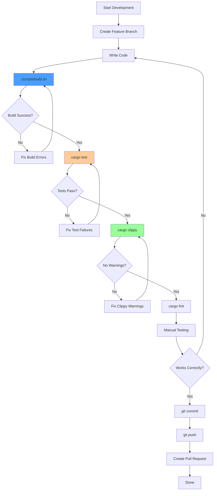

# Development Guide

This page provides comprehensive guidance for developers working on RTS Monitor, including setup, workflow, coding standards, and best practices.

## Quick Start

### Prerequisites

1. **Rust** (latest stable)
   ```bash
   curl --proto '=https' --tlsv1.2 -sSf https://sh.rustup.rs | sh
   ```

2. **wasm-pack**
   ```bash
   cargo install wasm-pack
   ```

3. **basic-http-server** (optional, for development)
   ```bash
   cargo install basic-http-server
   ```

### Clone and Build

```bash
# Clone repository
git clone https://github.com/yourusername/rts_monitor.git
cd rts_monitor

# Build the project
./scripts/build.sh

# Run development server
./scripts/run.sh
```

The development server will open http://localhost:4000/ automatically.

---

## Project Structure

```
rts_monitor/
├── src/
│   └── lib.rs              # Main WASM module (543 lines)
│                          # ALL Rust code is here
├── docs/
│   ├── overview.md         # Project overview
│   └── images/             # Documentation images
├── scripts/
│   ├── build.sh            # Build automation
│   └── run.sh              # Dev server startup
├── wiki/                   # GitHub Wiki source files
│   ├── Home.md
│   ├── Architecture-Overview.md
│   └── ...
├── pkg/                    # Generated WASM output (git-ignored)
│   ├── rts_monitor_bg.wasm
│   ├── rts_monitor.js
│   └── ...
├── index.html              # Complete UI with inline CSS/JS
├── Cargo.toml              # Rust dependencies
├── Cargo.lock              # Dependency lock file
├── CLAUDE.md               # AI assistant guidance
├── README.md               # Project documentation
├── LICENSE                 # MIT License
└── .gitignore
```

---

## Development Workflow



### Step-by-Step

1. **Create Feature Branch**
   ```bash
   git checkout -b feature/my-new-feature
   ```

2. **Make Changes**
   - Edit `src/lib.rs` for Rust logic
   - Edit `index.html` for UI changes
   - Add tests for new functionality

3. **Build**
   ```bash
   ./scripts/build.sh
   ```

4. **Test**
   ```bash
   cargo test
   ```

5. **Lint**
   ```bash
   cargo clippy
   ```

6. **Format**
   ```bash
   cargo fmt
   ```

7. **Manual Testing**
   ```bash
   ./scripts/run.sh
   ```
   - Test in browser
   - Check console for errors
   - Verify interactions work

8. **Commit**
   ```bash
   git add .
   git commit -m "Add feature: description"
   ```

9. **Push**
   ```bash
   git push origin feature/my-new-feature
   ```

10. **Create Pull Request**

---

## Coding Standards

### Rust Code Style

#### 1. Naming Conventions

| Item | Convention | Example |
|------|-----------|---------|
| Functions | `snake_case` | `initialize_map()` |
| Variables | `snake_case` | `offset_x` |
| Structs | `PascalCase` | `MapState` |
| Constants | `SCREAMING_SNAKE_CASE` | `PAN_AMOUNT` |
| Type Parameters | `PascalCase` | `T`, `MapState` |

#### 2. Function Documentation

Use doc comments for public functions:

```rust
/// Initializes the map state with default viewport settings.
///
/// This function should be called once when the WASM module loads.
/// It creates a new MapState with:
/// - Viewport: 800x600 pixels
/// - World: 3000x3000 pixels
/// - Initial offset: (0, 0)
#[wasm_bindgen]
pub fn initialize_map() {
    MAP_STATE.with(|state| {
        *state.borrow_mut() = Some(MapState::new());
    });
}
```

#### 3. Error Handling

Use `Option` and `Result` types:

```rust
// Good: Handle potential None
if let Some(element) = document().get_element_by_id("map-content") {
    element.set_attribute("transform", &transform).ok();
}

// Bad: Unwrap without checking
document().get_element_by_id("map-content").unwrap();
```

#### 4. Code Organization

**Order of items in `src/lib.rs`**:
1. Imports (`use` statements)
2. Constants
3. Struct definitions
4. Struct implementations
5. Thread-local statics
6. Public functions (`#[wasm_bindgen]`)
7. Private helper functions
8. Tests (`#[cfg(test)]`)

#### 5. Formatting Rules

- **Line length**: Max 100 characters
- **Indentation**: 4 spaces (no tabs)
- **Braces**: Same line for functions, structs
- **Imports**: Grouped and sorted

**Use `cargo fmt` to auto-format!**

---

### HTML/CSS Style

#### 1. Inline Styles

All CSS must be inline in `index.html`:

```html
<style>
    body {
        margin: 0;
        padding: 0;
        background: #000;
        color: #00ff00;
        font-family: 'Courier New', monospace;
    }
</style>
```

#### 2. Semantic HTML

Use semantic elements where appropriate:

```html
<!-- Good -->
<div class="panel">
    <h3>Resource Panel</h3>
    <p>CPU: 45%</p>
</div>

<!-- Avoid excessive nesting -->
```

#### 3. Retro Terminal Theme

**Color Palette**:
```css
--bg-color: #000000;          /* Black background */
--primary-color: #00ff00;     /* Bright green text */
--secondary-color: #66cc66;   /* Medium green */
--border-color: #003300;      /* Dark green borders */
--highlight-color: #00ffff;   /* Cyan highlights */
--warning-color: #ffff00;     /* Yellow warnings */
--error-color: #ff0000;       /* Red errors */
```

---

### JavaScript Style

Keep JavaScript minimal and focused:

#### 1. Module Imports

```javascript
import init, {
    initialize_map,
    on_mouse_down,
    on_mouse_move,
    on_mouse_up,
    on_key_down,
    minimap_click
} from './pkg/rts_monitor.js';
```

#### 2. Event Binding

Use modern event listeners:

```javascript
// Good: addEventListener
element.addEventListener('click', (e) => {
    window.minimap_click(e.clientX, e.clientY);
});

// Avoid: Inline event handlers (except for specific onclick attributes)
```

#### 3. Coordinate Conversion

Always convert to element-relative coordinates:

```javascript
const rect = element.getBoundingClientRect();
const x = event.clientX - rect.left;
const y = event.clientY - rect.top;
window.on_mouse_down(x, y);
```

---

## Adding New Features

### Example: Adding a Zoom Feature

#### 1. Define State

**src/lib.rs**:
```rust
struct MapState {
    offset_x: f64,
    offset_y: f64,
    viewport_width: f64,
    viewport_height: f64,
    world_width: f64,
    world_height: f64,
    zoom_level: f64,  // NEW: Add zoom level
}
```

#### 2. Implement Logic

```rust
#[wasm_bindgen]
pub fn on_wheel(delta_y: f64) {
    MAP_STATE.with(|state| {
        if let Some(map_state) = state.borrow_mut().as_mut() {
            // Zoom in/out based on wheel direction
            if delta_y < 0.0 {
                map_state.zoom_level *= 1.1;  // Zoom in
            } else {
                map_state.zoom_level *= 0.9;  // Zoom out
            }

            // Clamp zoom level
            map_state.zoom_level = map_state.zoom_level.max(0.5).min(2.0);

            update_map_transform();
            console::log_1(&format!("Zoom: {:.2}x", map_state.zoom_level).into());
        }
    });
}
```

#### 3. Update DOM

```rust
fn update_map_transform() {
    MAP_STATE.with(|state| {
        if let Some(map_state) = state.borrow().as_ref() {
            let transform = format!(
                "translate({}, {}) scale({})",
                -map_state.offset_x,
                -map_state.offset_y,
                map_state.zoom_level  // NEW: Add scale
            );
            // ... set attribute
        }
    });
}
```

#### 4. Bind Event

**index.html**:
```javascript
mapContainer.addEventListener('wheel', (e) => {
    e.preventDefault();
    window.on_wheel(e.deltaY);
});
```

#### 5. Add Tests

```rust
#[test]
fn test_zoom_clamp() {
    let mut state = MapState::new();

    state.zoom_level = 3.0;  // Too high
    assert_eq!(state.zoom_level.min(2.0), 2.0);

    state.zoom_level = 0.1;  // Too low
    assert_eq!(state.zoom_level.max(0.5), 0.5);
}
```

#### 6. Update Documentation

- Update [[State Management]] with new field
- Update [[Event Handling]] with new handler
- Update this Development Guide

---

## Testing Strategy

### Unit Tests

**Location**: `src/lib.rs` (bottom of file)

```rust
#[cfg(test)]
mod tests {
    use super::*;

    #[test]
    fn test_map_state_new() {
        let state = MapState::new();
        assert_eq!(state.offset_x, 0.0);
        assert_eq!(state.offset_y, 0.0);
        assert_eq!(state.viewport_width, 800.0);
        assert_eq!(state.viewport_height, 600.0);
    }
}
```

**Run Tests**:
```bash
cargo test
```

### Integration Tests

**Manual Testing Checklist**:

- [ ] Mouse drag pans viewport smoothly
- [ ] Keyboard navigation works (arrows + WASD)
- [ ] Minimap click centers viewport
- [ ] Viewport stays within world bounds
- [ ] Minimap viewport indicator updates
- [ ] Console messages display correctly
- [ ] No console errors in browser
- [ ] Works in Chrome, Firefox, Safari

### Test Coverage

| Component | Coverage | Test Type |
|-----------|----------|-----------|
| MapState | 100% | Unit tests |
| DragState | Manual | Interactive |
| Event Handlers | Manual | Interactive |
| Helper Functions | 100% | Unit tests |
| DOM Updates | Manual | Visual inspection |

**Goal**: 80%+ unit test coverage for logic, 100% manual testing for UI.

---

## Debugging

### Browser Console

**Enable Developer Tools**:
- Chrome: F12 or Cmd+Opt+I
- Firefox: F12 or Cmd+Opt+I
- Safari: Cmd+Opt+I (enable Developer menu first)

**Check for Errors**:
- Look for red error messages
- Check WASM initialization logs
- Monitor status messages from Rust

### Rust Console Logging

**Add debug logging**:
```rust
console::log_1(&format!("Debug: offset=({}, {})", offset_x, offset_y).into());
```

**Conditional logging**:
```rust
#[cfg(debug_assertions)]
console::log_1(&"Debug mode".into());
```

### Common Issues

#### 1. WASM Not Loading

**Symptom**: Blank page, no interactions
**Solution**:
- Check browser console for errors
- Verify `pkg/` directory exists
- Rebuild with `./scripts/build.sh`
- Check CORS (use HTTP server, not file://)

#### 2. Events Not Firing

**Symptom**: Clicks/keys don't work
**Solution**:
- Check event listeners in JavaScript
- Verify functions exported with `#[wasm_bindgen]`
- Check element IDs match HTML

#### 3. Map Not Moving

**Symptom**: Drag/keyboard don't pan
**Solution**:
- Check MapState initialization
- Verify `update_map_transform()` is called
- Check SVG transform attribute

---

## Performance Optimization

### Build Optimization

**Release Build**:
```bash
wasm-pack build --release --target web
```

**Cargo.toml optimizations**:
```toml
[profile.release]
opt-level = "s"     # Optimize for size
lto = true          # Link-time optimization
codegen-units = 1   # Better optimization
```

### Runtime Optimization

**Minimize DOM Updates**:
```rust
// Good: Update once after state change
map_state.pan(50.0, 0.0);
update_map_transform();

// Bad: Multiple updates
element.set_attribute("x", "50");
element.set_attribute("y", "0");
```

**Use Transform Instead of Attributes**:
```rust
// Fast: Single transform
set_attribute("transform", "translate(x, y)")

// Slow: Update individual elements
for element in elements {
    set_attribute("cx", x);
    set_attribute("cy", y);
}
```

---

## Continuous Integration

### Recommended CI Checks

```yaml
# Example: .github/workflows/ci.yml
name: CI

on: [push, pull_request]

jobs:
  test:
    runs-on: ubuntu-latest
    steps:
      - uses: actions/checkout@v2
      - uses: actions-rs/toolchain@v1
        with:
          toolchain: stable

      - name: Build
        run: cargo build --verbose

      - name: Run tests
        run: cargo test --verbose

      - name: Check formatting
        run: cargo fmt -- --check

      - name: Run clippy
        run: cargo clippy -- -D warnings

      - name: Build WASM
        run: |
          cargo install wasm-pack
          wasm-pack build --target web
```

---

## Contributing Guidelines

### Before Submitting PR

1. ✅ All tests pass (`cargo test`)
2. ✅ No clippy warnings (`cargo clippy`)
3. ✅ Code formatted (`cargo fmt`)
4. ✅ Manual testing complete
5. ✅ Documentation updated (if needed)
6. ✅ Commit messages descriptive

### Pull Request Template

```markdown
## Description
[Brief description of changes]

## Type of Change
- [ ] Bug fix
- [ ] New feature
- [ ] Refactoring
- [ ] Documentation update

## Testing
- [ ] Unit tests added/updated
- [ ] Manual testing completed
- [ ] All tests pass

## Checklist
- [ ] Code follows project style
- [ ] No clippy warnings
- [ ] Documentation updated
```

---

## Related Pages

- [[Architecture Overview]] - System architecture
- [[Technology Stack]] - Technologies used
- [[Build and Deploy]] - Build process details
- [[Testing Guide]] - Detailed testing strategy

---

*Last Updated: 2025-11-18*
