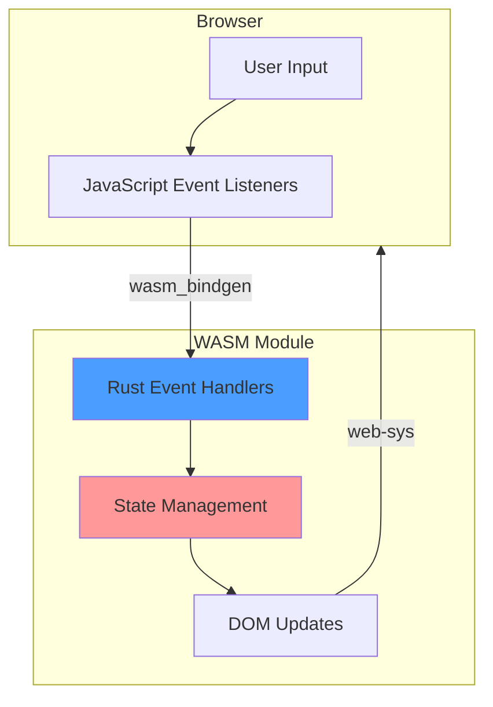
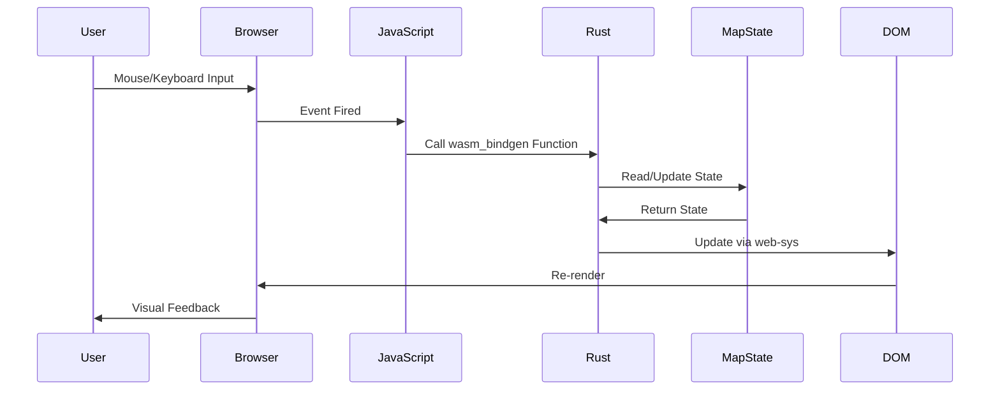
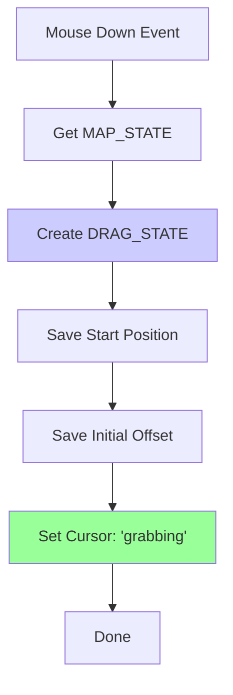
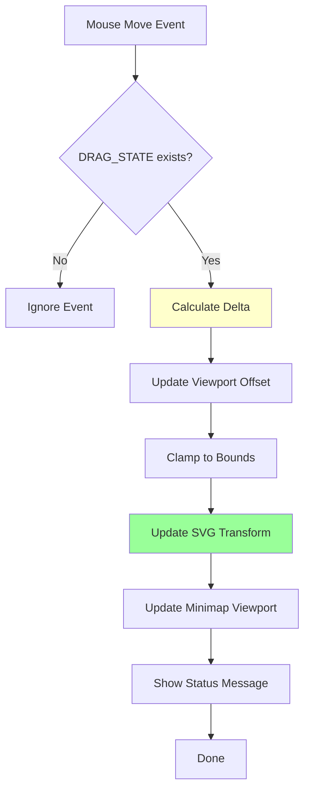
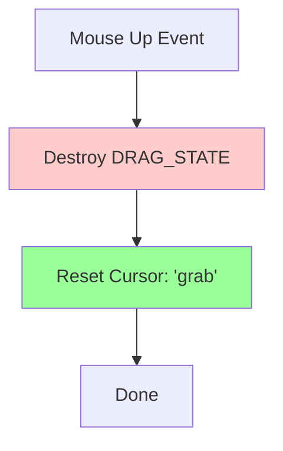
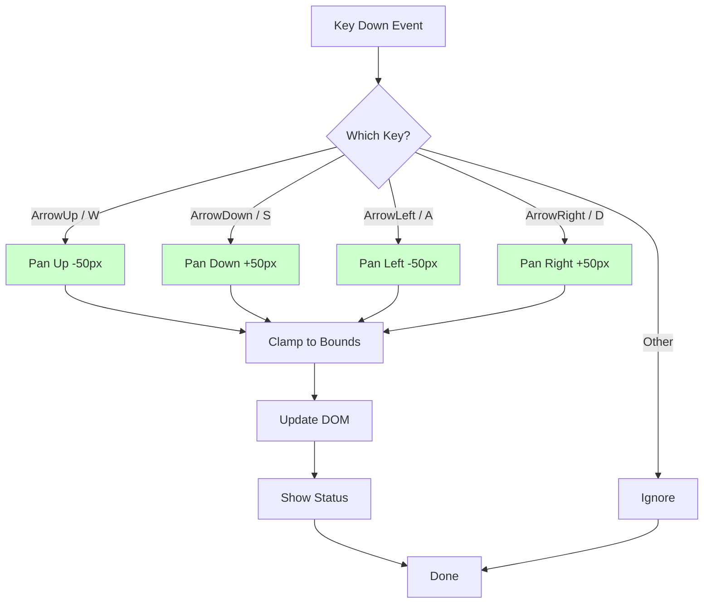
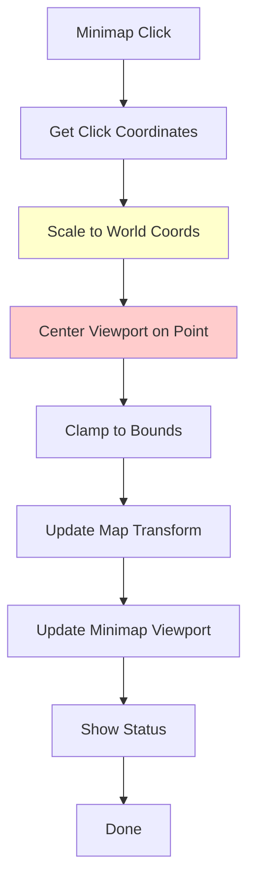

# Event Handling

This page describes how RTS Monitor processes user input through mouse, keyboard, and UI events, all handled in Rust via wasm-bindgen.

## Overview

All event handling logic resides in **Rust** code (`src/lib.rs`), exposed to JavaScript via `#[wasm_bindgen]` functions. JavaScript acts only as a thin event dispatcher, immediately delegating to Rust handlers.

## Event Architecture



## Event Categories

### 1. Mouse Events

**Supported Events**:
- `mousedown` - Start drag operation
- `mousemove` - Update drag position
- `mouseup` - End drag operation

**Handlers** (`src/lib.rs`):
- `on_mouse_down(x: f64, y: f64)`
- `on_mouse_move(x: f64, y: f64)`
- `on_mouse_up()`

---

### 2. Keyboard Events

**Supported Events**:
- `keydown` - Navigation and shortcuts

**Handlers** (`src/lib.rs`):
- `on_key_down(key: String)`

**Supported Keys**:
- Arrow keys: `ArrowUp`, `ArrowDown`, `ArrowLeft`, `ArrowRight`
- WASD: `w`, `a`, `s`, `d` (case-insensitive)

---

### 3. Click Events

**Supported Events**:
- Minimap click - Center viewport
- Server click - Select server (future)

**Handlers** (`src/lib.rs`):
- `minimap_click(click_x: f64, click_y: f64)`

---

### 4. Initialization Events

**Supported Events**:
- Page load - Initialize state

**Handlers** (`src/lib.rs`):
- `initialize_map()`

---

## Event Flow



## Mouse Event Handling

### Mouse Down (Begin Drag)

**Event**: `mousedown` on map container
**Handler**: `on_mouse_down(x: f64, y: f64)`



**Implementation**:
```rust
#[wasm_bindgen]
pub fn on_mouse_down(x: f64, y: f64) {
    MAP_STATE.with(|map| {
        if let Some(map_state) = map.borrow().as_ref() {
            DRAG_STATE.with(|drag| {
                *drag.borrow_mut() = Some(DragState {
                    start_x: x,
                    start_y: y,
                    initial_offset_x: map_state.offset_x,
                    initial_offset_y: map_state.offset_y,
                });
            });

            // Update cursor
            if let Some(map_container) = document()
                .get_element_by_id("map-container")
            {
                map_container
                    .set_attribute("style", "cursor: grabbing")
                    .ok();
            }
        }
    });
}
```

**State Changes**:
- `DRAG_STATE`: Created with initial position
- Cursor: Changed to `grabbing`

---

### Mouse Move (Update Drag)

**Event**: `mousemove` on document (global)
**Handler**: `on_mouse_move(x: f64, y: f64)`



**Implementation**:
```rust
#[wasm_bindgen]
pub fn on_mouse_move(x: f64, y: f64) {
    DRAG_STATE.with(|drag| {
        if let Some(drag_state) = drag.borrow().as_ref() {
            // Calculate movement delta
            let delta_x = x - drag_state.start_x;
            let delta_y = y - drag_state.start_y;

            MAP_STATE.with(|map| {
                if let Some(map_state) = map.borrow_mut().as_mut() {
                    // Update offset (inverted for natural drag)
                    map_state.offset_x = drag_state.initial_offset_x - delta_x;
                    map_state.offset_y = drag_state.initial_offset_y - delta_y;

                    // Clamp to world bounds
                    map_state.clamp_offset();

                    // Update DOM
                    update_map_transform();
                    update_minimap_viewport();

                    // Status message
                    console::log_1(
                        &format!("Viewport: ({:.0}, {:.0})",
                            map_state.offset_x,
                            map_state.offset_y
                        ).into()
                    );
                }
            });
        }
    });
}
```

**Delta Calculation**:
```
delta_x = current_mouse_x - drag_start_x
delta_y = current_mouse_y - drag_start_y

new_offset_x = initial_offset_x - delta_x  // Inverted!
new_offset_y = initial_offset_y - delta_y  // Inverted!
```

**Why Inverted?**
- Dragging right → viewport moves left (negative offset)
- Creates natural "grab and pull" feeling

**State Changes**:
- `MAP_STATE.offset_x`, `MAP_STATE.offset_y`: Updated
- SVG `transform`: Updated via `update_map_transform()`
- Minimap viewport rect: Updated via `update_minimap_viewport()`

---

### Mouse Up (End Drag)

**Event**: `mouseup` on document (global)
**Handler**: `on_mouse_up()`



**Implementation**:
```rust
#[wasm_bindgen]
pub fn on_mouse_up() {
    // Destroy drag state
    DRAG_STATE.with(|drag| {
        *drag.borrow_mut() = None;
    });

    // Reset cursor
    if let Some(map_container) = document()
        .get_element_by_id("map-container")
    {
        map_container
            .set_attribute("style", "cursor: grab")
            .ok();
    }
}
```

**State Changes**:
- `DRAG_STATE`: Destroyed (`None`)
- Cursor: Changed to `grab`
- `MAP_STATE`: Remains at last dragged position

---

## Keyboard Event Handling

### Key Down (Navigation)

**Event**: `keydown` on document (global)
**Handler**: `on_key_down(key: String)`



**Implementation**:
```rust
#[wasm_bindgen]
pub fn on_key_down(key: String) {
    MAP_STATE.with(|state| {
        if let Some(map_state) = state.borrow_mut().as_mut() {
            const PAN_AMOUNT: f64 = 50.0;

            match key.as_str() {
                "ArrowUp" | "w" | "W" => {
                    map_state.pan(0.0, -PAN_AMOUNT);
                    console::log_1(&"Panned up".into());
                }
                "ArrowDown" | "s" | "S" => {
                    map_state.pan(0.0, PAN_AMOUNT);
                    console::log_1(&"Panned down".into());
                }
                "ArrowLeft" | "a" | "A" => {
                    map_state.pan(-PAN_AMOUNT, 0.0);
                    console::log_1(&"Panned left".into());
                }
                "ArrowRight" | "d" | "D" => {
                    map_state.pan(PAN_AMOUNT, 0.0);
                    console::log_1(&"Panned right".into());
                }
                _ => {} // Ignore other keys
            }

            update_map_transform();
            update_minimap_viewport();
        }
    });
}
```

**Key Mapping**:

| Key | Direction | Delta X | Delta Y |
|-----|-----------|---------|---------|
| `ArrowUp`, `W` | Up | 0 | -50 |
| `ArrowDown`, `S` | Down | 0 | +50 |
| `ArrowLeft`, `A` | Left | -50 | 0 |
| `ArrowRight`, `D` | Right | +50 | 0 |

**State Changes**:
- `MAP_STATE.offset_x`, `MAP_STATE.offset_y`: Updated by `PAN_AMOUNT`
- Clamped to valid bounds
- DOM updated

---

## Minimap Click Handling

### Minimap Click (Center Viewport)

**Event**: `click` on minimap SVG
**Handler**: `minimap_click(click_x: f64, click_y: f64)`



**Implementation**:
```rust
#[wasm_bindgen]
pub fn minimap_click(minimap_x: f64, minimap_y: f64) {
    MAP_STATE.with(|state| {
        if let Some(map_state) = state.borrow_mut().as_mut() {
            // Scale minimap coordinates to world coordinates
            const MINIMAP_SIZE: f64 = 200.0;
            const WORLD_SIZE: f64 = 3000.0;
            let scale = WORLD_SIZE / MINIMAP_SIZE; // 15.0

            let world_x = minimap_x * scale;
            let world_y = minimap_y * scale;

            // Center viewport on clicked position
            map_state.offset_x = world_x - map_state.viewport_width / 2.0;
            map_state.offset_y = world_y - map_state.viewport_height / 2.0;

            // Clamp to valid bounds
            map_state.clamp_offset();

            // Update DOM
            update_map_transform();
            update_minimap_viewport();

            console::log_1(
                &format!("Centered on ({:.0}, {:.0})", world_x, world_y).into()
            );
        }
    });
}
```

**Coordinate Transformation**:
```
minimap_width = 200px
minimap_height = 200px
world_width = 3000px
world_height = 3000px

scale = 3000 / 200 = 15.0

world_x = minimap_x * 15.0
world_y = minimap_y * 15.0

// Center viewport on world point
offset_x = world_x - viewport_width / 2
offset_y = world_y - viewport_height / 2
```

**State Changes**:
- `MAP_STATE.offset_x`, `MAP_STATE.offset_y`: Set to center clicked position
- Clamped to bounds
- DOM updated

---

## JavaScript Event Binding

All event listeners are set up in `index.html` JavaScript section:

```javascript
// Wait for WASM to load
init().then(() => {
    // Initialize map state
    window.initialize_map();

    // Mouse events for dragging
    const mapContainer = document.getElementById('map-container');

    mapContainer.addEventListener('mousedown', (e) => {
        const rect = mapContainer.getBoundingClientRect();
        window.on_mouse_down(e.clientX - rect.left, e.clientY - rect.top);
    });

    document.addEventListener('mousemove', (e) => {
        const rect = mapContainer.getBoundingClientRect();
        window.on_mouse_move(e.clientX - rect.left, e.clientY - rect.top);
    });

    document.addEventListener('mouseup', () => {
        window.on_mouse_up();
    });

    // Keyboard events for navigation
    document.addEventListener('keydown', (e) => {
        window.on_key_down(e.key);
    });

    // Minimap click
    const minimap = document.getElementById('minimap');
    minimap.addEventListener('click', (e) => {
        const rect = minimap.getBoundingClientRect();
        window.minimap_click(e.clientX - rect.left, e.clientY - rect.top);
    });

    console.log("Map initialized. Use mouse to drag, arrow keys/WASD to pan.");
});
```

### Coordinate Conversion

**Why?**
- Browser events provide coordinates relative to viewport
- Rust needs coordinates relative to element

**Conversion**:
```javascript
const rect = element.getBoundingClientRect();
const relative_x = event.clientX - rect.left;
const relative_y = event.clientY - rect.top;
```

---

## Event Handler Testing

### Test Coverage

| Handler | Test | File |
|---------|------|------|
| Mouse Events | Manual (interactive) | N/A |
| Keyboard Events | Manual (interactive) | N/A |
| Minimap Click | Manual (interactive) | N/A |
| Helper Functions | Unit tests | `src/lib.rs:498-586` |

### Helper Function Tests

**Coordinate Transformation**:
```rust
#[test]
fn test_screen_to_world_coords() {
    let screen_x = 100.0;
    let screen_y = 200.0;
    let offset_x = 500.0;
    let offset_y = 300.0;

    let (world_x, world_y) = screen_to_world_coords(
        screen_x, screen_y, offset_x, offset_y
    );

    assert_eq!(world_x, 600.0); // 100 + 500
    assert_eq!(world_y, 500.0); // 200 + 300
}
```

**Distance Calculation**:
```rust
#[test]
fn test_distance() {
    let d = distance(0.0, 0.0, 3.0, 4.0);
    assert_eq!(d, 5.0); // 3-4-5 triangle
}
```

---

## Event Debugging

### Console Messages

All event handlers log status messages via `console::log_1()`:

```rust
console::log_1(&format!("Viewport: ({:.0}, {:.0})", offset_x, offset_y).into());
```

Messages appear in:
1. **Browser Console** (F12 Developer Tools)
2. **Status Footer** (bottom of UI)

### Common Messages

| Message | Meaning |
|---------|---------|
| "Map initialized" | WASM loaded, state initialized |
| "Viewport: (x, y)" | Current viewport position |
| "Panned up/down/left/right" | Keyboard navigation |
| "Centered on (x, y)" | Minimap click centering |

---

## Future Enhancements

### Planned Event Handlers

1. **Server Click**: Select server on map
   ```rust
   pub fn on_server_click(server_id: String)
   ```

2. **Process Click**: Select process within server
   ```rust
   pub fn on_process_click(server_id: String, process_id: String)
   ```

3. **Zoom**: Mouse wheel zoom in/out
   ```rust
   pub fn on_wheel(delta_y: f64)
   ```

4. **Touch Events**: Mobile support
   ```rust
   pub fn on_touch_start(x: f64, y: f64)
   pub fn on_touch_move(x: f64, y: f64)
   pub fn on_touch_end()
   ```

---

## Related Pages

- [[State Management]] - State structures modified by events
- [[UI Components]] - Components that fire events
- [[Interaction Flows]] - Complete interaction sequences
- [[Architecture Overview]] - System-level event architecture

---

*Last Updated: 2025-11-18*
