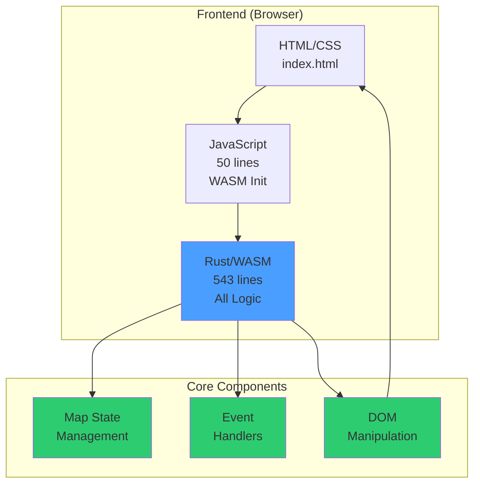

# RTS Monitor - Distributed System Monitor

Welcome to the RTS Monitor wiki! This web-based distributed system monitor is built with Rust and WebAssembly, providing a visual interface for managing distributed LLMs and Model Context Protocol (MCP) servers across a network.

## 🎯 Project Vision

RTS Monitor visualizes your distributed infrastructure as a network of interconnected server islands in a retro terminal aesthetic. Each island represents a server or workstation, containing "buildings" (processes) and connected via "bridges" (network links) in a star topology.

## 📊 Project Status

- ✅ **Code Quality**: All clippy warnings resolved, properly formatted
- ✅ **Build Status**: Builds successfully with `wasm-pack`
- ✅ **Testing**: 10 comprehensive tests implemented and passing
- ✅ **Rust/WASM Focus**: 80% JavaScript reduction - all logic now in Rust
- ✅ **Copyright & License**: MIT License with proper copyright attribution
- 📋 **Next Steps**: Backend integration for real server monitoring

## 📚 Documentation Pages

### Core Documentation

- **[Architecture](Architecture.md)** - System architecture overview with block diagrams
- **[Technology Stack](Technology-Stack.md)** - Detailed technology stack and dependencies
- **[UI Components](UI-Components.md)** - User interface components and layout
- **[Interaction Model](Interaction-Model.md)** - Event handling and user interactions with sequence diagrams
- **[Development Guide](Development-Guide.md)** - Development workflow, build process, and contribution guidelines

## 🚀 Quick Start

### Prerequisites

- Rust (latest stable)
- `wasm-pack` - Install with: `cargo install wasm-pack`
- `basic-http-server` - Install with: `cargo install basic-http-server`

### Build and Run

```bash
# Build the project
./scripts/build.sh

# Run the development server
./scripts/run.sh
# Opens browser at http://localhost:4000/
```

### Development Workflow

```bash
# Linting
cargo clippy

# Formatting
cargo fmt

# Run tests
cargo test
```

## 🏗️ Architecture at a Glance



## 🎨 Key Features

### Visual Representation
- **Server Islands**: Each server/workstation as a visual island
- **Process Buildings**: Running LLMs and MCP servers as buildings
- **Network Bridges**: Connections between servers in star topology
- **Retro Aesthetic**: Green-on-black terminal theme

### Management Capabilities
- Process deployment and control (deploy/stop/restart)
- Resource allocation and monitoring (CPU, Memory, GPU)
- Performance metrics visualization
- Alert and notification system
- MCP server discovery and configuration

### Interactive Controls
- **Mouse**: Drag-to-pan navigation
- **Keyboard**: Arrow keys and WASD for movement
- **Minimap**: Click to jump to locations
- **Real-time Updates**: Live resource and connection status

## 🛠️ Technology Highlights

- **Rust-First Architecture**: All application logic implemented in Rust
- **WebAssembly**: High-performance browser execution
- **web-sys**: Direct browser API access from Rust
- **SVG Graphics**: Scalable vector graphics for map rendering
- **Thread-Local State**: Efficient state management

## 📖 Getting Started

1. **New Developer?** Start with the [Development Guide](Development-Guide.md)
2. **Understanding the Architecture?** Check out [Architecture](Architecture.md)
3. **Working on UI?** See [UI Components](UI-Components.md)
4. **Adding Interactions?** Review [Interaction Model](Interaction-Model.md)
5. **Technology Questions?** Refer to [Technology Stack](Technology-Stack.md)

## 📄 License

This project is licensed under the MIT License. See the LICENSE file for details.

## 🤝 Contributing

Contributions are welcome! Please ensure:
- All tests pass (`cargo test`)
- Code is formatted (`cargo fmt`)
- No clippy warnings (`cargo clippy`)
- Follow the Rust-first philosophy - implement logic in Rust, not JavaScript
