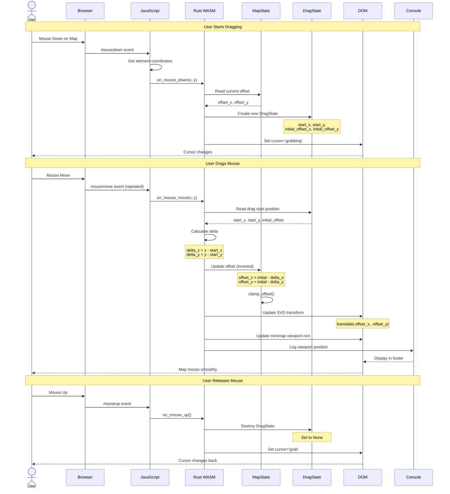
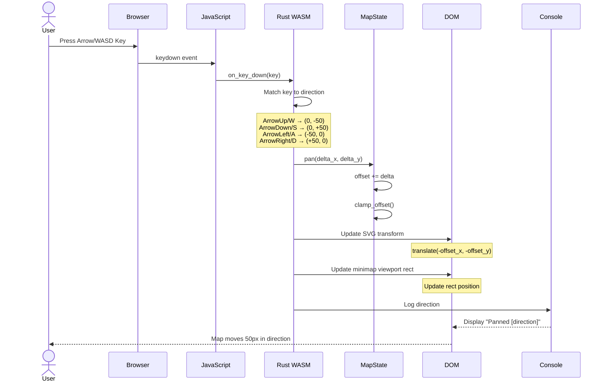
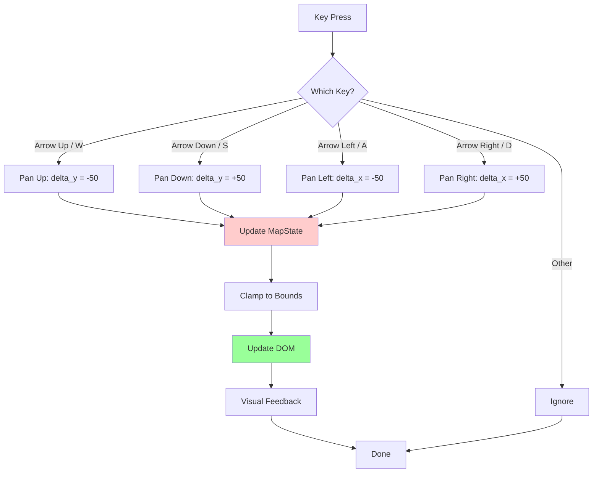
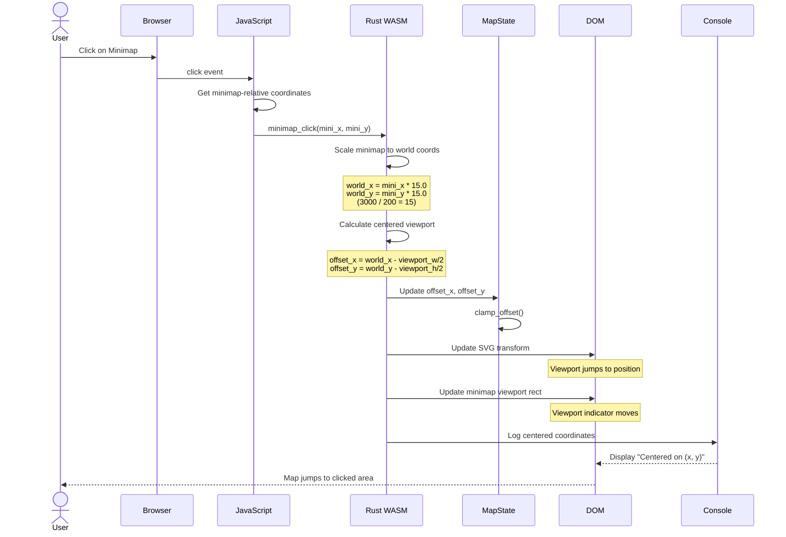
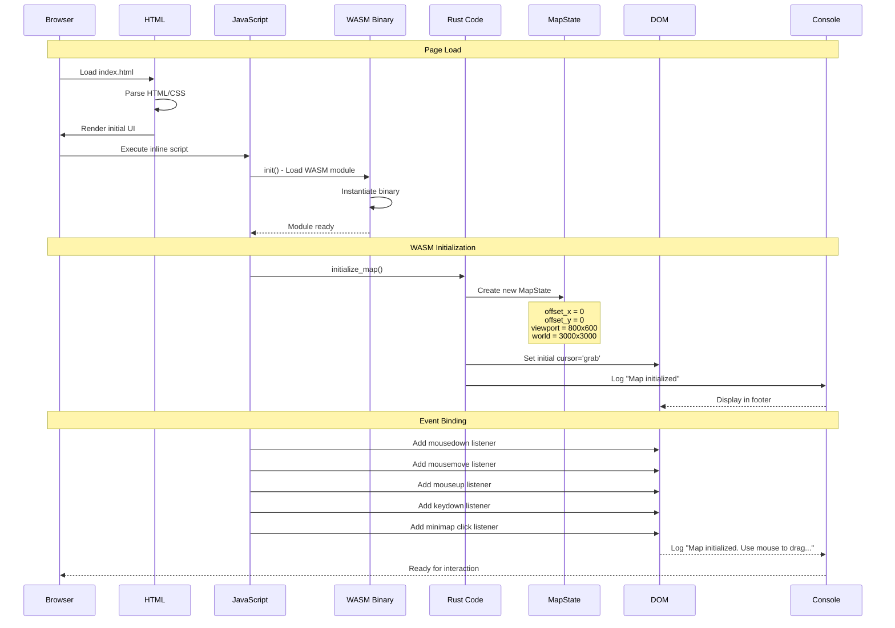
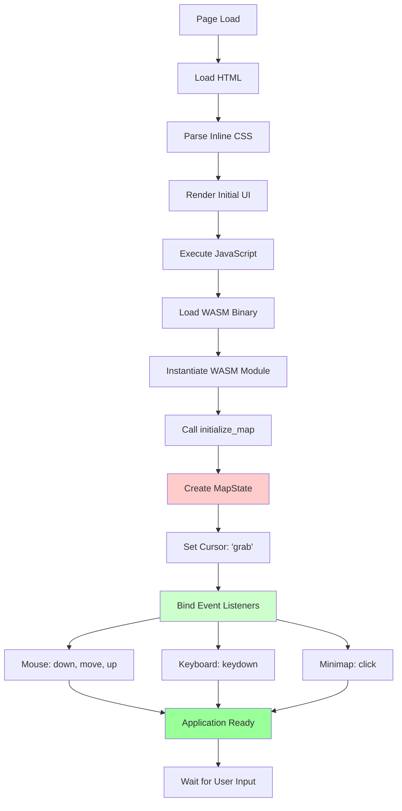
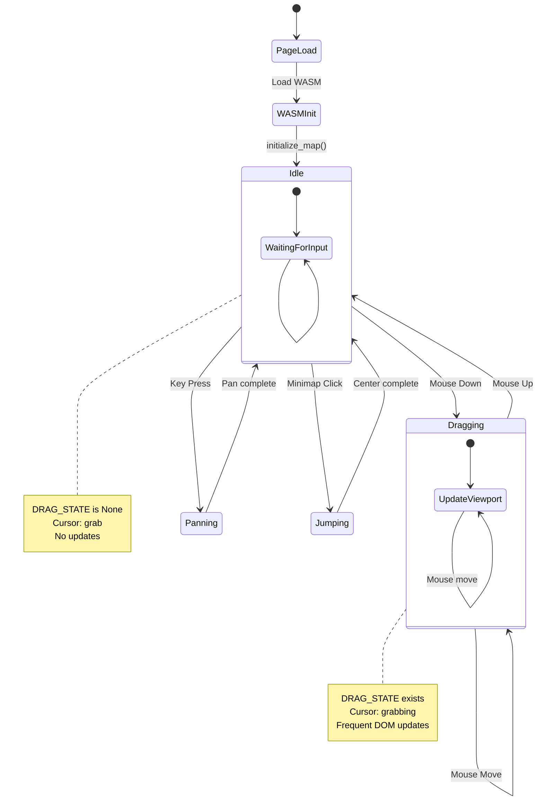
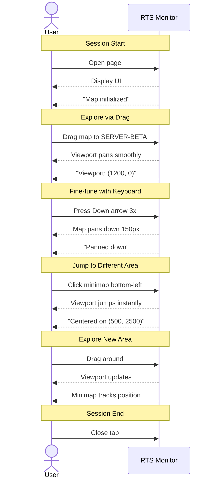

# Interaction Flows

This page documents common user interaction workflows in RTS Monitor using sequence diagrams and flow charts.

## Overview

This page illustrates the complete flow of user interactions from input to visual feedback, showing the collaboration between JavaScript, Rust/WASM, state management, and DOM updates.

## Interaction Categories

1. **Mouse Drag to Pan** - Primary navigation method
2. **Keyboard Navigation** - Arrow keys and WASD panning
3. **Minimap Click** - Quick viewport positioning
4. **Application Initialization** - Startup sequence

---

## 1. Mouse Drag to Pan

The most common interaction: dragging the map to pan the viewport.

### Complete Sequence



### Step-by-Step Breakdown

#### Phase 1: Mouse Down

1. **User Action**: Clicks and holds on map
2. **Event Capture**: Browser fires `mousedown`
3. **Coordinate Calc**: JavaScript calculates element-relative coordinates
4. **Rust Handler**: `on_mouse_down(x, y)` called
5. **State Creation**: `DragState` created with:
   - Current mouse position
   - Current viewport offset
6. **Visual Feedback**: Cursor changes to `grabbing`

#### Phase 2: Mouse Move (Repeated)

1. **User Action**: Moves mouse while holding button
2. **Event Capture**: Browser fires `mousemove` (60+ Hz)
3. **Rust Handler**: `on_mouse_move(x, y)` called
4. **Delta Calculation**:
   ```
   delta_x = current_x - start_x
   delta_y = current_y - start_y
   ```
5. **Offset Update** (inverted for natural drag):
   ```
   offset_x = initial_offset_x - delta_x
   offset_y = initial_offset_y - delta_y
   ```
6. **Clamping**: Ensure viewport stays in bounds
7. **DOM Update**: SVG `transform` attribute updated
8. **Minimap Update**: Viewport rectangle repositioned
9. **Visual Feedback**: Map appears to move with mouse

#### Phase 3: Mouse Up

1. **User Action**: Releases mouse button
2. **Event Capture**: Browser fires `mouseup`
3. **Rust Handler**: `on_mouse_up()` called
4. **State Cleanup**: `DragState` destroyed
5. **Visual Feedback**: Cursor changes back to `grab`
6. **Result**: Viewport remains at new position

---

## 2. Keyboard Navigation

Panning the viewport using arrow keys or WASD.

### Complete Sequence



### Key Handling Flow



### Step-by-Step

1. **User Action**: Presses arrow key or WASD
2. **Event Capture**: Browser fires `keydown`
3. **Key Identification**: JavaScript passes `event.key` to Rust
4. **Direction Mapping**:
   - `ArrowUp`/`W` → `pan(0, -50)`
   - `ArrowDown`/`S` → `pan(0, +50)`
   - `ArrowLeft`/`A` → `pan(-50, 0)`
   - `ArrowRight`/`D` → `pan(+50, 0)`
5. **State Update**: `MapState.offset` incremented
6. **Clamping**: Bounds enforcement
7. **DOM Update**: Transform and minimap updated
8. **Feedback**: Status message displayed

---

## 3. Minimap Click to Center

Clicking the minimap to quickly navigate to a specific area.

### Complete Sequence



### Coordinate Transformation Flow

```mermaid
flowchart TD
    Start[Minimap Click] --> GetCoords[Get Click Coords<br/>minimap_x, minimap_y]
    GetCoords --> Scale[Scale to World]
    Note1[world_x = minimap_x * 15.0<br/>world_y = minimap_y * 15.0]

    Scale --> Center[Calculate Center Offset]
    Note2[offset_x = world_x - 400<br/>offset_y = world_y - 300]

    Center --> Clamp{In Bounds?}
    Clamp -->|No| ClampFix[Clamp to [0, max]]
    Clamp -->|Yes| Update[Update DOM]
    ClampFix --> Update

    Update --> Transform[Update SVG Transform]
    Transform --> MiniRect[Update Minimap Rect]
    MiniRect --> End[Done]

    style Scale fill:#ffffcc
    style Center fill:#ffcccc
    style Update fill:#99ff99
```

### Step-by-Step

1. **User Action**: Clicks on minimap
2. **Event Capture**: Browser fires `click`
3. **Coordinate Calc**: JavaScript gets minimap-relative position
4. **Rust Handler**: `minimap_click(mini_x, mini_y)` called
5. **Coordinate Scaling**:
   ```
   scale = 3000 / 200 = 15.0
   world_x = minimap_x * 15.0
   world_y = minimap_y * 15.0
   ```
6. **Center Calculation**:
   ```
   offset_x = world_x - viewport_width / 2   (400)
   offset_y = world_y - viewport_height / 2  (300)
   ```
7. **Clamping**: Ensure valid offset
8. **DOM Update**: Map and minimap updated
9. **Feedback**: Viewport instantly centered on clicked point

---

## 4. Application Initialization

The startup sequence when the page loads.

### Complete Sequence



### Initialization Flow



### Step-by-Step

1. **Browser Load**: Parse HTML and CSS
2. **Initial Render**: Display UI with no interactions
3. **JavaScript Execution**: Inline script runs
4. **WASM Loading**:
   - `init()` fetches WASM binary
   - Binary instantiated
   - Rust functions exposed to JavaScript
5. **State Initialization**:
   - `initialize_map()` called
   - `MapState` created with defaults
   - Cursor set to `grab`
6. **Event Binding**:
   - Mouse events: `mousedown`, `mousemove`, `mouseup`
   - Keyboard events: `keydown`
   - Minimap events: `click`
7. **Ready State**:
   - Console message: "Map initialized..."
   - Application ready for user interaction

---

## 5. Complete User Session Flow

A typical user session combining multiple interactions.



### Example Session



---

## Performance Characteristics

### Event Frequency

| Interaction | Frequency | Updates/Second |
|-------------|-----------|----------------|
| Mouse Drag | Continuous | 60+ (mousemove) |
| Keyboard Hold | Continuous | ~10 (key repeat) |
| Minimap Click | Discrete | 1 (single event) |

### Update Pipeline Performance

```
Mouse Move Event
  ↓ < 1ms - Event capture
JavaScript Dispatch
  ↓ < 1ms - wasm_bindgen call
Rust Handler
  ↓ < 1ms - State update + clamp
DOM Update
  ↓ < 16ms - Browser render (60fps)
Visual Feedback
```

**Total Latency**: < 20ms (smooth 60fps)

### Optimization Strategies

1. **Minimal State**: Only `MapState` and `DragState`
2. **Direct DOM Updates**: No virtual DOM overhead
3. **Efficient Clamping**: Single pass per update
4. **Batched Updates**: State + DOM together
5. **No Re-renders**: Only transform updates

---

## Error Handling

### Missing Elements

If DOM elements not found:
```rust
if let Some(element) = document().get_element_by_id("map-content") {
    // Update element
} else {
    console::log_1(&"Warning: map-content not found".into());
}
```

### Invalid State

If state not initialized:
```rust
MAP_STATE.with(|state| {
    if let Some(map_state) = state.borrow().as_ref() {
        // Use state
    } else {
        console::log_1(&"Error: MapState not initialized".into());
    }
});
```

### Boundary Violations

Automatically handled by `clamp_offset()`:
```rust
self.offset_x = self.offset_x.max(0.0).min(max_x);
self.offset_y = self.offset_y.max(0.0).min(max_y);
```

---

## Related Pages

- [[Event Handling]] - Detailed event handler implementation
- [[State Management]] - State structures and transitions
- [[UI Components]] - Components involved in interactions
- [[Architecture Overview]] - System-level architecture

---

*Last Updated: 2025-11-18*
