# Interaction Model

This page details the user interaction patterns, event handling, and control flows in RTS Monitor with comprehensive sequence diagrams.

## Table of Contents

- [Interaction Overview](#interaction-overview)
- [Mouse Interactions](#mouse-interactions)
- [Keyboard Interactions](#keyboard-interactions)
- [Minimap Navigation](#minimap-navigation)
- [Event Flow Architecture](#event-flow-architecture)
- [State Transitions](#state-transitions)

## Interaction Overview

RTS Monitor provides multiple interaction methods for navigating and controlling the distributed system visualization.

### Interaction Methods

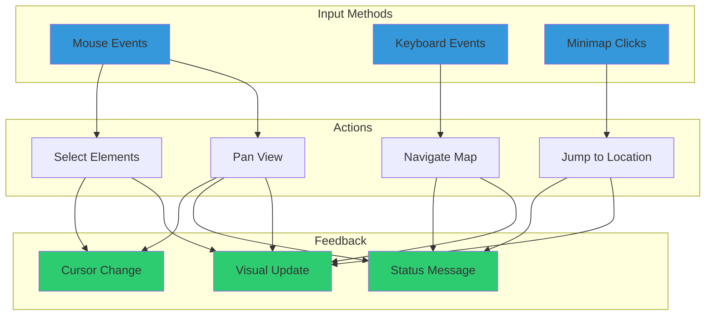

## Mouse Interactions

### Drag-to-Pan Interaction

The primary mouse interaction is **drag-to-pan**, allowing users to navigate the map by clicking and dragging.

#### Mouse Down Event

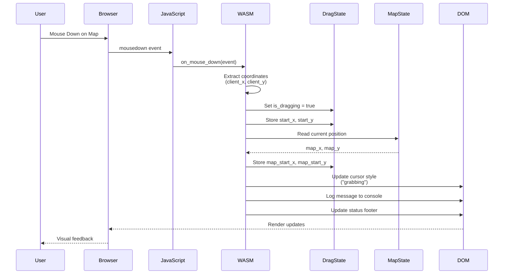

**Code Flow (src/lib.rs):**

```rust
#[wasm_bindgen]
pub fn on_mouse_down(event: web_sys::MouseEvent) {
    let x = event.client_x() as f64;
    let y = event.client_y() as f64;

    DRAG_STATE.with(|ds| {
        let mut drag = ds.borrow_mut();
        drag.is_dragging = true;
        drag.start_x = x;
        drag.start_y = y;

        MAP_STATE.with(|ms| {
            let map = ms.borrow();
            drag.map_start_x = map.x;
            drag.map_start_y = map.y;
        });
    });

    // Update UI feedback
    update_cursor("grabbing");
    log_to_console("Drag started");
}
```

#### Mouse Move Event (Dragging)

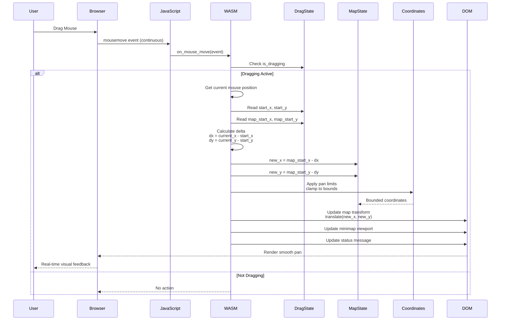

**Coordinate Calculation:**

```rust
// Calculate delta from drag start
let dx = current_x - drag.start_x;
let dy = current_y - drag.start_y;

// Apply to map position (inverted for natural movement)
let new_x = drag.map_start_x - dx;
let new_y = drag.map_start_y - dy;

// Clamp to world bounds
let clamped_x = new_x.max(0.0).min(MAX_X);
let clamped_y = new_y.max(0.0).min(MAX_Y);
```

#### Mouse Up Event

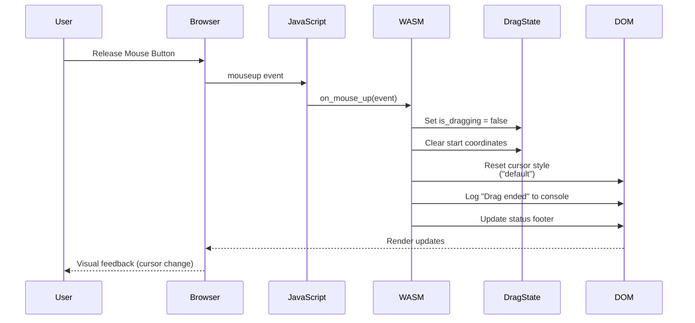

### Complete Drag Cycle

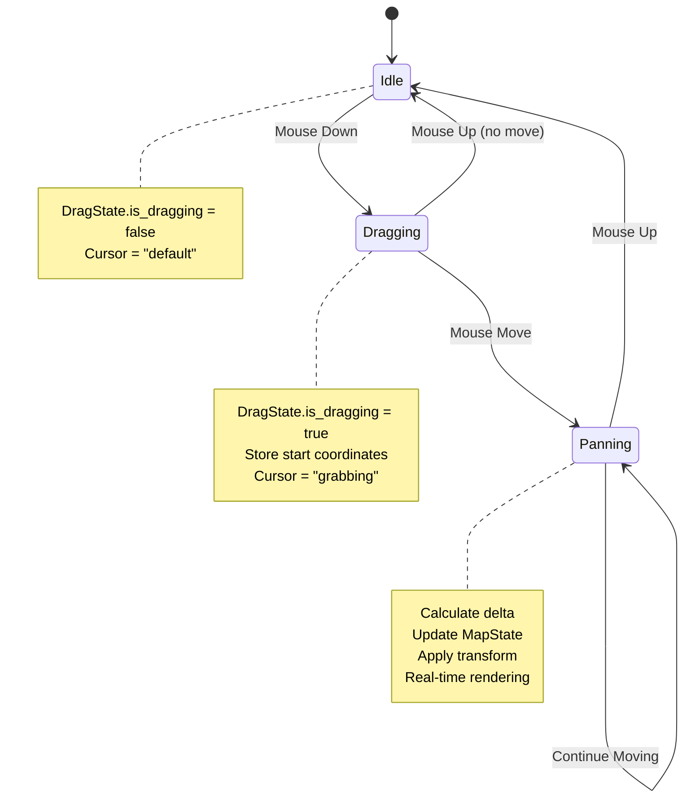

## Keyboard Interactions

### Keyboard Navigation

Users can navigate the map using **Arrow Keys** or **WASD** for continuous, smooth panning.

#### Keydown Event Sequence

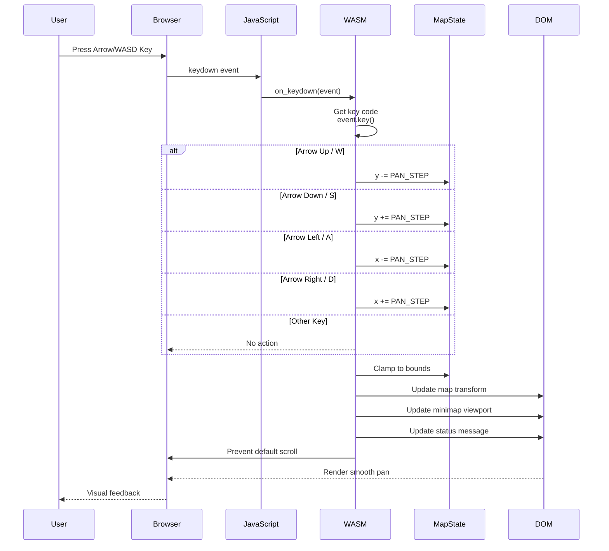

**Key Mapping:**

```rust
match event.key().as_str() {
    "ArrowUp" | "w" | "W" => {
        map.y -= PAN_STEP;
        event.prevent_default();
    }
    "ArrowDown" | "s" | "S" => {
        map.y += PAN_STEP;
        event.prevent_default();
    }
    "ArrowLeft" | "a" | "A" => {
        map.x -= PAN_STEP;
        event.prevent_default();
    }
    "ArrowRight" | "d" | "D" => {
        map.x += PAN_STEP;
        event.prevent_default();
    }
    _ => {} // Ignore other keys
}
```

### Keyboard Navigation Flow

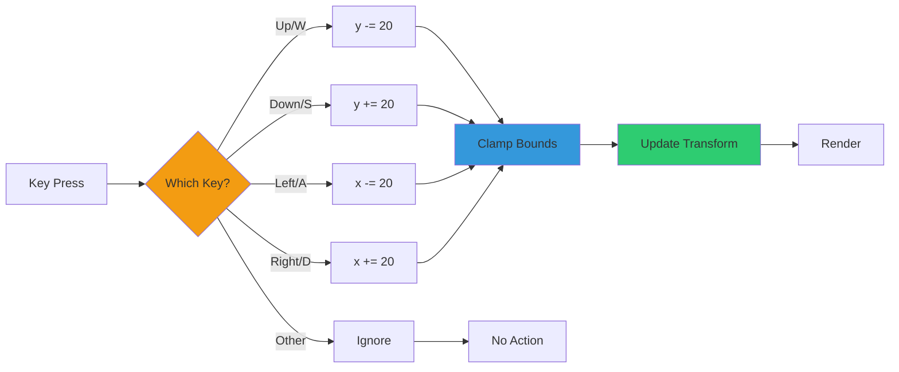

### Continuous Key Press

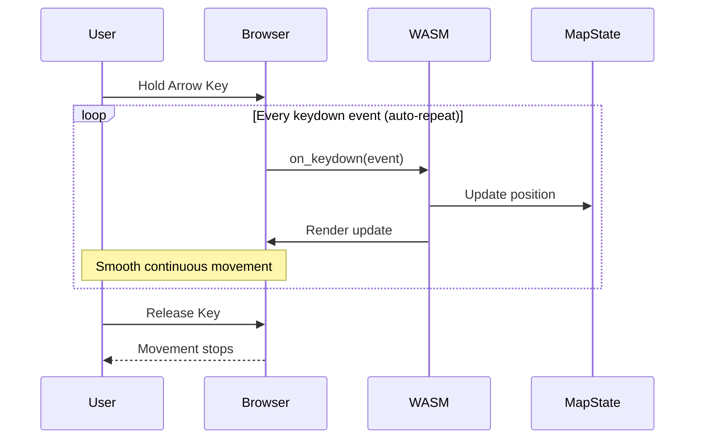

## Minimap Navigation

### Click-to-Center Interaction

The minimap provides **quick navigation** by clicking to center the main map view on any location.

#### Minimap Click Sequence

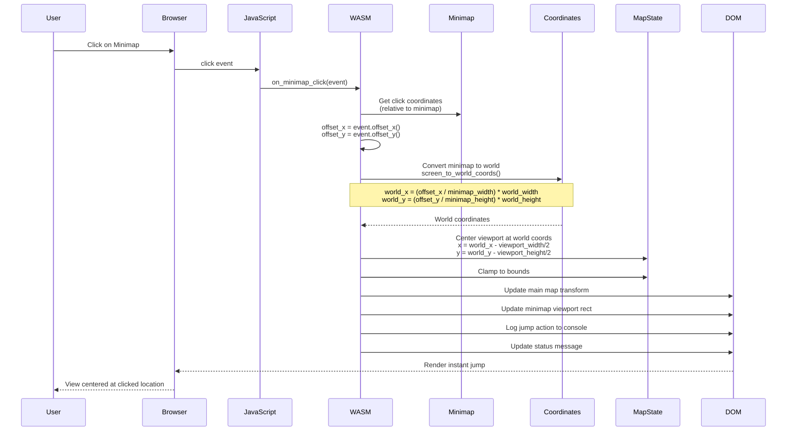

**Coordinate Transformation:**

```rust
fn screen_to_world_coords(screen_x: f64, screen_y: f64,
                          minimap_width: f64, minimap_height: f64,
                          world_width: f64, world_height: f64)
                          -> (f64, f64) {
    let world_x = (screen_x / minimap_width) * world_width;
    let world_y = (screen_y / minimap_height) * world_height;
    (world_x, world_y)
}

fn center_viewport(world_x: f64, world_y: f64,
                   viewport_width: f64, viewport_height: f64)
                   -> (f64, f64) {
    let map_x = world_x - (viewport_width / 2.0);
    let map_y = world_y - (viewport_height / 2.0);
    (map_x, map_y)
}
```

### Minimap Interaction Flow

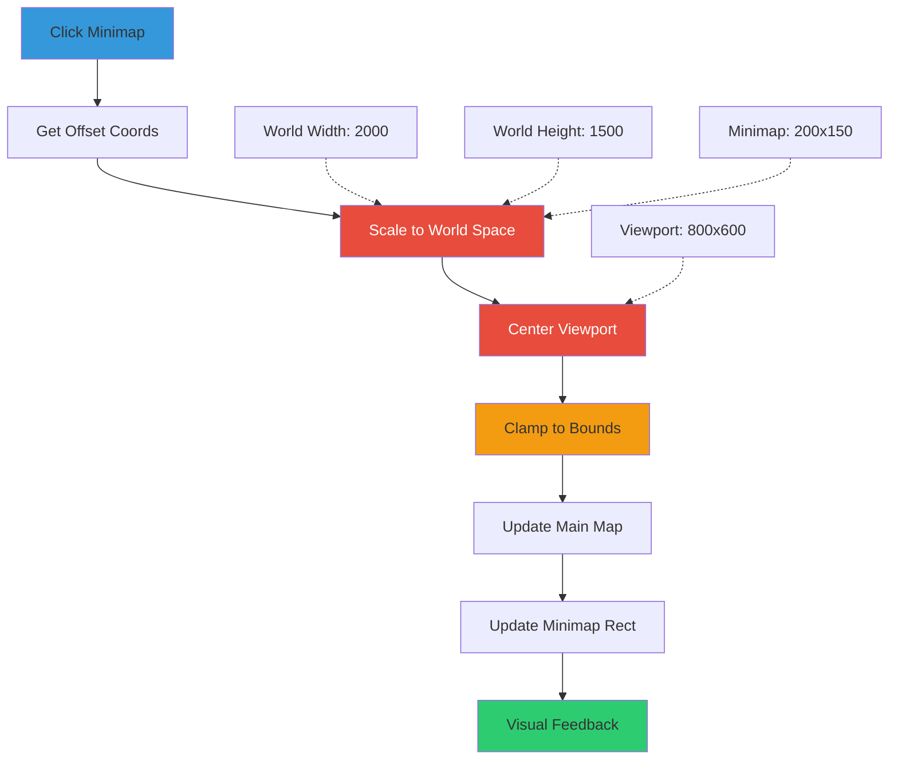

## Event Flow Architecture

### Complete Event Processing Pipeline

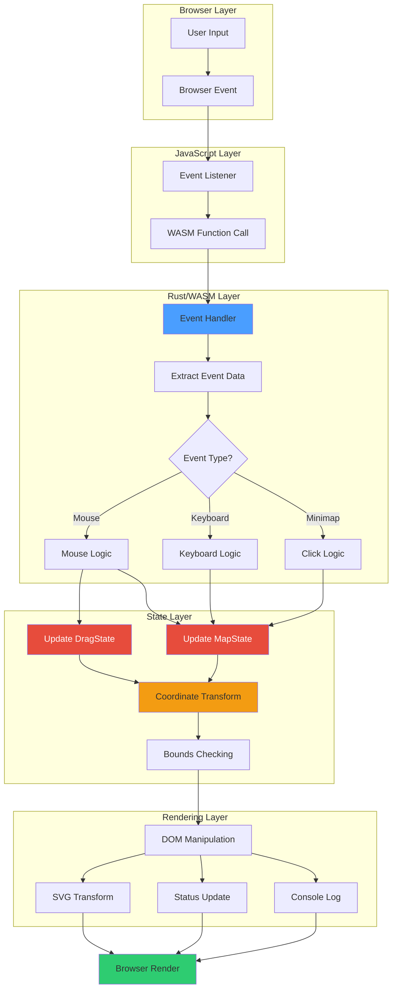

### Event Handler Mapping

| Browser Event | JavaScript Function | Rust Handler | State Modified |
|---------------|-------------------|--------------|----------------|
| `mousedown` | `on_mouse_down` | `on_mouse_down()` | `DragState` |
| `mousemove` | `on_mouse_move` | `on_mouse_move()` | `MapState`, `DragState` |
| `mouseup` | `on_mouse_up` | `on_mouse_up()` | `DragState` |
| `keydown` | `on_keydown` | `on_keydown()` | `MapState` |
| `click` (minimap) | `on_minimap_click` | `on_minimap_click()` | `MapState` |

## State Transitions

### MapState Lifecycle

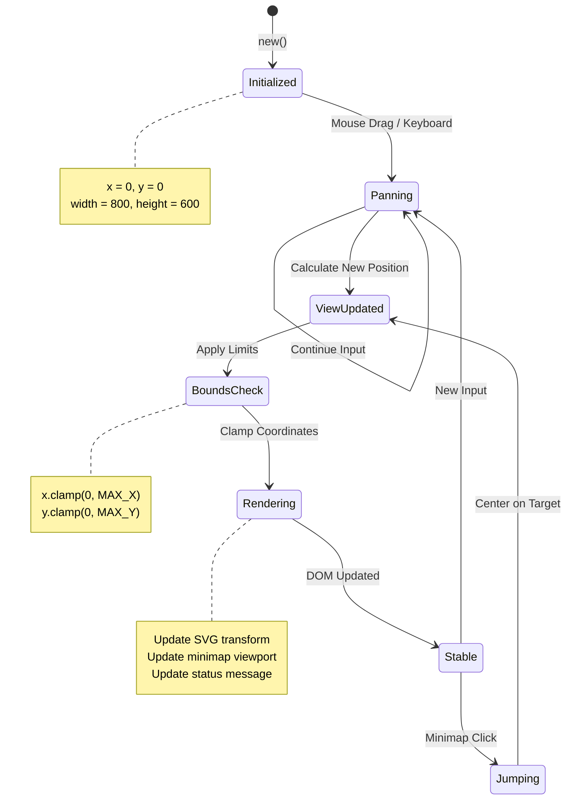

### DragState Lifecycle

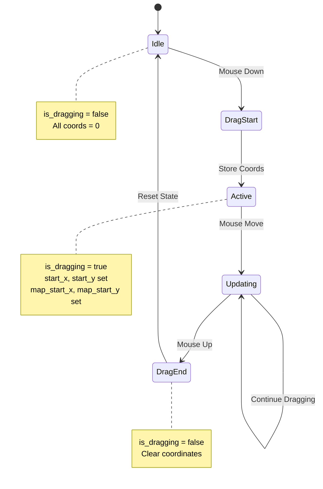

### Combined State Flow

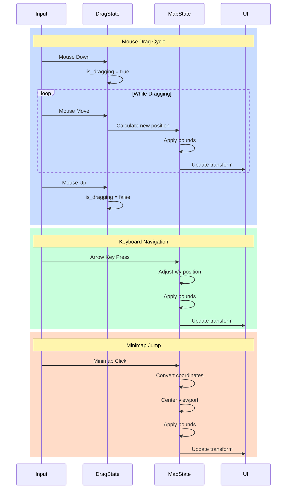

## Performance Optimizations

### Event Throttling Strategy

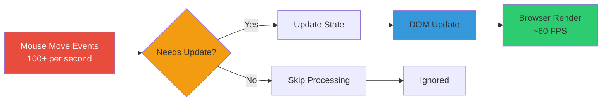

**Optimization Techniques:**

1. **Request Animation Frame**: Sync updates with browser rendering
2. **Conditional Updates**: Only update if position actually changed
3. **Batch DOM Operations**: Group multiple attribute changes
4. **WASM Speed**: Native-speed calculations vs JavaScript

### Update Efficiency

```rust
// Efficient state update pattern
DRAG_STATE.with(|ds| {
    let drag = ds.borrow();
    if !drag.is_dragging {
        return; // Early exit - no update needed
    }

    MAP_STATE.with(|ms| {
        let mut map = ms.borrow_mut();
        // Calculate new position
        let new_x = calculate_new_x();
        let new_y = calculate_new_y();

        // Only update if changed
        if (new_x - map.x).abs() > 0.1 || (new_y - map.y).abs() > 0.1 {
            map.x = new_x;
            map.y = new_y;
            update_dom(&map); // Single DOM update
        }
    });
});
```

## Coordinate Systems

### Coordinate Spaces

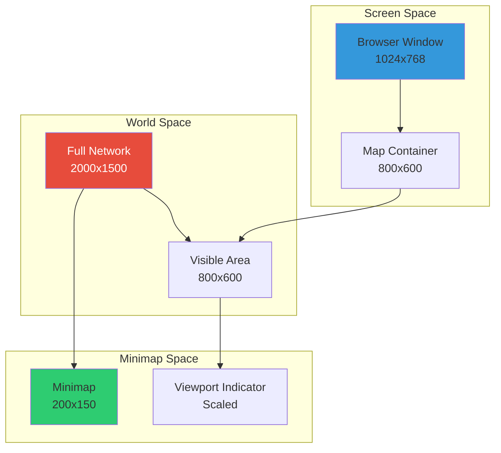

### Coordinate Transformations

**Screen to World:**
```rust
world_x = (screen_x / screen_width) * world_width
world_y = (screen_y / screen_height) * world_height
```

**World to Screen:**
```rust
screen_x = (world_x / world_width) * screen_width
screen_y = (world_y / world_height) * screen_height
```

**Viewport Centering:**
```rust
map_x = target_world_x - (viewport_width / 2.0)
map_y = target_world_y - (viewport_height / 2.0)
```

## Related Pages

- [Architecture](Architecture.md) - System architecture overview
- [UI Components](UI-Components.md) - UI component details
- [Technology Stack](Technology-Stack.md) - Technologies used
- [Development Guide](Development-Guide.md) - Development workflow
- [Home](Home.md) - Return to wiki home
