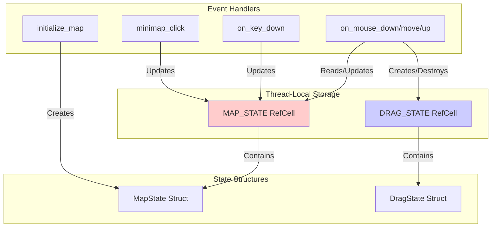
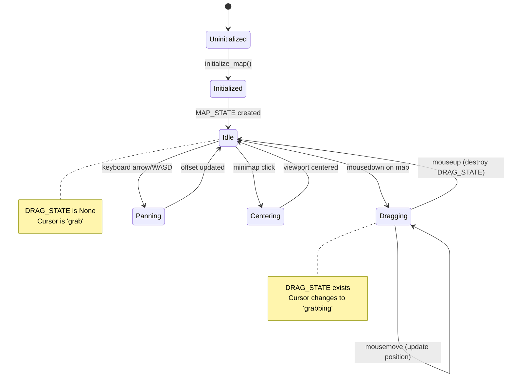

# State Management

This page describes the state management architecture in RTS Monitor, including the MapState and DragState structures, thread-local storage patterns, and state transitions.

## Overview

RTS Monitor uses **thread-local storage** in Rust to manage global application state. This pattern allows state to persist across function calls while maintaining thread safety in a single-threaded WASM environment.

## State Architecture



## State Structures

### MapState

**Purpose**: Manages the viewport position and dimensions for the main map.

**Definition** (`src/lib.rs`):
```rust
struct MapState {
    offset_x: f64,
    offset_y: f64,
    viewport_width: f64,
    viewport_height: f64,
    world_width: f64,
    world_height: f64,
}
```

#### Fields

| Field | Type | Description | Default |
|-------|------|-------------|---------|
| `offset_x` | `f64` | Current X offset of viewport | `0.0` |
| `offset_y` | `f64` | Current Y offset of viewport | `0.0` |
| `viewport_width` | `f64` | Width of visible area | `800.0` |
| `viewport_height` | `f64` | Height of visible area | `600.0` |
| `world_width` | `f64` | Total world width | `3000.0` |
| `world_height` | `f64` | Total world height | `3000.0` |

#### Methods

**`new()`** - Creates a new MapState with default values
```rust
impl MapState {
    fn new() -> Self {
        MapState {
            offset_x: 0.0,
            offset_y: 0.0,
            viewport_width: 800.0,
            viewport_height: 600.0,
            world_width: 3000.0,
            world_height: 3000.0,
        }
    }
}
```

**`clamp_offset()`** - Ensures viewport stays within world bounds
```rust
fn clamp_offset(&mut self) {
    let max_x = self.world_width - self.viewport_width;
    let max_y = self.world_height - self.viewport_height;

    self.offset_x = self.offset_x.max(0.0).min(max_x);
    self.offset_y = self.offset_y.max(0.0).min(max_y);
}
```

**`pan()`** - Applies a delta to the viewport position
```rust
fn pan(&mut self, delta_x: f64, delta_y: f64) {
    self.offset_x += delta_x;
    self.offset_y += delta_y;
    self.clamp_offset();
}
```

---

### DragState

**Purpose**: Tracks mouse drag operations for panning the map.

**Definition** (`src/lib.rs`):
```rust
struct DragState {
    start_x: f64,
    start_y: f64,
    initial_offset_x: f64,
    initial_offset_y: f64,
}
```

#### Fields

| Field | Type | Description |
|-------|------|-------------|
| `start_x` | `f64` | Mouse X position when drag started |
| `start_y` | `f64` | Mouse Y position when drag started |
| `initial_offset_x` | `f64` | Viewport X offset when drag started |
| `initial_offset_y` | `f64` | Viewport Y offset when drag started |

#### Lifecycle

1. **Created**: On `mousedown` event on the map
2. **Used**: During `mousemove` to calculate delta
3. **Destroyed**: On `mouseup` to end drag operation

---

## Thread-Local Storage

### Declaration

```rust
thread_local! {
    static MAP_STATE: RefCell<Option<MapState>> = RefCell::new(None);
    static DRAG_STATE: RefCell<Option<DragState>> = RefCell::new(None);
}
```

### Access Pattern

**Reading State**:
```rust
MAP_STATE.with(|state| {
    if let Some(map_state) = state.borrow().as_ref() {
        // Use map_state
        let x = map_state.offset_x;
    }
});
```

**Updating State**:
```rust
MAP_STATE.with(|state| {
    if let Some(map_state) = state.borrow_mut().as_mut() {
        map_state.offset_x = 100.0;
        map_state.clamp_offset();
    }
});
```

**Initializing State**:
```rust
MAP_STATE.with(|state| {
    *state.borrow_mut() = Some(MapState::new());
});
```

**Destroying State**:
```rust
DRAG_STATE.with(|state| {
    *state.borrow_mut() = None;
});
```

## State Transitions



### State Transition Details

#### 1. Initialization

**Trigger**: Page load → `initialize_map()` called from JavaScript
**Action**:
- Create new `MapState` with default values
- Store in `MAP_STATE` thread-local
- Set map container cursor to `grab`

**Code**:
```rust
#[wasm_bindgen]
pub fn initialize_map() {
    MAP_STATE.with(|state| {
        *state.borrow_mut() = Some(MapState::new());
    });
}
```

#### 2. Begin Drag (Idle → Dragging)

**Trigger**: `mousedown` event on map container
**Action**:
- Create `DragState` with current mouse position
- Store initial viewport offset
- Change cursor to `grabbing`

**Code**:
```rust
#[wasm_bindgen]
pub fn on_mouse_down(x: f64, y: f64) {
    MAP_STATE.with(|map| {
        if let Some(map_state) = map.borrow().as_ref() {
            DRAG_STATE.with(|drag| {
                *drag.borrow_mut() = Some(DragState {
                    start_x: x,
                    start_y: y,
                    initial_offset_x: map_state.offset_x,
                    initial_offset_y: map_state.offset_y,
                });
            });
        }
    });
}
```

#### 3. Update Drag (Dragging → Dragging)

**Trigger**: `mousemove` event while dragging
**Action**:
- Calculate delta from drag start position
- Update viewport offset (inverted for natural drag)
- Clamp to world bounds
- Update DOM transform

**Code**:
```rust
#[wasm_bindgen]
pub fn on_mouse_move(x: f64, y: f64) {
    DRAG_STATE.with(|drag| {
        if let Some(drag_state) = drag.borrow().as_ref() {
            let delta_x = x - drag_state.start_x;
            let delta_y = y - drag_state.start_y;

            MAP_STATE.with(|map| {
                if let Some(map_state) = map.borrow_mut().as_mut() {
                    map_state.offset_x = drag_state.initial_offset_x - delta_x;
                    map_state.offset_y = drag_state.initial_offset_y - delta_y;
                    map_state.clamp_offset();
                    update_map_transform();
                }
            });
        }
    });
}
```

#### 4. End Drag (Dragging → Idle)

**Trigger**: `mouseup` event
**Action**:
- Destroy `DragState`
- Change cursor back to `grab`
- Viewport offset remains at last dragged position

**Code**:
```rust
#[wasm_bindgen]
pub fn on_mouse_up() {
    DRAG_STATE.with(|drag| {
        *drag.borrow_mut() = None;
    });
}
```

#### 5. Keyboard Pan (Idle → Panning → Idle)

**Trigger**: Arrow key or WASD key press
**Action**:
- Calculate pan direction and amount (50 pixels)
- Update viewport offset
- Clamp to bounds
- Update DOM

**Code**:
```rust
#[wasm_bindgen]
pub fn on_key_down(key: String) {
    MAP_STATE.with(|state| {
        if let Some(map_state) = state.borrow_mut().as_mut() {
            const PAN_AMOUNT: f64 = 50.0;
            match key.as_str() {
                "ArrowUp" | "w" | "W" => map_state.pan(0.0, -PAN_AMOUNT),
                "ArrowDown" | "s" | "S" => map_state.pan(0.0, PAN_AMOUNT),
                "ArrowLeft" | "a" | "A" => map_state.pan(-PAN_AMOUNT, 0.0),
                "ArrowRight" | "d" | "D" => map_state.pan(PAN_AMOUNT, 0.0),
                _ => {}
            }
            update_map_transform();
        }
    });
}
```

#### 6. Minimap Center (Idle → Centering → Idle)

**Trigger**: Click on minimap
**Action**:
- Convert minimap coordinates to world coordinates
- Center viewport on clicked position
- Clamp to bounds
- Update DOM

**Code**:
```rust
#[wasm_bindgen]
pub fn minimap_click(minimap_x: f64, minimap_y: f64) {
    MAP_STATE.with(|state| {
        if let Some(map_state) = state.borrow_mut().as_mut() {
            // Scale minimap coords to world coords
            let world_x = minimap_x * (3000.0 / 200.0);
            let world_y = minimap_y * (3000.0 / 200.0);

            // Center viewport on clicked position
            map_state.offset_x = world_x - map_state.viewport_width / 2.0;
            map_state.offset_y = world_y - map_state.viewport_height / 2.0;
            map_state.clamp_offset();

            update_map_transform();
            update_minimap_viewport();
        }
    });
}
```

## DOM Updates

### Update Map Transform

**Purpose**: Apply viewport offset to SVG transform

```rust
fn update_map_transform() {
    MAP_STATE.with(|state| {
        if let Some(map_state) = state.borrow().as_ref() {
            let document = web_sys::window().unwrap().document().unwrap();
            if let Some(element) = document.get_element_by_id("map-content") {
                let transform = format!(
                    "translate({}, {})",
                    -map_state.offset_x,
                    -map_state.offset_y
                );
                element.set_attribute("transform", &transform).ok();
            }
        }
    });
}
```

### Update Minimap Viewport

**Purpose**: Update viewport indicator rectangle in minimap

```rust
fn update_minimap_viewport() {
    MAP_STATE.with(|state| {
        if let Some(map_state) = state.borrow().as_ref() {
            let scale = 200.0 / 3000.0; // Minimap scale
            let mini_x = map_state.offset_x * scale;
            let mini_y = map_state.offset_y * scale;
            let mini_w = map_state.viewport_width * scale;
            let mini_h = map_state.viewport_height * scale;

            let document = web_sys::window().unwrap().document().unwrap();
            if let Some(rect) = document.get_element_by_id("viewport-rect") {
                rect.set_attribute("x", &mini_x.to_string()).ok();
                rect.set_attribute("y", &mini_y.to_string()).ok();
                rect.set_attribute("width", &mini_w.to_string()).ok();
                rect.set_attribute("height", &mini_h.to_string()).ok();
            }
        }
    });
}
```

## State Validation

### Boundary Clamping

The `clamp_offset()` method ensures the viewport never goes outside world bounds:

```
World: 3000 x 3000
Viewport: 800 x 600

Valid X range: 0 to 2200 (3000 - 800)
Valid Y range: 0 to 2400 (3000 - 600)
```

**Clamping Logic**:
```rust
fn clamp_offset(&mut self) {
    let max_x = self.world_width - self.viewport_width;   // 2200
    let max_y = self.world_height - self.viewport_height; // 2400

    self.offset_x = self.offset_x.max(0.0).min(max_x);
    self.offset_y = self.offset_y.max(0.0).min(max_y);
}
```

### Coordinate Transformations

**Screen to World**:
```rust
world_x = screen_x + viewport_offset_x
world_y = screen_y + viewport_offset_y
```

**Minimap to World**:
```rust
world_x = minimap_x * (world_width / minimap_width)
world_y = minimap_y * (world_height / minimap_height)
```

**World to Minimap**:
```rust
minimap_x = world_x * (minimap_width / world_width)
minimap_y = world_y * (minimap_height / world_height)
```

## Testing

The state management system is covered by comprehensive unit tests:

### Test Coverage

| Test | Purpose | File |
|------|---------|------|
| `test_map_state_new()` | MapState initialization | `src/lib.rs:498` |
| `test_map_state_clamp()` | Boundary clamping | `src/lib.rs:512` |
| `test_map_state_pan()` | Pan method | `src/lib.rs:533` |

**Example Test**:
```rust
#[test]
fn test_map_state_clamp() {
    let mut state = MapState::new();

    // Test clamping negative offsets
    state.offset_x = -100.0;
    state.offset_y = -100.0;
    state.clamp_offset();
    assert_eq!(state.offset_x, 0.0);
    assert_eq!(state.offset_y, 0.0);

    // Test clamping oversized offsets
    state.offset_x = 5000.0;
    state.offset_y = 5000.0;
    state.clamp_offset();
    assert_eq!(state.offset_x, 2200.0); // 3000 - 800
    assert_eq!(state.offset_y, 2400.0); // 3000 - 600
}
```

## Performance Considerations

### RefCell Overhead

`RefCell` provides runtime borrow checking with minimal overhead:
- Borrow checks are fast (single pointer comparison)
- No allocation overhead
- Panic on borrow violations (caught during testing)

### State Update Frequency

| Event | Frequency | State Updates |
|-------|-----------|---------------|
| Mouse Move | ~60 Hz (during drag) | MAP_STATE updated |
| Keyboard | ~1-10 Hz (key repeat) | MAP_STATE updated |
| Minimap Click | Once per click | MAP_STATE updated |

### Optimization Strategies

1. **Batch Updates**: State updates followed by DOM updates
2. **Clamping**: Done once per state change, not per render
3. **Transform Only**: Only SVG `transform` attribute updated (fast)

## Related Pages

- [[Event Handling]] - How events trigger state changes
- [[UI Components]] - Components that display state
- [[Interaction Flows]] - Sequence diagrams showing state flow
- [[Architecture Overview]] - High-level architecture

---

*Last Updated: 2025-11-18*
