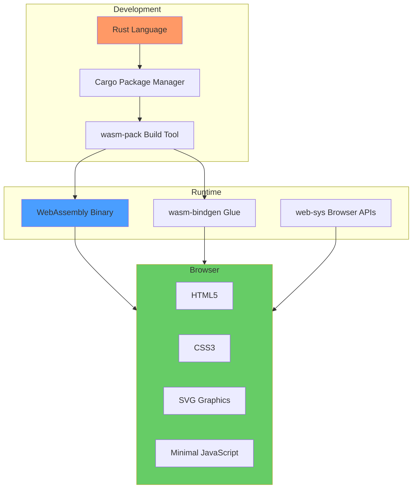
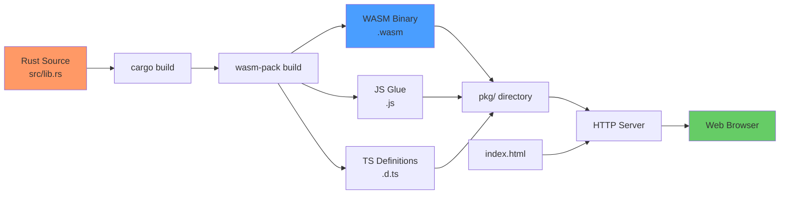

# Technology Stack

This page provides a detailed breakdown of all technologies, libraries, and tools used in RTS Monitor.

## Overview

RTS Monitor is built with a **Rust-first** philosophy, where all application logic is implemented in Rust and compiled to WebAssembly for browser execution.



## Core Technologies

### 1. Rust

**Version**: Latest stable (1.70+)
**Website**: https://www.rust-lang.org/

#### Why Rust?

- **Type Safety**: Compile-time error prevention
- **Performance**: Near-native execution speed
- **Memory Safety**: No garbage collector, no undefined behavior
- **WASM Support**: First-class WebAssembly compilation
- **Tooling**: Excellent ecosystem (Cargo, Clippy, rustfmt)

#### Rust Features Used

| Feature | Purpose | Example |
|---------|---------|---------|
| Structs | State management | `MapState`, `DragState` |
| Thread-locals | Global state | `MAP_STATE`, `DRAG_STATE` |
| Pattern matching | Event handling | `match key.as_str()` |
| Error handling | Graceful failures | `Option<T>`, `Result<T, E>` |
| Traits | Code reuse | `impl` blocks |

#### Cargo Dependencies

**Cargo.toml**:
```toml
[package]
name = "rts_monitor"
version = "0.1.0"
edition = "2021"

[lib]
crate-type = ["cdylib"]

[dependencies]
wasm-bindgen = "0.2"
web-sys = { version = "0.3", features = [
    "Document",
    "Element",
    "HtmlElement",
    "Window",
    "console",
] }

[profile.release]
opt-level = "s"  # Optimize for size
lto = true       # Link-time optimization
```

---

### 2. WebAssembly (WASM)

**Version**: WASM MVP (Minimum Viable Product)
**Website**: https://webassembly.org/

#### What is WASM?

WebAssembly is a binary instruction format for a stack-based virtual machine, designed as a portable compilation target for high-level languages like Rust, C++, and Go.

#### Why WASM?

- **Performance**: Near-native execution (10-100x faster than JavaScript)
- **Portability**: Runs in all modern browsers
- **Security**: Sandboxed execution environment
- **Interoperability**: Seamless JavaScript integration
- **Size**: Compact binary format (smaller than equivalent JS)

#### WASM in RTS Monitor

**Generated Files** (`pkg/` directory):
- `rts_monitor_bg.wasm` - Binary executable (~50KB)
- `rts_monitor.js` - JavaScript glue code
- `rts_monitor.d.ts` - TypeScript definitions

**Exported Functions**:
```javascript
export function initialize_map();
export function on_mouse_down(x, y);
export function on_mouse_move(x, y);
export function on_mouse_up();
export function on_key_down(key);
export function minimap_click(x, y);
```

---

### 3. wasm-bindgen

**Version**: 0.2
**Website**: https://rustwasm.github.io/wasm-bindgen/

#### What is wasm-bindgen?

A library and tool for facilitating high-level interactions between Rust and JavaScript.

#### Features Used

**Function Export**:
```rust
#[wasm_bindgen]
pub fn initialize_map() {
    // Rust function callable from JavaScript
}
```

**Console Logging**:
```rust
use web_sys::console;
console::log_1(&"Hello from Rust!".into());
```

**Type Conversions**:
- Rust `String` ↔ JavaScript `string`
- Rust `f64` ↔ JavaScript `number`
- Rust `bool` ↔ JavaScript `boolean`

---

### 4. web-sys

**Version**: 0.3
**Website**: https://rustwasm.github.io/wasm-bindgen/api/web_sys/

#### What is web-sys?

Rust bindings for Web APIs, providing type-safe access to browser functionality.

#### Browser APIs Used

| API | Purpose | Example |
|-----|---------|---------|
| `Window` | Global browser object | `web_sys::window()` |
| `Document` | DOM access | `window.document()` |
| `Element` | DOM manipulation | `get_element_by_id()` |
| `console` | Logging | `console::log_1()` |

**Example Usage**:
```rust
use web_sys::{window, Document, Element};

let window = window().unwrap();
let document = window.document().unwrap();
let element = document.get_element_by_id("map-content").unwrap();
element.set_attribute("transform", "translate(0, 0)").unwrap();
```

#### web-sys Features

**Cargo.toml configuration**:
```toml
[dependencies.web-sys]
version = "0.3"
features = [
    "Document",      # DOM document access
    "Element",       # Generic DOM elements
    "HtmlElement",   # HTML-specific elements
    "Window",        # Browser window object
    "console",       # Console logging
]
```

---

### 5. wasm-pack

**Version**: Latest (0.12+)
**Website**: https://rustwasm.github.io/wasm-pack/

#### What is wasm-pack?

A build tool for compiling Rust to WebAssembly and generating JavaScript bindings.

#### Build Command

```bash
wasm-pack build --target web --out-dir pkg
```

#### Build Options

| Option | Value | Purpose |
|--------|-------|---------|
| `--target` | `web` | Browser-compatible output |
| `--out-dir` | `pkg` | Output directory |
| `--release` | (flag) | Optimized build |
| `--dev` | (flag) | Debug build with symbols |

#### Generated Output

```
pkg/
├── rts_monitor_bg.wasm       # WASM binary
├── rts_monitor_bg.wasm.d.ts  # TypeScript types for WASM
├── rts_monitor.js            # JavaScript glue code
├── rts_monitor.d.ts          # TypeScript definitions
└── package.json              # NPM package metadata
```

---

## Frontend Technologies

### 6. HTML5

**Standard**: HTML Living Standard
**Features Used**:
- Semantic elements (`<div>`, `<svg>`)
- Inline styles
- Event attributes (`onclick`, `onmousedown`)

**Structure**:
```html
<!DOCTYPE html>
<html lang="en">
<head>
    <meta charset="UTF-8">
    <title>RTS Monitor</title>
    <style>/* Inline CSS */</style>
</head>
<body>
    <!-- UI components -->
    <script type="module">/* JavaScript */</script>
</body>
</html>
```

---

### 7. CSS3

**Standard**: CSS3 (various modules)
**Features Used**:
- Flexbox layout
- Grid layout
- Custom colors
- Borders and shadows
- Cursor styles

**Design System**:
```css
/* Retro Terminal Theme */
:root {
    --bg-color: #000000;
    --primary-color: #00ff00;
    --secondary-color: #66cc66;
    --border-color: #003300;
    --warning-color: #ffff00;
    --error-color: #ff0000;
}
```

---

### 8. SVG (Scalable Vector Graphics)

**Standard**: SVG 1.1 / SVG 2
**Features Used**:
- `<svg>` canvas
- `<g>` groups with transforms
- `<ellipse>`, `<rect>`, `<line>` shapes
- `<text>` labels
- Coordinate systems

**Example**:
```html
<svg id="map" width="800" height="600" viewBox="0 0 800 600">
    <g id="map-content" transform="translate(0, 0)">
        <ellipse cx="400" cy="300" rx="80" ry="60" fill="#003300"/>
        <text x="400" y="305" text-anchor="middle">SERVER-ALPHA</text>
    </g>
</svg>
```

**Dynamic Updates** (from Rust):
```rust
element.set_attribute("transform", "translate(-500, -300)").unwrap();
```

---

### 9. JavaScript (Minimal)

**Version**: ES6+ (ES2015 and later)
**Amount**: ~50 lines (90% reduction from typical JS app)

#### JavaScript Responsibilities

1. **WASM Initialization**:
```javascript
import init, { initialize_map } from './pkg/rts_monitor.js';

init().then(() => {
    window.initialize_map();
    // ...
});
```

2. **Event Binding**:
```javascript
document.addEventListener('mousedown', (e) => {
    window.on_mouse_down(e.clientX, e.clientY);
});
```

3. **Console Override** (for status footer):
```javascript
const originalLog = console.log;
console.log = function(...args) {
    originalLog.apply(console, args);
    document.getElementById('status').textContent = args.join(' ');
};
```

**That's it!** All other logic in Rust.

---

## Development Tools

### 10. Cargo

**Version**: Latest stable
**Website**: https://doc.rust-lang.org/cargo/

#### Commands Used

```bash
# Build the project
cargo build --release

# Run tests
cargo test

# Check for errors (no compilation)
cargo check

# Format code
cargo fmt

# Lint code
cargo clippy
```

---

### 11. Clippy

**Version**: Latest (bundled with Rust)
**Website**: https://github.com/rust-lang/rust-clippy

#### What is Clippy?

Rust's official linter for catching common mistakes and suggesting improvements.

#### Usage

```bash
cargo clippy
```

#### Example Warnings Caught

- Unused variables
- Redundant clones
- Inefficient patterns
- Style violations

**Status**: All clippy warnings resolved ✅

---

### 12. rustfmt

**Version**: Latest (bundled with Rust)
**Website**: https://github.com/rust-lang/rustfmt

#### What is rustfmt?

Rust's official code formatter for consistent style.

#### Usage

```bash
cargo fmt
```

#### Configuration

**rustfmt.toml** (optional):
```toml
max_width = 100
tab_spaces = 4
edition = "2021"
```

**Status**: All code formatted ✅

---

### 13. basic-http-server

**Version**: Latest
**Installation**: `cargo install basic-http-server`

#### What is it?

A simple, static HTTP server for local development.

#### Usage

```bash
basic-http-server -a 127.0.0.1:4000
```

#### Features

- Serves static files
- CORS enabled
- Auto-indexing
- Lightweight

**Wrapped in**: `scripts/run.sh`

---

## Build Pipeline



### Build Script

**scripts/build.sh**:
```bash
#!/bin/bash
set -e

echo "Building RTS Monitor..."
wasm-pack build --target web --out-dir pkg

echo "Build complete! Output in pkg/"
```

### Run Script

**scripts/run.sh**:
```bash
#!/bin/bash
set -e

./scripts/build.sh

echo "Starting HTTP server on http://localhost:4000/"
basic-http-server -a 127.0.0.1:4000 &

sleep 1
xdg-open http://localhost:4000/ || open http://localhost:4000/
```

---

## Version Requirements

| Technology | Minimum Version | Recommended |
|------------|----------------|-------------|
| Rust | 1.70 | Latest stable |
| wasm-pack | 0.12 | Latest |
| wasm-bindgen | 0.2 | 0.2.90+ |
| Node.js | N/A | (optional for npm) |
| Browser | ES6+, WASM | Chrome 90+, Firefox 88+ |

---

## Browser Compatibility

### Supported Browsers

| Browser | Minimum Version | Notes |
|---------|----------------|-------|
| Chrome | 90+ | Full support |
| Firefox | 88+ | Full support |
| Safari | 15+ | Full support |
| Edge | 90+ | Full support |

### Required Features

- ✅ WebAssembly MVP
- ✅ ES6 Modules (`import`)
- ✅ SVG 1.1
- ✅ CSS Flexbox
- ✅ Pointer Events

---

## Performance Characteristics

### Bundle Sizes

| File | Size (gzip) | Purpose |
|------|------------|---------|
| `rts_monitor_bg.wasm` | ~50 KB | Rust logic |
| `rts_monitor.js` | ~5 KB | JS glue |
| `index.html` | ~25 KB | UI + CSS + JS |
| **Total** | **~80 KB** | Complete app |

### Load Time

```
Network (fast 3G):
  HTML: 100ms
  WASM: 200ms
  Parse + Init: 50ms
  Total: ~350ms
```

### Runtime Performance

- **Event Handling**: < 1ms per event
- **State Updates**: < 1ms
- **DOM Updates**: < 16ms (60fps)
- **Memory Usage**: ~5MB total

---

## Security Considerations

### WASM Sandbox

- ✅ No direct file system access
- ✅ No network access (without explicit permissions)
- ✅ Memory isolated from JavaScript
- ✅ No arbitrary code execution

### Content Security Policy

Recommended CSP headers:
```
Content-Security-Policy:
  default-src 'self';
  script-src 'self' 'wasm-unsafe-eval';
  style-src 'self' 'unsafe-inline';
```

---

## Related Pages

- [[Architecture Overview]] - System architecture
- [[Build and Deploy]] - Build process details
- [[Development Guide]] - Development workflow

---

*Last Updated: 2025-11-18*
