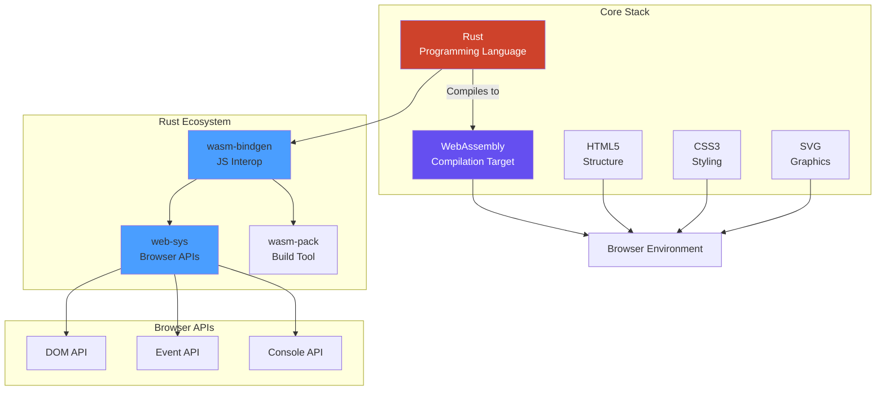
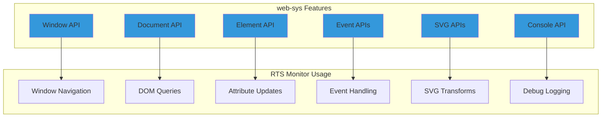
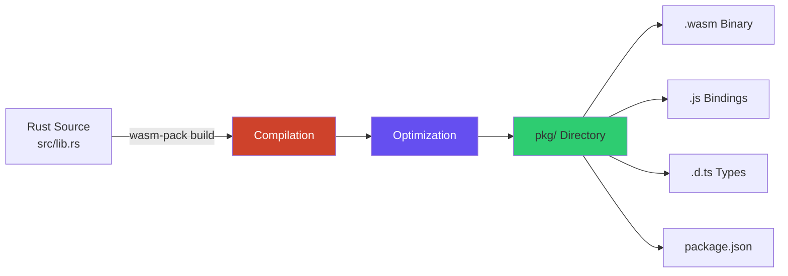
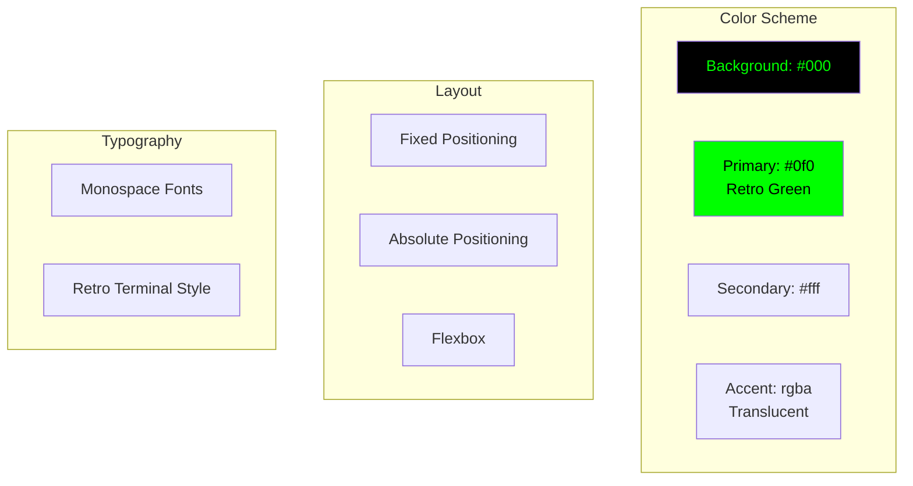
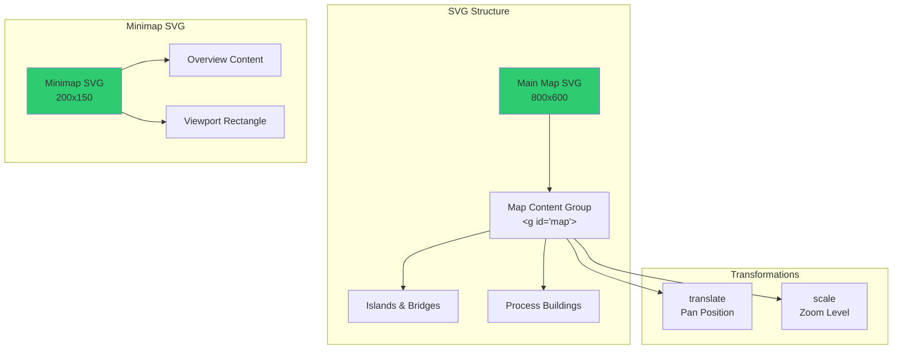
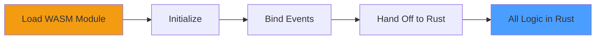
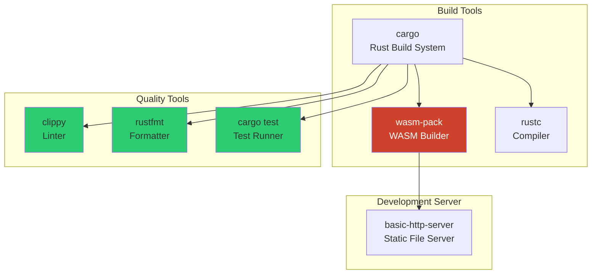
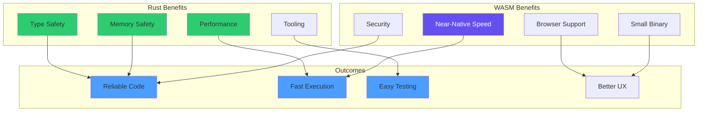
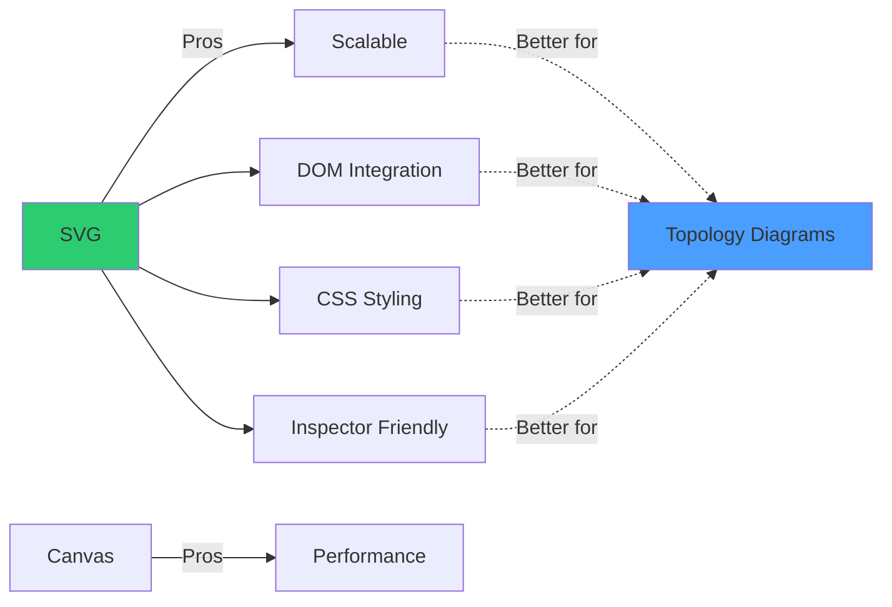
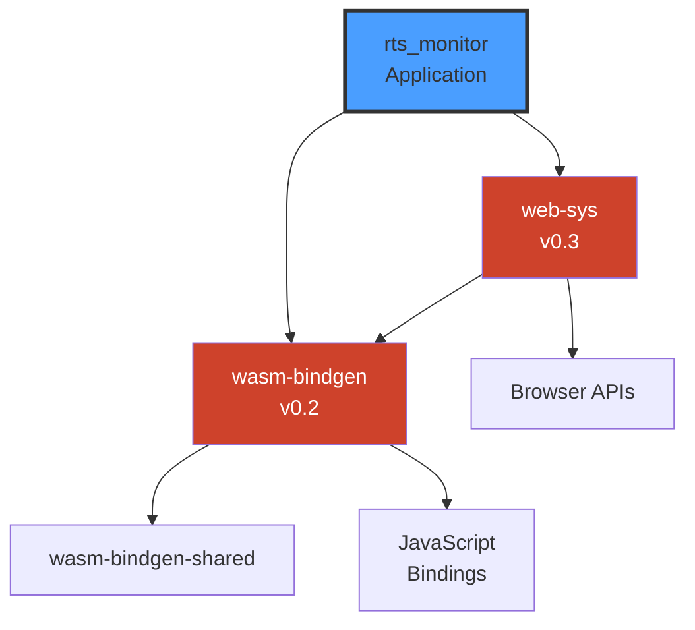

# Technology Stack

This page provides detailed information about the technologies, libraries, and tools used in RTS Monitor.

## Table of Contents

- [Core Technologies](#core-technologies)
- [Rust Dependencies](#rust-dependencies)
- [Frontend Technologies](#frontend-technologies)
- [Development Tools](#development-tools)
- [Technology Decision Rationale](#technology-decision-rationale)

## Core Technologies

### Technology Overview



## Rust Dependencies

### Primary Dependencies

| Crate | Version | Purpose | Usage |
|-------|---------|---------|-------|
| `wasm-bindgen` | Latest | JavaScript interop | Export Rust functions to JS |
| `web-sys` | Latest | Browser API bindings | DOM manipulation, events |

### Cargo.toml Configuration

```toml
[package]
name = "rts_monitor"
version = "0.1.0"
edition = "2021"

[lib]
crate-type = ["cdylib"]

[dependencies]
wasm-bindgen = "0.2"

[dependencies.web-sys]
version = "0.3"
features = [
    "console",
    "Document",
    "Element",
    "HtmlElement",
    "MouseEvent",
    "KeyboardEvent",
    "Window",
    "SvgElement",
    "SvgGraphicsElement",
]
```

### wasm-bindgen

**Purpose**: Bridge between Rust/WebAssembly and JavaScript

```mermaid
graph LR
    A[Rust Functions] -->|#[wasm_bindgen]| B[Exported Functions]
    B --> C[JavaScript Bindings]
    C --> D[Browser APIs]

    E[JavaScript Events] --> C
    C --> F[Rust Handlers]

    style B fill:#4a9eff
    style C fill:#f39c12
```

**Key Features:**
- Export Rust functions to JavaScript
- Import JavaScript functions into Rust
- Handle complex types between languages
- Automatic memory management
- Zero-cost abstractions

**Example Usage:**

```rust
use wasm_bindgen::prelude::*;

#[wasm_bindgen]
pub fn on_mouse_down(event: web_sys::MouseEvent) {
    // Rust function callable from JavaScript
}
```

### web-sys

**Purpose**: Rust bindings for Web APIs



**Key APIs Used:**

1. **Window & Document**
   ```rust
   fn window() -> Option<web_sys::Window> {
       web_sys::window()
   }

   let document = window.document()?;
   ```

2. **Element Manipulation**
   ```rust
   let element = document.get_element_by_id("map")?;
   element.set_attribute("transform", &value)?;
   ```

3. **Event Handling**
   ```rust
   pub fn on_mouse_move(event: web_sys::MouseEvent) {
       let x = event.client_x() as f64;
       let y = event.client_y() as f64;
   }
   ```

4. **Console Logging**
   ```rust
   web_sys::console::log_1(&"Debug message".into());
   ```

### Build Tool: wasm-pack

**Purpose**: Build, optimize, and package Rust WebAssembly



**Build Command:**
```bash
wasm-pack build --target web --out-dir pkg
```

**Output Files:**
- `rts_monitor_bg.wasm` - Compiled WebAssembly binary
- `rts_monitor.js` - JavaScript bindings
- `rts_monitor.d.ts` - TypeScript definitions
- `package.json` - NPM package metadata

## Frontend Technologies

### HTML5

**Version**: HTML5
**Purpose**: Application structure and layout

**Key Features Used:**
- Semantic elements (`<div>`, `<svg>`, `<script>`)
- Inline event attributes (minimal, delegated to Rust)
- SVG embedding for graphics
- Module script loading for WASM

**Structure:**
```html
<!DOCTYPE html>
<html>
  <head>
    <style>/* Inline CSS */</style>
  </head>
  <body>
    <!-- UI Components -->
    <div id="resource-panel">...</div>
    <svg id="map">...</svg>
    <svg id="minimap">...</svg>
    <!-- ... -->
    <script type="module">/* WASM Init */</script>
  </body>
</html>
```

### CSS3

**Purpose**: Visual styling and layout

**Design System:**


**Key Styling Patterns:**
- **Retro Terminal Aesthetic**: Green text on black background
- **Fixed Layout**: Absolute positioning for panels
- **Monospace Typography**: Courier New, monospace fonts
- **Transparent Overlays**: RGBA colors for menus
- **SVG Styling**: Inline stroke and fill attributes

### SVG (Scalable Vector Graphics)

**Purpose**: Map and minimap rendering



**SVG Elements Used:**
- `<svg>` - Container elements
- `<g>` - Grouping with transforms
- `<rect>` - Buildings, panels, borders
- `<line>` - Bridges, connections
- `<circle>` - Nodes, indicators
- `<text>` - Labels, metrics

**Dynamic Updates:**
- Transform attributes via Rust/web-sys
- Position updates for pan/zoom
- Style changes for interaction feedback

### JavaScript (ES6 Modules)

**Purpose**: WASM initialization and event binding only

**Minimal JavaScript (~50 lines):**



**Responsibilities:**
1. Load WASM module (`init()`)
2. Bind event listeners to Rust functions
3. Nothing else!

**Example:**
```javascript
import init, {
  on_mouse_down,
  on_mouse_move,
  on_mouse_up,
  on_keydown,
  on_minimap_click
} from './pkg/rts_monitor.js';

await init();

document.addEventListener('mousedown', on_mouse_down);
document.addEventListener('mousemove', on_mouse_move);
// ...
```

## Development Tools

### Build & Development Tools



### Tool Details

| Tool | Purpose | Installation | Usage |
|------|---------|--------------|-------|
| `cargo` | Rust package manager | Bundled with Rust | `cargo build`, `cargo test` |
| `wasm-pack` | WASM build tool | `cargo install wasm-pack` | `wasm-pack build --target web` |
| `clippy` | Rust linter | `rustup component add clippy` | `cargo clippy` |
| `rustfmt` | Code formatter | `rustup component add rustfmt` | `cargo fmt` |
| `basic-http-server` | Dev server | `cargo install basic-http-server` | `basic-http-server .` |

### Build Scripts

**build.sh:**
```bash
#!/bin/bash
wasm-pack build --target web --out-dir pkg
```

**run.sh:**
```bash
#!/bin/bash
./scripts/build.sh
basic-http-server . -a 127.0.0.1:4000 &
sleep 1
xdg-open http://localhost:4000/ || open http://localhost:4000/
```

## Technology Decision Rationale

### Why Rust + WebAssembly?



**Key Advantages:**

1. **Type Safety**: Compile-time error checking prevents runtime bugs
2. **Performance**: WASM runs at near-native speed, faster than JavaScript
3. **Memory Safety**: No null pointers, buffer overflows, or memory leaks
4. **Testing**: Comprehensive unit testing with `cargo test`
5. **Tooling**: Excellent IDE support, linting, formatting
6. **Maintainability**: Clear ownership model and explicit error handling

### Why Minimal JavaScript?

**Problem**: JavaScript challenges
- Dynamic typing leads to runtime errors
- Difficult to maintain large codebases
- Testing overhead
- Performance unpredictability

**Solution**: Rust-first architecture
- Move all logic to Rust
- Use JavaScript only for WASM initialization
- 80% reduction in JavaScript code
- Better reliability and performance

### Why web-sys over Other Frameworks?

**Considered Alternatives:**
- React/Vue/Angular: Too heavy, unnecessary abstraction
- Yew/Seed: Additional complexity, prefer direct control
- Canvas API: Less scalable than SVG for topology diagrams

**web-sys Advantages:**
- Direct access to browser APIs from Rust
- No additional JavaScript framework needed
- Fine-grained control over DOM
- Zero runtime overhead
- Type-safe bindings

### Why SVG over Canvas?



**SVG Benefits:**
- Resolution independent (scalable graphics)
- Easier to manipulate individual elements
- CSS styling support
- Better for structured diagrams
- DevTools inspection

## Dependency Graph



## Version Requirements

| Technology | Minimum Version | Current |
|------------|----------------|---------|
| Rust | 1.70+ | Latest stable |
| wasm-bindgen | 0.2.80+ | 0.2.x |
| web-sys | 0.3.60+ | 0.3.x |
| wasm-pack | 0.12.0+ | Latest |

## Browser Compatibility

**Supported Browsers:**
- Chrome/Edge 89+
- Firefox 88+
- Safari 15+

**Required Features:**
- WebAssembly support
- ES6 module support
- SVG 2.0
- Modern DOM APIs

## Related Pages

- [Architecture](Architecture.md) - System architecture overview
- [Development Guide](Development-Guide.md) - Build and development workflow
- [Home](Home.md) - Return to wiki home
