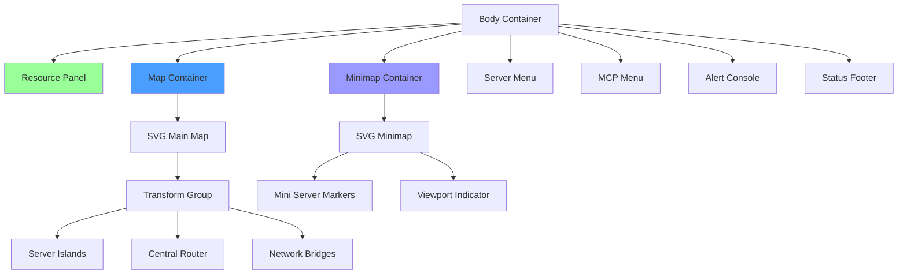
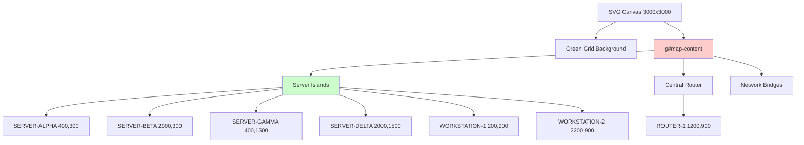
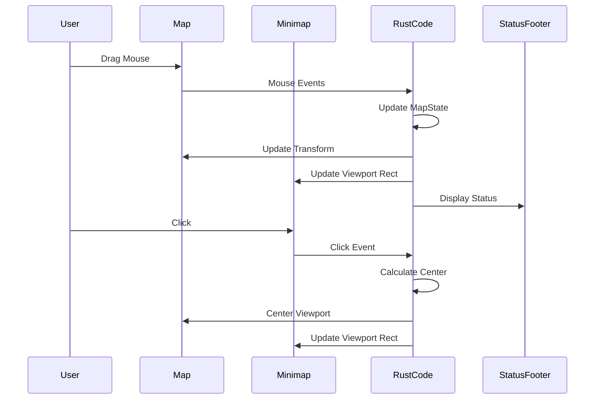

# UI Components

This page details the user interface components of the RTS Monitor, their structure, responsibilities, and interactions.

## Overview

The RTS Monitor UI is built with **HTML5/CSS3** with all styling inline in `index.html`. The interface uses **SVG graphics** for the map and minimap, with a retro terminal aesthetic (green-on-black theme).

## Component Hierarchy



## Component Details

### 1. Resource Panel

**Location**: Top-left corner
**File**: `index.html` (Resource Panel section)

#### Purpose
Displays system-wide aggregate metrics across all monitored servers.

#### Structure
```
┌─ RESOURCE PANEL ────────────┐
│ TOTAL CPU: 45%              │
│ TOTAL MEMORY: 128GB/256GB   │
│ NETWORK: 2.4 Gbps           │
│ ALERTS: 3 warnings          │
└─────────────────────────────┘
```

#### Elements
- **Total CPU**: Aggregate CPU usage percentage
- **Total Memory**: Used/Total memory across all nodes
- **Network**: Total network throughput
- **Alerts**: Count of active warnings/errors

#### Current Status
- Static demo data (hardcoded values)
- No real-time updates
- Visual only (no interactions)

---

### 2. Main Map

**Location**: Center of screen
**File**: `index.html` (SVG#map)

#### Purpose
Primary interactive visualization of the network topology showing server islands, processes, and network connections.

#### Structure



#### Map Elements

**Server Islands**:
- Oval shapes representing physical/virtual servers
- Contains "building" icons for processes
- Labels showing server names
- Coordinates for positioning

**Network Bridges**:
- Lines connecting servers to central router
- Star topology (all connect to ROUTER-1)
- Visual representation of network links

**Central Router**:
- Hexagonal shape at center (1200, 900)
- Hub of the star network topology

#### Viewport Dimensions
- **World Size**: 3000 x 3000 pixels
- **Viewport Size**: 800 x 600 pixels (visible area)
- **Initial Offset**: (0, 0) - top-left corner

#### Interactions
- **Mouse Drag**: Pan the viewport (see [[Event Handling]])
- **Keyboard**: Arrow keys and WASD for navigation
- **Click**: Select servers (future functionality)

#### SVG Transform
```html
<g id="map-content" transform="translate(0, 0)">
  <!-- All map elements -->
</g>
```

The `transform` attribute is dynamically updated by Rust code via `web-sys`.

---

### 3. Minimap

**Location**: Bottom-right corner
**File**: `index.html` (SVG#minimap)

#### Purpose
Provides an overview of the entire world map with a viewport indicator showing the current visible area.

#### Structure

```
┌─ MINIMAP ───────────┐
│  ┌─────────────┐   │
│  │   •    •    │   │  • = Server markers
│  │      ◊      │   │  ◊ = Router
│  │ ┌─────┐     │   │  ┌─┐ = Viewport indicator
│  │ │•   •│     │   │
│  └─┴─────┴─────┘   │
└─────────────────────┘
```

#### Elements
- **Server Markers**: Small circles at scaled positions
- **Viewport Indicator**: Rectangle showing current view area
- **Background**: Darker shade for contrast

#### Scaling
- Minimap dimensions: 200 x 200 pixels
- World dimensions: 3000 x 3000 pixels
- Scale factor: 200/3000 ≈ 0.067

#### Interactions
- **Click**: Centers viewport on clicked position
- **Visual Feedback**: Viewport rectangle updates during pan

#### Implementation
```rust
// Minimap click handler (src/lib.rs)
pub fn minimap_click(click_x: f64, click_y: f64)
```

Converts minimap coordinates to world coordinates and centers the viewport.

---

### 4. Server Management Menu

**Location**: Right side panel
**File**: `index.html` (Server Management section)

#### Purpose
Controls for managing processes on selected servers.

#### Structure
```
┌─ SERVER MANAGEMENT ──┐
│ Selected: [None]     │
│                      │
│ [Deploy Process]     │
│ [Stop Process]       │
│ [Restart Process]    │
│ [View Logs]          │
│                      │
│ Process List:        │
│ (empty)              │
└──────────────────────┘
```

#### Controls
- **Selected Server**: Displays currently selected server
- **Deploy Process**: Add new LLM/MCP process
- **Stop Process**: Halt running process
- **Restart Process**: Restart process
- **View Logs**: Show process logs

#### Current Status
- UI layout complete
- No backend integration
- Buttons non-functional (placeholders)

---

### 5. MCP Configuration Menu

**Location**: Right side panel (below Server Management)
**File**: `index.html` (MCP Configuration section)

#### Purpose
Configuration and discovery of Model Context Protocol servers.

#### Structure
```
┌─ MCP CONFIGURATION ──┐
│ Discovery:           │
│ [Scan Network]       │
│                      │
│ Known MCP Servers:   │
│ • mcp-server-1       │
│ • mcp-server-2       │
│                      │
│ [Configure]          │
│ [Test Connection]    │
└──────────────────────┘
```

#### Features
- **Network Scan**: Discover MCP servers on network
- **Server List**: Display known MCP servers
- **Configuration**: Adjust MCP server settings
- **Connection Test**: Verify connectivity

#### Current Status
- UI layout complete
- Mock server list (hardcoded)
- No real network scanning

---

### 6. Alert Console

**Location**: Bottom panel
**File**: `index.html` (Alert Console section)

#### Purpose
Displays system notifications, warnings, and errors.

#### Structure
```
┌─ ALERTS ─────────────────────────────────────┐
│ [14:30:15] WARNING: High CPU on SERVER-BETA │
│ [14:29:42] INFO: Process deployed           │
│ [14:28:10] ERROR: Connection lost           │
└──────────────────────────────────────────────┘
```

#### Message Format
- **Timestamp**: `[HH:MM:SS]`
- **Level**: INFO, WARNING, ERROR
- **Message**: Descriptive text

#### Current Status
- UI layout complete
- Receives console.log messages
- No severity filtering
- No persistence

---

### 7. Status Footer

**Location**: Bottom of page
**File**: `index.html` (footer element)

#### Purpose
Displays application status, copyright, and links.

#### Structure
```
┌──────────────────────────────────────────────┐
│ Status: [Dynamic status messages]           │
│ © 2024 MIT License | GitHub                  │
└──────────────────────────────────────────────┘
```

#### Features
- **Status Messages**: Real-time feedback from Rust code
- **Copyright**: MIT License notice
- **Links**: GitHub repository, LICENSE file

#### Message Updates
Status messages are updated by Rust code via `console::log_1()`, which is intercepted by JavaScript and displayed in the footer.

---

## Visual Design

### Color Scheme (Retro Terminal)

| Element | Color | Hex Code |
|---------|-------|----------|
| Background | Black | `#000000` |
| Primary Text | Bright Green | `#00ff00` |
| Secondary Text | Medium Green | `#66cc66` |
| Borders | Dark Green | `#003300` |
| Highlights | Cyan | `#00ffff` |
| Warnings | Yellow | `#ffff00` |
| Errors | Red | `#ff0000` |

### Typography

- **Font Family**: `'Courier New', monospace`
- **Font Size**: 12px (base)
- **Line Height**: 1.5

### Layout

```
┌─────────────────────────────────────────────┐
│  ┌─ RESOURCE ──┐         ┌─ SERVER MGT ─┐  │
│  │ CPU: 45%    │         │ Selected: -- │  │
│  │ MEM: 128GB  │         │ [Deploy]     │  │
│  └─────────────┘         │ [Stop]       │  │
│                          │ [Restart]    │  │
│  ┌─────────────────┐     └──────────────┘  │
│  │                 │     ┌─ MCP CONFIG ─┐  │
│  │   MAIN MAP      │     │ [Scan Net]   │  │
│  │                 │     │ Servers: 2   │  │
│  │    (SVG)        │     └──────────────┘  │
│  │             ┌──┐│                        │
│  │             │mm││      [MINIMAP appears  │
│  └─────────────└──┘┘       in bottom-right] │
│                                             │
│  ┌─ ALERTS ─────────────────────────────┐  │
│  │ [14:30] WARNING: High CPU            │  │
│  └──────────────────────────────────────┘  │
│  Status: Ready | © 2024 MIT | GitHub      │
└─────────────────────────────────────────────┘
```

## Component Interaction



## Implementation Files

| Component | HTML ID | Rust Handler | Purpose |
|-----------|---------|--------------|---------|
| Main Map | `#map` | `on_mouse_down()` | Viewport panning |
| Minimap | `#minimap` | `minimap_click()` | Viewport centering |
| Map Content | `#map-content` | `update_map_transform()` | SVG transform |
| Viewport Rect | `#viewport-rect` | `update_minimap_viewport()` | Minimap indicator |
| Status Footer | `#status` | `console::log_1()` | Status messages |

## Related Pages

- [[Event Handling]] - How UI components respond to user input
- [[State Management]] - Managing viewport and interaction state
- [[Interaction Flows]] - Sequence diagrams for component interactions
- [[Architecture Overview]] - High-level system architecture

---

*Last Updated: 2025-11-18*
