# UI Components

This page details the user interface components of RTS Monitor, including layout, styling, and component responsibilities.

## Table of Contents

- [UI Overview](#ui-overview)
- [Component Layout](#component-layout)
- [Component Details](#component-details)
- [Visual Design](#visual-design)
- [Interaction Areas](#interaction-areas)

## UI Overview

RTS Monitor uses a **retro terminal aesthetic** with a fixed-layout interface consisting of six primary components arranged around a central map view.

### Screen Layout

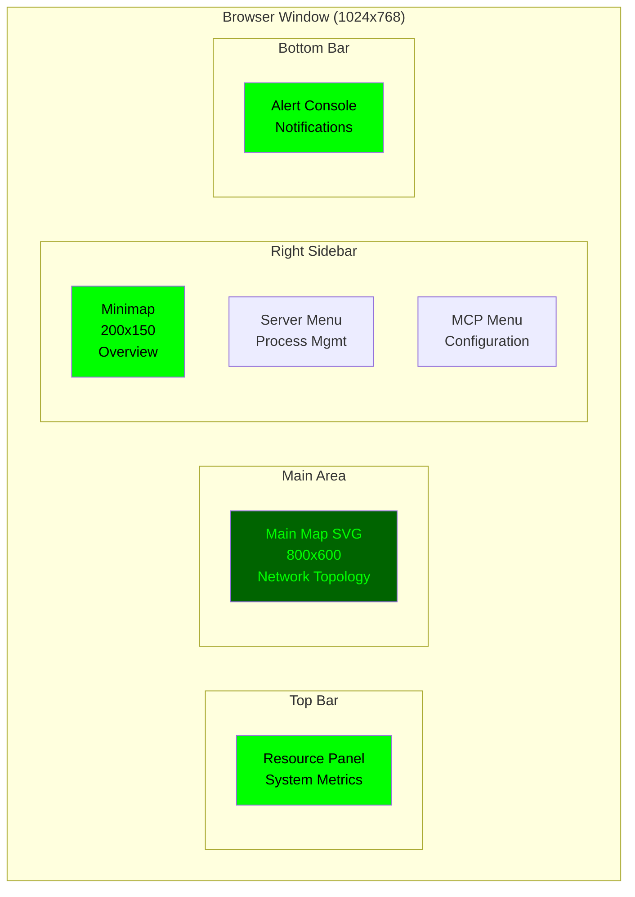

### Component Positioning

```
┌─────────────────────────────────────────────────────────────┐
│ Resource Panel (Top: 0-60px)                                │
│ CPU: 45%  Memory: 8.2GB  Network: 125MB/s  Active Proc: 12 │
├─────────────────────────────────────┬───────────────────────┤
│                                     │ Minimap (200x150)     │
│                                     │ [Overview Map]        │
│                                     ├───────────────────────┤
│   Main Map (800x600)                │ Server Management     │
│   [Network Topology View]           │ • Deploy              │
│   [Islands, Buildings, Bridges]     │ • Stop                │
│                                     │ • Restart             │
│                                     ├───────────────────────┤
│                                     │ MCP Configuration     │
│                                     │ • Discover Servers    │
│                                     │ • Protocol Settings   │
├─────────────────────────────────────┴───────────────────────┤
│ Alert Console (Bottom: 708-768px)                           │
│ [System Alerts: WARN] Server-3 CPU at 95%                   │
└─────────────────────────────────────────────────────────────┘
```

## Component Layout

### Layout Architecture

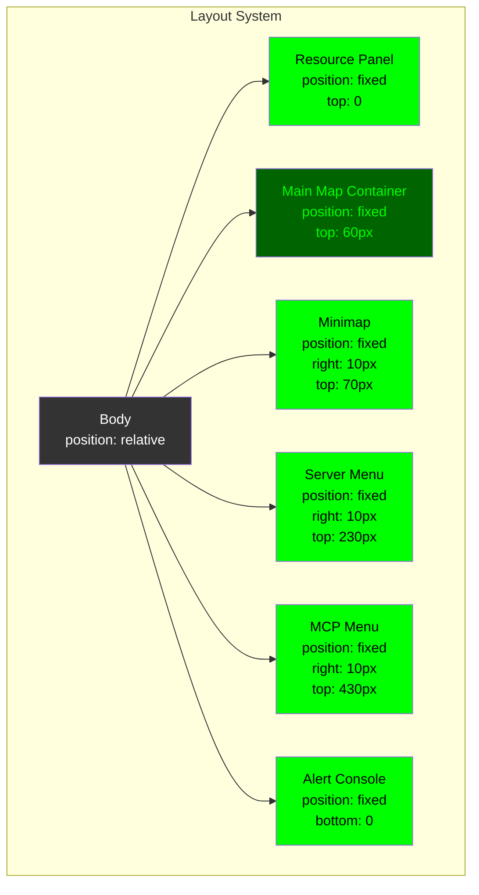

### CSS Grid Structure

| Component | Position | Dimensions | Z-Index |
|-----------|----------|------------|---------|
| Resource Panel | `top: 0, left: 0, right: 0` | `height: 60px` | 100 |
| Main Map | `top: 60px, left: 10px` | `800x600px` | 1 |
| Minimap | `top: 70px, right: 10px` | `200x150px` | 10 |
| Server Menu | `top: 230px, right: 10px` | `200x180px` | 10 |
| MCP Menu | `top: 430px, right: 10px` | `200x180px` | 10 |
| Alert Console | `bottom: 0, left: 0, right: 0` | `height: 60px` | 100 |

## Component Details

### 1. Resource Panel

**Location**: Top of screen (0-60px height)
**Purpose**: Display system-wide resource metrics

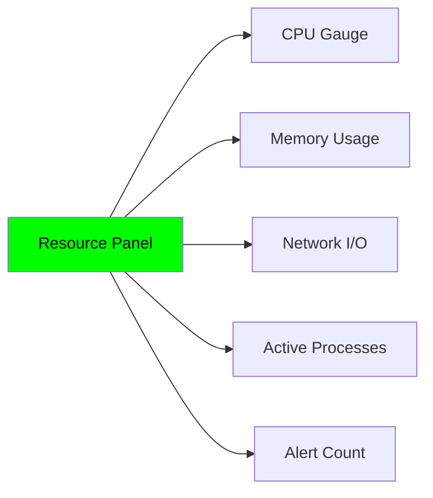

**Visual Structure:**
```
┌────────────────────────────────────────────────────────┐
│  RTS MONITOR  │  CPU: ███████░░ 45%  │  MEM: 8.2/16GB  │
│               │  NET: ↑125MB/s ↓80MB/s  │  PROC: 12    │
└────────────────────────────────────────────────────────┘
```

**Displayed Metrics:**
- **CPU Usage**: Percentage bar and numeric value
- **Memory**: Used/Total in GB
- **Network**: Upload/Download rates
- **Active Processes**: Count of running processes
- **Alert Indicator**: Warning/Error count

**Styling:**
- Background: `#000` (black)
- Text: `#0f0` (green)
- Border: `2px solid #0f0`
- Font: `monospace, 14px`

### 2. Main Map

**Location**: Center-left (60px from top, 10px from left)
**Purpose**: Primary network topology visualization

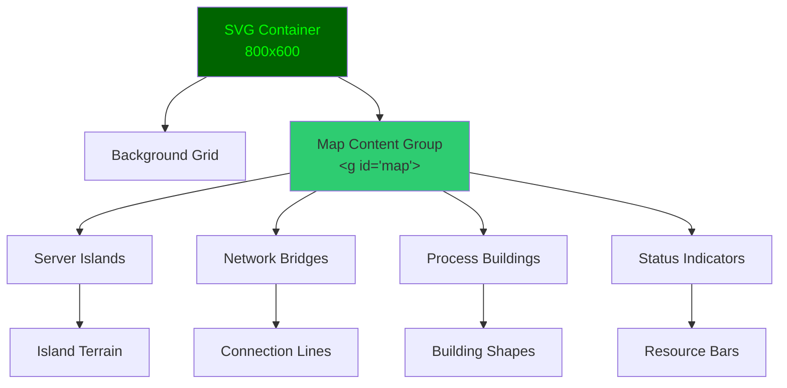

**SVG Structure:**
```xml
<svg id="map-container" width="800" height="600">
  <!-- Background -->
  <rect fill="#001100" width="800" height="600"/>

  <!-- Transformable content -->
  <g id="map" transform="translate(0,0)">
    <!-- Islands (servers) -->
    <g id="island-1">
      <rect class="island-terrain" .../>
      <!-- Buildings (processes) -->
      <rect class="building" .../>
      <text class="label">LLM-1</text>
    </g>

    <!-- Bridges (connections) -->
    <line class="bridge" x1="..." y1="..." x2="..." y2="..."/>
  </g>
</svg>
```

**Visual Elements:**

1. **Server Islands**
   - Represented as rectangular landmasses
   - Size proportional to server capacity
   - Color indicates server health/status

2. **Process Buildings**
   - Rectangles on islands
   - Height indicates resource usage
   - Labels show process type (LLM, MCP, etc.)

3. **Network Bridges**
   - Lines connecting islands
   - Thickness indicates bandwidth
   - Color shows connection quality

4. **Status Indicators**
   - Small bars showing CPU, Memory, GPU
   - Color-coded: Green (normal), Yellow (warning), Red (critical)

**Interaction:**
- **Mouse Drag**: Pan the view
- **Hover**: Show detailed tooltips
- **Click**: Select servers/processes

### 3. Minimap

**Location**: Top-right sidebar (70px from top)
**Purpose**: Overview and navigation aid

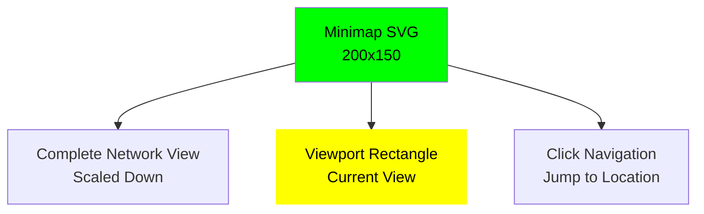

**Visual Structure:**
```
┌──────────────────┐
│ Minimap          │
│ ┌──────────────┐ │
│ │  ▪ ▪   ▪     │ │  <- Islands (scaled)
│ │    ┌────┐    │ │
│ │  ▪ │VIEW│ ▪  │ │  <- Yellow viewport rect
│ │    └────┘    │ │
│ │  ▪     ▪  ▪  │ │
│ └──────────────┘ │
└──────────────────┘
```

**Features:**
- **Complete View**: Shows entire network topology at scale
- **Viewport Indicator**: Yellow rectangle shows current main map view
- **Click-to-Navigate**: Click to center main map on that location
- **Real-time Updates**: Reflects main map pan operations

**Coordinate Mapping:**
```rust
// Screen to world coordinates
world_x = (click_x / minimap_width) * world_width
world_y = (click_y / minimap_height) * world_height
```

### 4. Server Management Menu

**Location**: Right sidebar (230px from top)
**Purpose**: Process deployment and control

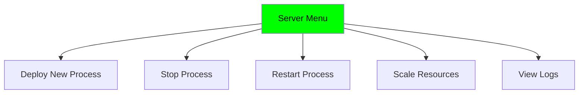

**Visual Structure:**
```
┌──────────────────┐
│ Server Management│
├──────────────────┤
│ Selected: None   │
│                  │
│ [Deploy]         │
│ [Stop]           │
│ [Restart]        │
│ [Scale]          │
│ [Logs]           │
│                  │
│ Status: Ready    │
└──────────────────┘
```

**Menu Items:**
- **Deploy**: Launch new LLM or MCP server
- **Stop**: Gracefully shutdown selected process
- **Restart**: Restart selected process
- **Scale**: Adjust resource allocation
- **Logs**: View process logs

**State Management:**
- Enabled when server/process selected
- Disabled when no selection
- Status indicator shows operation progress

### 5. MCP Configuration Menu

**Location**: Right sidebar (430px from top)
**Purpose**: Model Context Protocol server management

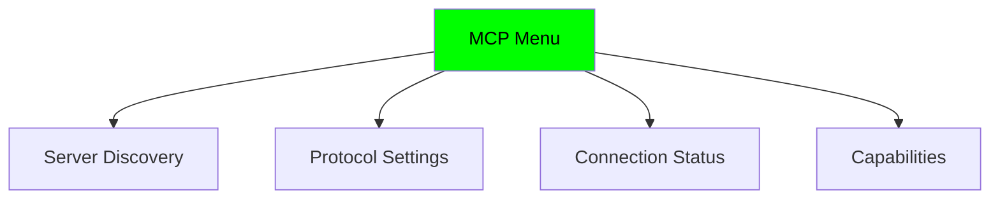

**Visual Structure:**
```
┌──────────────────┐
│ MCP Configuration│
├──────────────────┤
│ [Discover]       │
│ [Settings]       │
│                  │
│ Active Servers:  │
│ • server-1 ✓     │
│ • server-2 ✓     │
│ • server-3 ✗     │
│                  │
│ Status: 2/3 OK   │
└──────────────────┘
```

**Features:**
- **Discovery**: Find MCP servers on network
- **Settings**: Configure protocol parameters
- **Status List**: Show active MCP servers
- **Health Indicators**: Connection status icons

### 6. Alert Console

**Location**: Bottom of screen (708-768px)
**Purpose**: System notifications and messages

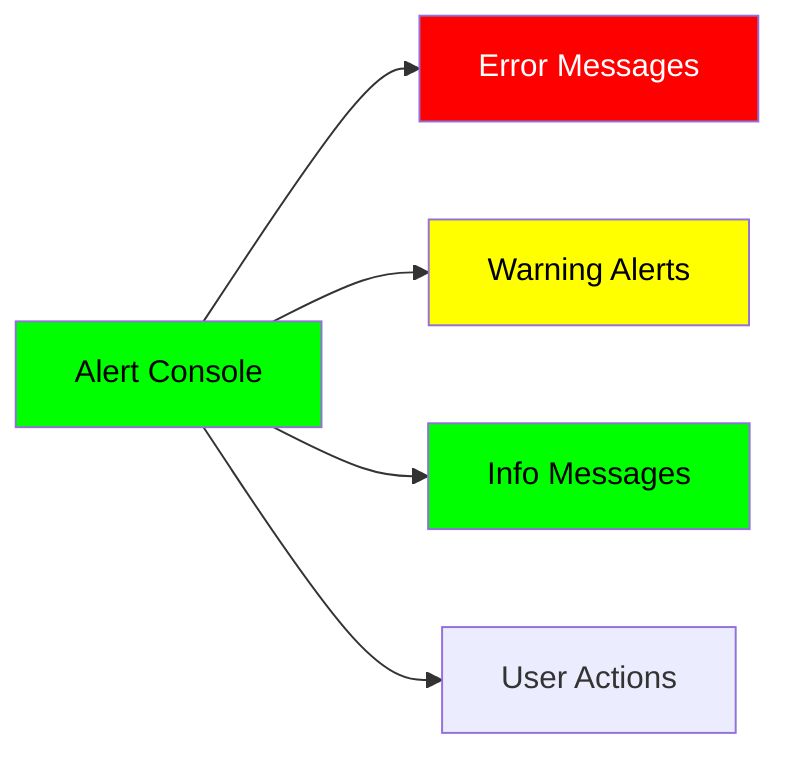

**Visual Structure:**
```
┌────────────────────────────────────────────────────┐
│ ALERTS:                                            │
│ [12:34:56] INFO   Map view centered at (100, 200)  │
│ [12:34:52] WARN   Server-3 CPU usage at 95%        │
│ [12:34:45] ERROR  Connection lost to Server-5      │
└────────────────────────────────────────────────────┘
```

**Alert Levels:**
- **ERROR**: Red text, critical issues
- **WARN**: Yellow text, warnings
- **INFO**: Green text, informational messages
- **DEBUG**: Gray text, debug information

**Features:**
- Auto-scroll to latest message
- Timestamp for each entry
- Color-coded severity
- Persistent message history

## Visual Design

### Color Scheme

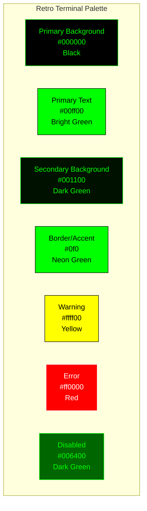

### Typography

**Font Stack:**
```css
font-family: 'Courier New', Courier, monospace;
```

**Font Sizes:**
- Headers: `16px` bold
- Body text: `14px` normal
- Labels: `12px` normal
- Metrics: `14px` bold

### Borders and Spacing

**Border Style:**
```css
border: 2px solid #0f0;
border-radius: 4px;
```

**Spacing:**
- Padding: `10px` standard
- Margin: `10px` between components
- Gap: `5px` within components

## Interaction Areas

### Clickable Regions

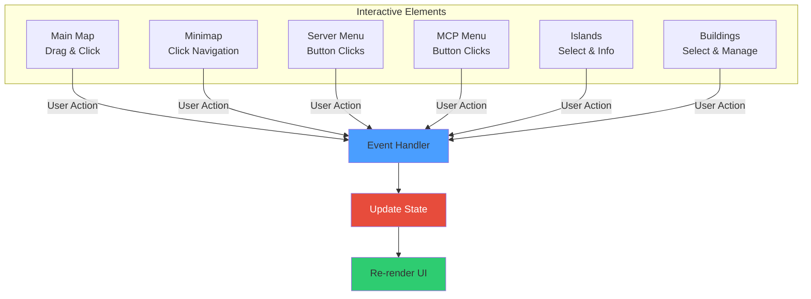

### Hover States

| Element | Hover Effect |
|---------|-------------|
| Main Map | Hand cursor when draggable |
| Minimap | Pointer cursor, highlight area |
| Buttons | Brighten color, show border |
| Islands | Highlight border, show tooltip |
| Buildings | Highlight, show resource details |
| Bridges | Highlight, show bandwidth stats |

### Visual Feedback

**Interaction Feedback:**
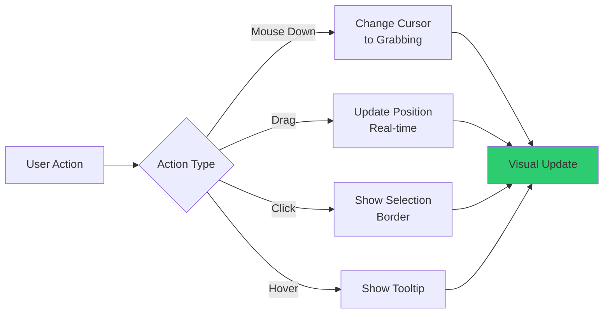

**Status Indicators:**
- **Active**: Bright green (#0f0)
- **Inactive**: Dark green (#060)
- **Error**: Red (#f00)
- **Warning**: Yellow (#ff0)
- **Processing**: Blinking animation

## Responsive Behavior

### Fixed Layout

The UI uses a **fixed layout** optimized for 1024x768+ screens.

**Minimum Requirements:**
- Screen width: 1024px
- Screen height: 768px
- SVG support
- JavaScript enabled

**Future Considerations:**
- Responsive breakpoints for mobile
- Flexible grid system
- Touch interaction support

## Accessibility

### Current Implementation

- **Keyboard Navigation**: Arrow keys and WASD for map navigation
- **Color Contrast**: High contrast green-on-black
- **Monospace Font**: Clear, readable text
- **Visual Feedback**: Clear interaction cues

### Future Enhancements

- ARIA labels for screen readers
- Keyboard shortcuts for all actions
- Focus indicators
- Alternative color schemes for color-blind users

## Related Pages

- [Interaction Model](Interaction-Model.md) - User interaction patterns and event handling
- [Architecture](Architecture.md) - System architecture
- [Technology Stack](Technology-Stack.md) - Technologies used
- [Development Guide](Development-Guide.md) - Development workflow
- [Home](Home.md) - Return to wiki home
